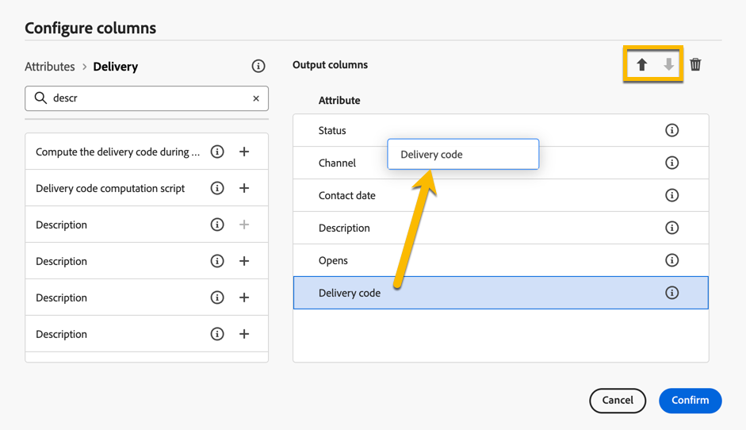

# Browse and filter lists {#list-screens}

Most of the links from the left navigation menu display lists of objects, such as the list of **Deliveries** or **Campaigns**. Some of these list screens are read-only. You can customize the list display, and filter these lists, as detailed below.

## Customize list screens {#custom-lists}

The lists are displayed in columns. You can display additional information by changing the column configuration. To do this, click the **Configure column for a custom layout** icon in the top right corner of the list. 

{zoomable="yes"}{width="70%" align="left" zoomable="yes"}

In the **Configure columns** screen, add or remove columns, and change the order in which they are displayed.

You can change the order of your list either by **drag and drop**, or by using **up and down arrows** as shown below :

{zoomable="yes"}{width="70%" align="left" zoomable="yes"}

For example, for these settings:

{zoomable="yes"}{width="70%" align="left" zoomable="yes"}

The list shows the following columns:

{zoomable="yes"}{width="70%" align="left" zoomable="yes"}

## Sort data {#sort-lists}

You can also sort items in the list by clicking any column header. An arrow is displayed (Up or Down) indicating that the list is sorted on that column. 

For numeric or date columns, the **Up** arrow indicates that the list is sorted in ascending order while the **Down** arrow indicates a descending order. For string or alphanumeric columns, values are listed in alphabetical order.

## Filters {#list-built-in-filters}

To find items quicker, you can use the search bar, or built-in and custom filters to adapt the list based on contextual criteria. 

{zoomable="yes"}{width="70%" align="left" zoomable="yes"}

Detailed information on how to use filters and create your own custom filters it is available in [this section](../query/filter.md).

<!--
## Use advanced attributes {#adv-attributes}

>[!CONTEXTUALHELP]
>id="acw_attributepicker_advancedfields"
>title="Display advanced attributes"
>abstract="Only the most common attributes are displayed by default in the attribute list. Activate the **Display advanced attributes** toggle to see all available attributes for the current list in the left palette of the rule builder, such as nodes, groupings, 1-1 links, 1-N links."

>[!CONTEXTUALHELP]
>id="acw_rulebuilder_advancedfields"
>title="Rule builder advanced fields"
>abstract="Only the most common attributes are displayed by default in the attribute list. Activate the **Display advanced attributes** toggle to see all available attributes for the current list in the left palette of the rule builder, such as nodes, groupings, 1-1 links, 1-N links."

>[!CONTEXTUALHELP]
>id="acw_rulebuilder_properties_advanced"
>title="Rule builder advanced attributes"
>abstract="Only the most common attributes are displayed by default in the attribute list. Activate the **Display advanced attributes** toggle to see all available attributes for the current list in the left palette of the rule builder, such as nodes, groupings, 1-1 links, 1-N links."

Only most common attributes are displayed by default in the attribute list and filter configuration screens. Attributes which were set as `advanced` attributes in the data schema are hidden from the configuration screens. 

Activate the **Display advanced attributes** toggle to see all available attributes for the current list in the left palette of the rule builder, such as nodes, groupings, 1-1 links, 1-N links. The attribute list is updated instantly.

{zoomable="yes"}{width="70%" align="left" zoomable="yes"}
-->