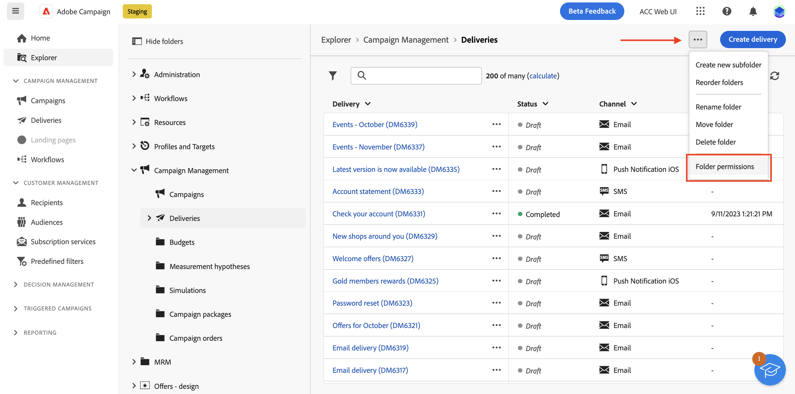
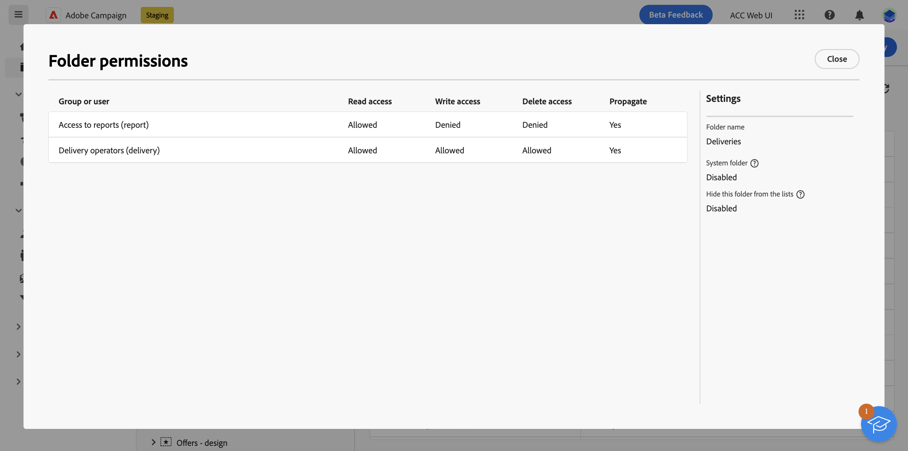
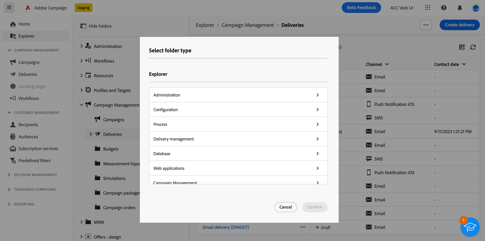
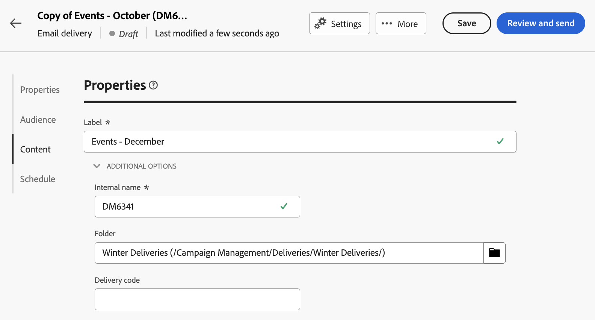

# Access and permissions {#access-and-permissions}

>[!CONTEXTUALHELP]
>id="acw_explorer_permissions_create"
>title="Permission required"
>abstract="Your admin must grant you permission before you can create this object."

>[!CONTEXTUALHELP]
>id="acw_audiences_read_only"
>title="This audience is read only"
>abstract="You do not have permissions to edit this audience. If needed, contact your administrator to grant you access."

>[!CONTEXTUALHELP]
>id="acw_subscription_services_read_only"
>title="This service is read only"
>abstract="You do not have permissions to edit this service. If needed, contact your administrator to grant you access."

>[!CONTEXTUALHELP]
>id="acw_recipients_readonlyprofile"
>title="Recipients read only profile"
>abstract="You do not have permissions to edit this profike. If needed, contact your administrator to grant you access."

>[!CONTEXTUALHELP]
>id="acw_campaign_read_only"
>title="This campaign is read only"
>abstract="You do not have permissions to edit this campaign. If needed, contact your administrator to grant you access."

>[!CONTEXTUALHELP]
>id="acw_deliveries_read_only"
>title="This delivery is read only"
>abstract="You do not have permissions to edit this delivery. If needed, contact your administrator to grant you access."

>[!CONTEXTUALHELP]
>id="acw_wf_read_only"
>title="This workflow is read only"
>abstract="You do not have permissions to edit this workflow. If needed, contact your administrator to grant you access."

Access control can restrict access to objects and data from main lists, such as deliveries, recipients, or worklows. These restrictions also apply in the **Explorer** navigation tree. In addition, you need permissions to create, delete, duplicate, and edit objects from the user interface.

Access control is managed in the Campaign Client Console. All permissions in Campaign Web are synched up with Campaign Client Console permissions. Only Campaign Administrators can define and modify user permissions. Learn more about user permissions in [Campaign v8 (client console) documentation](https://experienceleague.adobe.com/docs/campaign/campaign-v8/admin/permissions/gs-permissions.html){target="_blank"}.

As you are browsing Campaign Web user interface, you can access data, objects and capabilities depending on your permissions. For example, if you do not have access permissions to a folder, you cannot see it. Your permissions also affect objects and data management. Without Write permissions for a specific folder, you cannot create a delivery in that folder, even if you can see it in the user interface.

## View permissions {#view-permissions}

From the **Explorer**, you can browse permissions for each folders. These permissions are set in the client console, and are used to organize and control access to Campaign data.

To view permissions for a folder, follow these steps:

1. From the **Explorer** left nav menu, select a folder.
1. Click the three dots on the upper right corner and select **Folder permissions**.

    {zoomable="yes"}{width="70%" align="left" zoomable="yes"}

1. Check details in the screen, as below:

    {zoomable="yes"}{width="70%" align="left" zoomable="yes"}

    A group, or an operator, can have Read, Write, and/or Delete permissions on data which are stored in the selected folder. 
    
    If the **Propagate** option is enabled, all permissions defined for a folder are applied to all its sub-folders. These permissions can be overloaded for each sub-folder.

    If the **System folder** option is enabled, access is allowed to all operators, regardless of their permissions.

Learn more about folder permissions in [Campaign v8 (client console) documentation](https://experienceleague.adobe.com/docs/campaign/campaign-v8/admin/permissions/folder-permissions.html){target="_blank"}.

## Work with folders {#folders} 

You can create, rename, reorder, and move folders to organize your components and data. You can also delete folders from the same menu. 

>[!CAUTION]
>
>When deleting a folder, all data stored in the folder is also deleted.

To create a folder, follow these steps:

1. From the **Explorer** left nav menu, select a folder.
1. Click the three dots on the upper right corner and choose **Create new folder**.
1. Enter the name of the folder.

    {zoomable="yes"}{width="70%" align="left" zoomable="yes"}

1. Select the folder type. By default, the parent folder type is selected, "Deliveries", in our example. To change the folder type, click the folder icon and select any other type.

    {zoomable="yes"}{width="70%" align="left" zoomable="yes"}

1. Click **Create**.

    The folder is added as a subfolder of the current folder. Browse to that new folder to create components directly into it. You can also create a component from any folder, and save it in that new folder, from the **Additional Options** section of the properties, as shown below for a delivery:

    {zoomable="yes"}{width="70%" align="left" zoomable="yes"}
