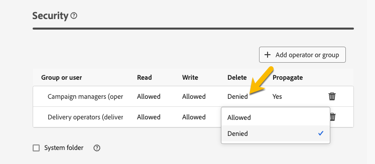

# Permissions {#permissions}

Each user in Adobe Campaign has its own permissions and restrictions in the application. The user can be a part of operators group and inherits the permissions of the group.

According to its permissions, an operator can :

* Access to certain capabilities
* Access to certain data
* Access to certain actions (create, modify, delete)

Detailed procedure to set up permissions in Adobe Campaign are available in [Adobe Campaign v8 (console) documentation](https://experienceleague.adobe.com/en/docs/campaign/campaign-v8/admin/permissions/gs-permissions){target="_blank"}.

## Permissions on folders {#folder-permissions}

According to your rights, you have the possibility to view and manage the permissions on folders in the **[!UICONTROL Folder settings]**.

Below is an example on a delivery folder:

  {zoomable="yes"}

In the **[!UICONTROL Security]** section of the **[!UICONTROL Folder settings]**, you can view and manage (add or delete) operators or groups who can access to the folder. 

  {zoomable="yes"}

You can directly click on the permissions and change them either **[!UICONTROL Allowed]** or **[!UICONTROL Denied]**.

  {zoomable="yes"}

If the **[!UICONTROL Propagate]** option is enabled, all permissions defined for a folder are applied to all its sub-folders. These permissions can be overloaded for each sub-folder.

If the **[!UICONTROL System folder]** option is checked, access is allowed to all operators, regardless of their permissions.

You can also [manage the permissions on folders in Adobe Campaign console](https://experienceleague.adobe.com/en/docs/campaign/campaign-v8/admin/permissions/folder-permissions){target="_blank"}.

All permissions in Campaign Web user interface are synched up with Campaign Client Console permissions.
