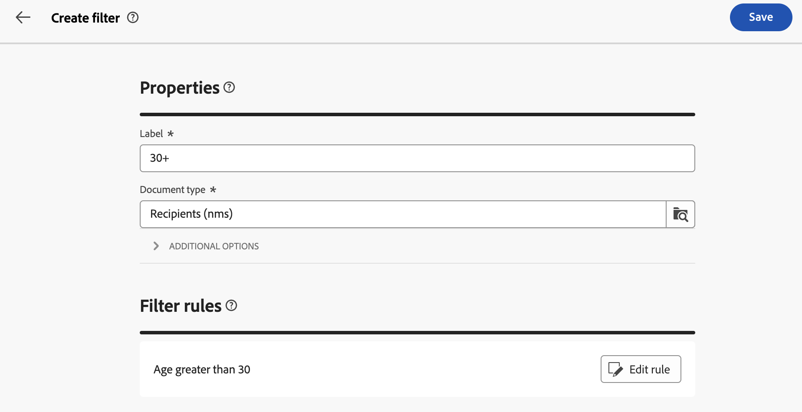
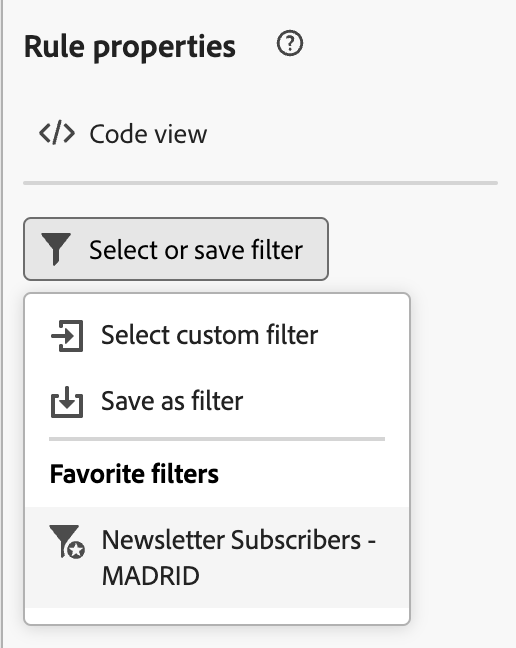

# Work with predefined filters {#predefined-filters}

>[!CONTEXTUALHELP]
>id="acw_homepage_learning_card4"
>title="Predefined filter management"
>abstract="Campaign Web user interface offers an user-friendly interface to effortlessly manage and customize predefined filters to meet your specific needs. Create once and save for future use."

<!--TO REMOVE BELOW-->
>[!CONTEXTUALHELP]
>id="acw_homepage_card4"
>title="Predefined filter management"
>abstract="Campaign web now offers you an user-friendly interface to effortlessly manage and customize predefined filters to meet your specific needs. Create once and save for future use."
<!--TO REMOVE ABOVE-->

>[!CONTEXTUALHELP]
>id="acw_predefined-filters-dashboard"
>title="Predefined filters"
>abstract="Campaign Web user interface offers you an user-friendly interface to effortlessly manage and customize predefined filters to meet your specific needs. Create once and save for future use."

Predefined filters are custom filters which are created and saved to be available for future use. They can be used as shortcuts during any filtering operations with the query modeler, for example when filtering a list of data, or creating the audience of a delivery. 

You can use existing built-in filters to access a specific sub-set of your data, or create your own predefined filters and save them.

{zoomable="yes"}{zoomable="yes"}

>[!IMPORTANT]
>
>In that version of the product, when building rules, selecting the audience of a delivery, or when building an audience in a workflow, some predefined filters are not available in the user interface. You can still use them. [Learn more](guardrails.md#predefined-filters-filters-guardrails-limitations)

## Create a predefined filter {#create-predefined-filter}

>[!CONTEXTUALHELP]
>id="acw_predefined-filters-creation"
>title="Create a predefined filter"
>abstract="Enter a label for the predefined filter, and select the table it applies to. Open the additional options to add a description and set this filter as a favorite. Then use the 'Create rule' button to define the filtering conditions."

>[!CONTEXTUALHELP]
>id="acw_predefined-filters-rules"
>title="Create the predefined filter rules"
>abstract="To define the filtering conditions of your custom filter, click the 'Create rule' button."

### Create a filter from the query modeler {#create-from-rule-builder}

You can save a custom filter from the [query modeler](../query/query-modeler-overview.md) to have it available for future use. Follow these steps:

1. Open the query modeler and define your filtering conditions. In the example below, you filter recipients who live in Madrid and subscribed to a Newsletter.
1. Click the **Select or save filter** button, and select **Save as a filter**.

    {zoomable="yes"}

1. Select **Create a new filter**, and enter a name and a description for that filter.
    
    {zoomable="yes"}

    You can save the filter as a favorite if needed. Learn more in [this section](#fav-filter).

1. Click **Confirm** to save your changes.

Your custom filter is now available in the **Predefined Filters** list and accessible to all Campaign users.

### Create a filter from the filter list {#create-filter-from-list}

You can create a filter from the **Predefined filters** entry in the left menu. To perform this, follow the steps below:

1. Browse the the **Predefined filters** entry in the left menu.
1. Click the **Create filter** button.
1. Enter the filter name and, from the **Document type** field, select the schema it applies to. The default schema is `Recipients(nms)`.

    
1. Define the rule for the filter. For example, profiles older than 30.

    {zoomable="yes"}

1. Save your changes. 

    {zoomable="yes"}

The filter is added to the predefined filter list. You can save the filter as a favorite if needed. Learn more in [this section](#fav-filter).

## Save your filter as a favorite {#fav-filter}

When creating a predefined filter, you can enable the **Save as favorite** option if you want to see this predefined filter in your favorites.

When a filter is saved as a favorite, it is available to all users in the **Favorite filters** section of the filter creation list, as shown below:

{zoomable="yes"}{width="30%" align="left"}

## Use a predefined filter {#use-predefined-filter}

Predefined filters are available when defining rule properties. To access predefined filters, choose the **Select custom filter** option in the drop down of the query modeler.

You can then access the full list of predefined filters available for the current context.

You can also use the filter shortcuts available in the **Favorite filters** section of the drop-down. Learn more about favorites in [this section](#fav-filter).

For example, to build an audience from a predefined filter, follow these steps:

1. Browse the the **Audiences** entry in the left menu.
1. Click the **Create Audience** button.
1. Enter the audience name, and click the **Create Audience** button.
1. Select the **Query** activity, and, from the right pane, click **Create audience** button.

    {zoomable="yes"}

1. From the **Select or save filter button**, choose the **Select custom filter** option. 

    {zoomable="yes"}

1. Browse to the predefined filter to use to create the audience, select it, and confirm.

    {zoomable="yes"}

1. Check the rule properties for this filter and confirm.

    The filter is now used as a query in the **Query** activity.

    {zoomable="yes"}

1. Save your changes and click the **Start** button to build the audience and make it available in the audience list.

## Manage your predefined filters {#manage-predefined-filter}

Predefined filters are all grouped in the dedicated entry of the left navigation menu.

{zoomable="yes"}

From this list, you can create a new filter as detailed above, and:

* edit an existing filter, and change it rules and properties
* duplicate a predefined filter
* delete a predefined filter

You can add a predefined filter as a favorite for a quick access when building your audiences. Learn more in [this section](#fav-filter).

<!--
## Built-in predefined filters {#ootb-predefined-filter}

Campaign comes with a set of predefined filters, built from the client console. These filters can be used to define your audiences, and rules. They must not be modified.
-->
