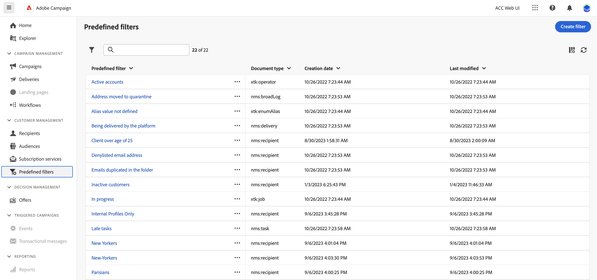
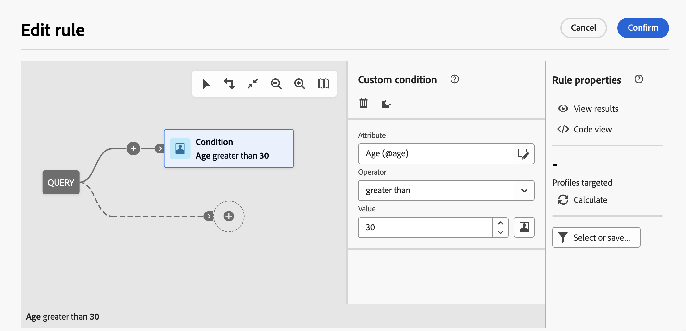
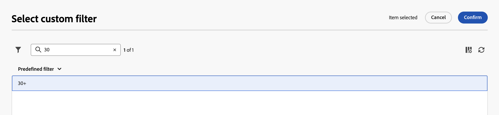

# Work with predefined filters {#predefined-filters}

>[!CONTEXTUALHELP]
>id="acw_homepage_learning_card4"
>title="Predefined filter management"
>abstract="Campaign Web user interface offers a user-friendly interface to effortlessly manage and customize predefined filters to meet your specific needs. Create once and save for future use."

>[!CONTEXTUALHELP]
>id="acw_predefined-filters-dashboard"
>title="Predefined filters"
>abstract="Campaign Web user interface offers a user-friendly interface to effortlessly manage and customize predefined filters to meet your specific needs. Create once and save for future use."

>[!CONTEXTUALHELP]
>id="acw_delivery_alerting_filter"
>title="Create an alerting criterion"
>abstract="You can create your own delivery filters from the Customer Management > Predefined filters menu."

Predefined filters are custom filters created and saved for future use. They act as shortcuts during filtering operations with the query modeler. For example, they can be used when filtering a list of data or creating the audience of a delivery.

You can use existing built-in filters to access a specific subset of your data or create your own predefined filters and save them.

{zoomable="yes"}

## Create a predefined filter {#create-predefined-filter}

>[!CONTEXTUALHELP]
>id="acw_predefined-filters-creation"
>title="Create a predefined filter"
>abstract="Enter a label for the predefined filter, and select the table it applies to. Open the additional options to add a description and set this filter as a favorite. Then use the 'Create rule' button to define the filtering conditions."

>[!CONTEXTUALHELP]
>id="acw_predefined-filters-rules"
>title="Create the predefined filter rules"
>abstract="To define the filtering conditions of your custom filter, click the 'Create rule' button."

### Create a filter from the query modeler {#create-from-rule-builder}

Save a custom filter from the [query modeler](../query/query-modeler-overview.md) to make it available for future use. Follow these steps:

1. Open the query modeler and define your filtering conditions. In the example below, recipients who live in Madrid and subscribed to a newsletter are filtered.
1. Click the **Select or save filter** button, and select **Save as a filter**.

    {zoomable="yes"}

1. Select **Create a new filter**, and enter a name and a description for that filter.
    
    {zoomable="yes"}

    You can save the filter as a favorite if needed. Learn more in [this section](#fav-filter).

1. Click **Confirm** to save your changes.

Your custom filter is now available in the **Predefined Filters** list and accessible to all Campaign users.

### Create a filter from the filter list {#create-filter-from-list}

Create a filter from the **Predefined filters** entry in the left menu. Follow these steps:

1. Browse to the **Predefined filters** entry in the left menu.
1. Click the **Create filter** button.
1. Enter the filter name and, from the **Document type** field, select the schema it applies to. The default schema is `Recipients(nms)`.

1. Define the rule for the filter. For example, profiles older than 30.

    {zoomable="yes"}

1. Save your changes.

    {zoomable="yes"}

The filter is added to the predefined filter list. You can save the filter as a favorite if needed. Learn more in [this section](#fav-filter).

## Save your filter as a favorite {#fav-filter}

When creating a predefined filter, enable the **Save as favorite** option to see this predefined filter in your favorites.

When a filter is saved as a favorite, it is available to all users in the **Favorite filters** section of the filter creation list, as shown below:

{zoomable="yes"}{width="30%" align="left"}

## Use a predefined filter {#use-predefined-filter}

Predefined filters are available when defining rule properties. To access predefined filters, choose the **Select custom filter** option in the drop-down of the query modeler.

Access the full list of predefined filters available for the current context, and use shortcuts in the **Favorite filters** section of the drop-down. Learn more about favorites in [this section](#fav-filter).

For example, to build an audience from a predefined filter, follow these steps:

1. Browse to the **Audiences** entry in the left menu and click the **Create Audience** button in the upper-left corner of the audiences list.
1. Enter the audience name, and click the **Create Audience** button.
1. Select the **Query** activity, and, from the right pane, click the **Create audience** button.

    {zoomable="yes"}

1. From the **Select or save filter** button, choose the **Select custom filter** option.

    {zoomable="yes"}

1. Browse to the predefined filter to use to create the audience, select it, and confirm.

    {zoomable="yes"}

1. Check the rule properties for this filter and confirm.

    The filter is now used as a query in the **Query** activity.

    {zoomable="yes"}

1. Save your changes and click the **Start** button to build the audience and make it available in the audience list.

## Manage your predefined filters {#manage-predefined-filter}

All predefined filters are grouped together in the dedicated entry of the left navigation menu.

{zoomable="yes"}

From this list, you can create a new filter as detailed above and perform the actions listed below:

* Edit an existing filter, and change its rules and properties.
* Duplicate a predefined filter.
* Delete a predefined filter.

You can also edit or delete a predefined filter directly from the rule builder. From the predefined filter selection window, use the **More actions** button. You can delete the filter or edit it. You can change the label, add a description and add it as a favorite.

{zoomable="yes"}

<!--
## Built-in predefined filters {#ootb-predefined-filter}

Campaign comes with a set of predefined filters, built from the client console. These filters can be used to define your audiences, and rules. They must not be modified.
-->