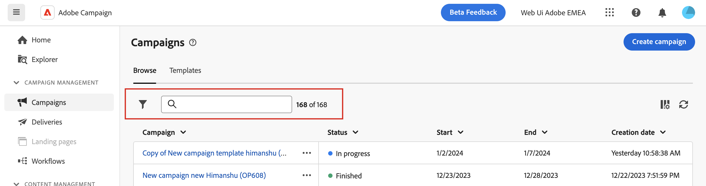
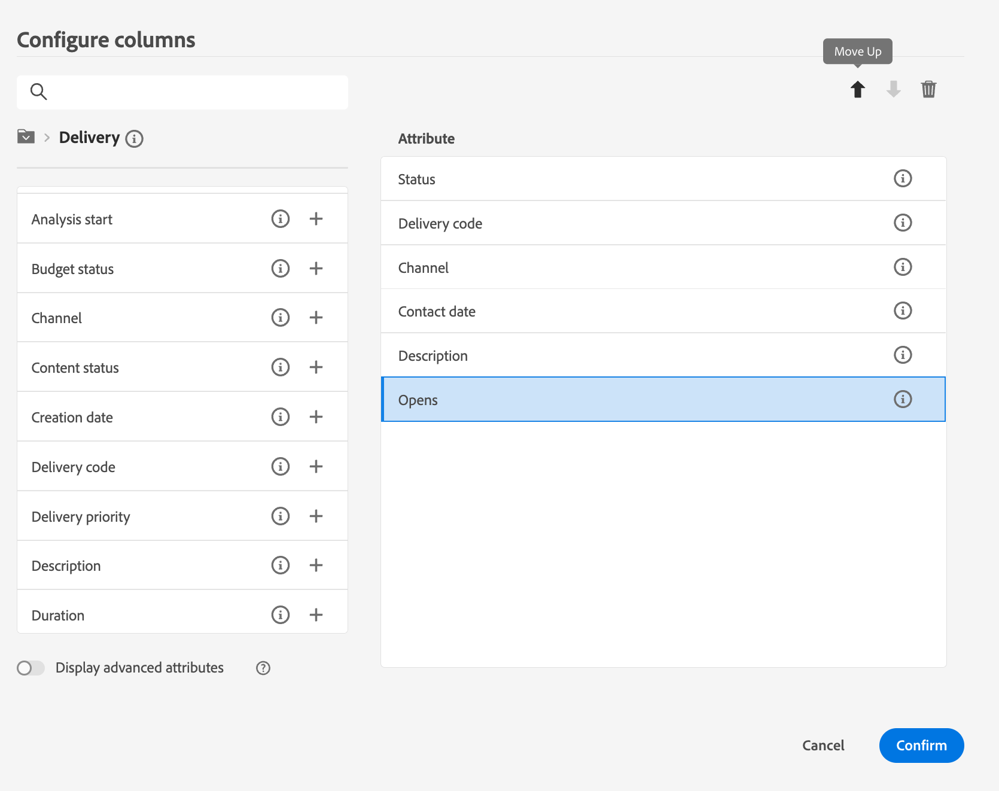

# Discover the interface {#user-interface}

>[!NOTE]
>
>This documentation is under construction and frequently updated. The final version of this content will be ready in January 2023.

>[!CONTEXTUALHELP]
>id="acw_homepage_learnmore"
>title="Interface"
>abstract="TBC"

The new Campaign v8 web interface offers an integrated, intuitive and consistent user experience.

Key concepts when browsing the user interface are common with Adobe Experience Platform. Refer to [Adobe Experience Platform documentation](https://experienceleague.adobe.com/docs/experience-platform/landing/platform-ui/ui-guide.html#adobe-experience-platform-ui-guide) for more details.

>[!NOTE]
>
>This documentation is frequently updated to reflect latest changes in the product user interface. However, some screenshots can slightly differ from your user interface.

<!--
* console + web interface (overview, why use each of them)
* web UI made up of read-only lists that can be configured, show how to add columns
-->

## Unified Shell

Campaign v8 web is integrated with Unified Shell. In the top bar, on the right side, several buttons are available. 

These buttons allow you to:

* share your feedback as an Alpha customer
* switch between IMS organizations 
* switch between your Adobe Experience Cloud applications
* access help pages, contact support and share feedback. You can search help articles and videos from the search field.

<!--
Org / Sub-org switcher to switch between instances. Only one for Alpha. Later: intermerdiate screen with Control Panel (beta). if v8 + ACS with one card per ACS instance. Maybe quickly explain the menu for Alpha?
-->

## Contextual help and on-boarding guides

A contextual help is available in the interface. When available, click on the **?** icon to display help information and related documentation links. 

An on-boarding guide is also available to help you get started with Campaign v8 web. Click the icon in the top right corner, choose one of the available step-by-step scenarios, and simply follow the intructions.

## General

For the moment, all list screens are read-only, except the delivery list. 

To find items quicker, you can use the search bar or filter. 

The lists are displayed in columns. Each column can be sorted in ascending or descending order one at a time. You can also display additional information by changing the column configuration. To do this, click the icon in the top right corner. You can add or remove columns. You can also change the order in which they are displayed.

## Left navigation menu

Browse the links on the left to access Campaign v8 web capabilities.

### Home page

The Campaign v8 web home page contains key links and resources to start. The Recents list provides shortcuts to the recently created deliveries. This list shows their creation and modification dates and status.

<!--
* Banner
* KPIs on email channel (cross-deliveries): open rate, delivery rate, etc
* Recent items
* Learning cards
-->

Access Campaign v8 web key help pages from the lower section of the home page.

<!--
show global KPIs, recent items + left menu to access features)
CONTROL PANEL not alpha
Global report not alpha
-->

### Explorer

>[!CONTEXTUALHELP]
>id="acw_explorer"
>title="Explorer"
>abstract="TBC"

The **Explorer** menu displays the same folder hierarchy as the one in the client console. Browse all your Campaign v8 components, folders and schemas. For the moment, all lists are read-only, except the delivery list. 

The items displayed in the Explorer depend on your user permissions. 

Like in any list screen, you can configure columns to display all the information you need. 
<!--
Explorer' menu in web UI to navigate through console content: console navtree second view in addition to the left menu lists with filters. The Explorer gives the real folder hierarchy from the console. Make sure you find your deliveries in sub-folders. All lists can be accessed in read-only. No Create/Edit. You can configure lists (colums). All schema fields, linked tables are available. 

If you need to view your lists of recipients (age, gender), transactions or live transactional messages. To view each/edit -> console.

Navtree view depends on permissions (same as console).
-->

### Campaign Management

>[!CONTEXTUALHELP]
>id="acw_campaigns_list"
>title="Campaigns"
>abstract="TBC"

>[!CONTEXTUALHELP]
>id="acw_deliveries_list"
>title="Deliveries"
>abstract="TBC"

* **Campaigns** - This is the list of your campaigns. You can view useful information such as their start/end/last modification dates, was well as their status. You can filter the list by status or start/end dates. Campaign templates are also available. These lists are read-only. 

* **Deliveries** - Browse through your list of deliveries. You can view their state, last modification date as well as key KPIs. You can filter the list by state, contact date or channel. Click an email delivery to open its dashboard. Other items are read-only. Delivery templates are also available.

### Customer Management

>[!CONTEXTUALHELP]
>id="acw_recipients_list"
>title="Recipients"
>abstract="TBC"

>[!CONTEXTUALHELP]
>id="acw_audiences_list"
>title="Audiences"
>abstract="TBC"

>[!CONTEXTUALHELP]
>id="acw_subscriptions_list"
>title="Subscriptions lists"
>abstract="TBC"

>[!CONTEXTUALHELP]
>id="acw_targeting_workflow_list"
>title="Targeting workflows"
>abstract="TBC"

* **Recipients** - Access your recipient database. You can view useful information such as their email address, first name and last name. This list is read-only. 
* **Audiences** - This is your list of audiences. You can view their type, origin, creation/last modification dates and label. You can filter the list by origin. This list is read-only. 
* **Subscriptions lists** - Browse through your subscriptions lists. You can view their type, mode and label. This list is read-only. 
* **Targeting workflows** - Access your list of Campaign workflows. You can view their state, last/next processing dates and environment. You can filter the list by state, last processing date and workflow type. Workflow templates are also available. These lists are read-only. 

### Decision Management

>[!CONTEXTUALHELP]
>id="acw_offers_list"
>title="Offers"
>abstract="TBC"

* **Offers** - Browse through your list of Interaction offers. You can view their status, start/end dates and environment. You can filter the list by state and start/end dates. Offer templates are also available. These lists are read-only. 

<!--
## Supported browsers {#browsers}

Adobe [!DNL Journey Optimizer] interface is designed to work optimally in the latest version of Google Chrome. You might have trouble using certain features on older versions or other browsers.
-->