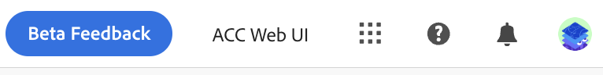

# Discover the interface {#user-interface}

>[!CONTEXTUALHELP]
>id="acw_homepage_learnmore"
>title="Discover the interface"
>abstract="The new Campaign v8 Web interface offers an integrated, intuitive, and consistent user experience."

The new Campaign v8 Web interface offers a modern and intuitive user experience to simplify marketing campaign design and delivery. This new interface is integrated with Adobe Experience Platform. 

>[!NOTE]
>
>This documentation is frequently updated to reflect latest changes in the product user interface. However, some screenshots can slightly differ from your user interface.

## Left navigation menu {#user-interface-left-nav}

Browse the links on the left to access Campaign v8 Web capabilities. Several links display lists of objects which can be sorted and filtered. You can also configure columns to display all the information you need. See this [section](#list-screens). All list screens are read-only, except the email delivery list. Clicking on any list item for edition/viewing is not available in Alpha. All lists will be editable in future versions. The items displayed in the left navigation menu depend on your user permissions.

### Home {#user-interface-home}

This screen includes key links and resources for a quick access to the main Campaign v8 Web features. 

The **Recents** list provides shortcuts to the recently created and modified deliveries. This list shows their channel, status, owner, creation and modification dates.

Access Campaign v8 Web key help pages from the **Learning** section of the home page.

### Explorer {#user-interface-explorer} 

>[!CONTEXTUALHELP]
>id="acw_explorer"
>title="Explorer"
>abstract="The **Explorer** menu displays all Campaign components and objects with the same folder hierarchy as the one in the client console. Browse all your Campaign v8 components, folders and schemas, and create deliveries, workflows and campaigns. All other lists are read-only."

The **Explorer** menu displays all Campaign resources and objects with the same folder hierarchy as the one in the client console. Browse all your Campaign v8 components, folders and schemas, and create deliveries, workflows and campaigns. All other lists are read-only.

The items displayed in the Explorer depend on your user permissions. 

Like in any list screen, you can configure columns to personalize the display to view all the information you need. See this [section](#list-screens).

For more information about the Campaign explorer, folder hierarchy and resources, refer to this [Campaign v8 (console) documentation](https://experienceleague.adobe.com/docs/campaign/campaign-v8/new/campaign-ui.html#ac-explorer-ui){target="_blank"}.

### Campaign Management {#user-interface-campaign-management}

>[!CONTEXTUALHELP]
>id="acw_campaigns_list"
>title="Campaigns"
>abstract="This is the list of your campaigns. You can view useful information such as their start/end/last modification dates, as well as their status. You can filter the list by status or start/end dates. Click the 'Create campaign' button to add a new campaign. Select a campaign to view its content, deliveries, and details. Browse to the 'Templates' tab to view and create templates."

>[!CONTEXTUALHELP]
>id="acw_deliveries_list"
>title="Deliveries"
>abstract="Browse through your list of deliveries. You can view their status, contact and modification dates, key KPIs. You can filter the list by state, contact date or channel. Click the 'Create delivery' button to add a new delivery. Select a delivery to view its content, audience, and details."

In the CAMPAIGN MANAGEMENT section, you can access marketing campaigns, deliveries, and workflows.

* **Campaigns** - This is the list of your campaigns, and campaign templates. By default, for each campaign you can view the start/end/creation/last modification dates, the current status, and the name of the Campaign operator who created it. You can filter the list by status, start/end dates, folder, or create an advanced filter to define your own filtering criteria. Learn more about campaigns [in this section](../campaigns/gs-campaigns.md).

* **Deliveries** - Browse through your list of deliveries. By default, you can view their state, last modification date as well as key KPIs. You can filter the list by state, contact date or channel. Click an email delivery to open its dashboard to get an overview of the delivery details. Deliveries on other channels are read-only. Learn more about deliveries [in this section](../msg/gs-messages.md).

    Use the **More actions** button to delete or duplicate a delivery.

    {width="70%" align="left"}

* **Workflows** - In this screen, you can access the full list of workflows and workflow templates. You can check their status, last/next execution dates, and create a new workflow or a new workflow template. You can filter the list with the same criteria as for other objects. In addition, you can filter workflows which belong to a campaign, or not. Learn more about workflows [in this section](../workflows/gs-workflows.md).

### Customer Management {#user-interface-customer-management}

>[!CONTEXTUALHELP]
>id="acw_recipients_list"
>title="Recipients"
>abstract="Access your recipient database. You can view useful information such as their email address, first name and last name. This list is read-only."

>[!CONTEXTUALHELP]
>id="acw_audiences_list"
>title="Audiences"
>abstract="This is your list of audiences. You can view their type, origin, creation/last modification dates and label. You can filter the list by origin. This list is read-only."

>[!CONTEXTUALHELP]
>id="acw_subscriptions_list"
>title="Subscriptions lists"
>abstract="Browse through your subscriptions lists. You can view their type, mode and label. This list is read-only."

In the CUSTOMER MANAGEMENT section, you can view your recipients, audiences, and subscriptions. These lists are rea-only.

* **Recipients** - Access your recipient database. By default, you can view their email address, first name and last name. Learn more about recipients in [Adobe Campaign v8 (console) documentation](https://experienceleague.adobe.com/docs/campaign/campaign-v8/audience/gs-audiences.html){target="_blank"}.
* **Audiences** - This is your list of audiences. By default, you can view their type, origin, creation/last modification dates and label. You can filter the list by origin. Learn more about audiences and lists in [Adobe Campaign v8 (console) documentation](https://experienceleague.adobe.com/docs/campaign/campaign-v8/audience/create-audiences/create-audiences.html){target="_blank"}.
* **Subscriptions** - Browse through your subscriptions lists. By default, you can view their type, mode and label. Learn how to manage subscriptions and unsubscriptions in [Adobe Campaign v8 (console) documentation](https://experienceleague.adobe.com/docs/campaign/campaign-v8/campaigns/send/subscriptions.html){target="_blank"}. 

### Decision Management

>[!CONTEXTUALHELP]
>id="acw_offers_list"
>title="Offers"
>abstract="Browse through your list of Interaction offers. By default, you can view their status, start/end dates and environment. You can filter the list by state and start/end dates. Offer templates are also available. These lists are read-only."

* **Offers** - Browse through your list of Interaction offers. By default, you can view their status, start/end dates and environment. You can filter the list by state and start/end dates. Offer templates are also available. These lists are read-only. 

Learn how to create manage offers in [Adobe Campaign v8 (console) documentation](https://experienceleague.adobe.com/docs/campaign/campaign-v8/offers/interaction.html){target="_blank"}. 

## Top bar

Use the top bar of the interface to:

* share your feedback as an Alpha tester
* switch between organizations and instances
* switch between your Adobe Experience Cloud applications
* access help pages, contact support and share feedback. You can search help articles and videos from the search field.

{width="50%" align="left"}
<!--
Org / Sub-org switcher to switch between instances. Only one for Alpha. Later: intermerdiate screen with Control Panel (beta). if v8 + ACS with one card per ACS instance. Maybe quickly explain the menu for Alpha?
-->

## Contextual help {#contextual-help}

A contextual help is available in the interface. When available, click on the `?` icon to display help information and related documentation links. 

{width="40%" align="left"}

<!--An on-boarding guide is also available to help you get started with Campaign v8 Web. Click the icon in the bottom right corner, choose one of the available step-by-step scenarios, and simply follow the instructions.

{width="70%" align="left"}-->

## Supported browsers {#browsers}

Campaign v8 Web is designed to work optimally in the latest version of Google Chrome, Safari and Microsoft Edge. You might have trouble using certain features on older versions or other browsers.

## Language preferences {#language-pref}

Campaign v8 Web is currently available in the following languages:

<table>
<tr>
<td>

English (US) - EN-US

French - FR

German - DE

Italian - IT

</td>
<td>

Spanish - ES

Portuguese (Brazilian) - PTBR

Japanese - JP

</td>
<td>

Korean - KR

Simplified Chinese - CHS

Traditional Chinese - CHT

</td>
</tr>
</table>

Your default interface language is determined by the preferred language specified in your user profile.

To change your language:

1. Click on your profile icon, on the top right, then select **Preferences**.
1. Then click the language link displayed under your email address.
1. Select your preferred language and click **Save**. You can select a second language in case the component you are using is not localized in your first language.

<!--
######## This part stores the contextualHelp definition for WebUI BETA ###########
######## These blocks should be dispatched in the appropriate pages when available ###########
######## PLEASE DO NOT DELETE ###########
REFER TO 
https://wiki.corp.adobe.com/pages/viewpage.action?spaceKey=neolane&title=v8+WebUI+Contextual+Help+%3CALPHA%3E-+Official+list
-->

>[!CONTEXTUALHELP]
>id="acw_rulebuilder_advancedfields"
>title="Rule builder advanced fields"
>abstract="Configure columns with advanced fields."

>[!CONTEXTUALHELP]
>id="acw_rulebuilder_properties_advanced"
>title="Rule Builder Advanced attributes"
>abstract="Use an advanced attributes to define your rule."

>[!CONTEXTUALHELP]
>id="acw_deliveries_email_metrics_sent"
>title="Sent Metrics"
>abstract="Number of email delivered."

>[!CONTEXTUALHELP]
>id="acw_deliveries_email_metrics_errors"
>title="Errors Metrics"
>abstract="Number of emails with the error status."

>[!CONTEXTUALHELP]
>id="acw_email_preview_option_test_target"
>title="Test population"
>abstract="Select a test population mode."

>[!CONTEXTUALHELP]
>id="acw_email_preview_mode"
>title="Preview mode"
>abstract="Preview and test the message by including the test population to the main target."

>[!CONTEXTUALHELP]
>id="acw_targetdata_personalization_enrichmentdata"
>title="Enrichment data"
>abstract="TBD"

>[!CONTEXTUALHELP]
>id="acw_campaign_reporting_sending"
>title="Reporting Sending"
>abstract="Consult the sending indicators for the campaign reporting."

>[!CONTEXTUALHELP]
>id="acw_campaign_reporting_tracking"
>title="Reporting tracking"
>abstract="Consult the tracking indicators for the campaign reporting."

>[!CONTEXTUALHELP]
>id="acw_campaign_reporting_deliveries_overview"
>title="Reporting overview"
>abstract="Key metrics for your delivery."

>[!CONTEXTUALHELP]
>id="acw_campaign_reporting_deliveries_target"
>title="Reporting target statistics"
>abstract="This section displays specific metrics according to audiences."

>[!CONTEXTUALHELP]
>id="acw_campaign_reporting_deliveries_selection"
>title="Aggregated reporting for deliveries"
>abstract="Select at least two deliveries for displaying an aggregated data report."

>[!CONTEXTUALHELP]
>id="acw_orchestration_deduplication_fields"
>title="Deduplication fields"
>abstract="TBD"

>[!CONTEXTUALHELP]
>id="acw_orchestration_deduplication_settings"
>title="Deduplication settings"
>abstract="TBD"

>[!CONTEXTUALHELP]
>id="acw_orchestration_deduplication_complement"
>title="Deduplication complement"
>abstract="TBD"

>[!CONTEXTUALHELP]
>id="acw_orchestration_dimension_complement"
>title="Dimension complement"
>abstract="TBD"

>[!CONTEXTUALHELP]
>id="acw_push_permission_for_segment"
>title="Permission required"
>abstract="Your administrator must grant you permission before you can create a segment."

>[!CONTEXTUALHELP]
>id="acw_push_overview_edit"
>title="Permission required"
>abstract="Your administrator must grant you permission before you can create a segment."

>[!CONTEXTUALHELP]
>id="acw_deliveries_metrics_newquarantines"
>title="New quarantines metric"
>abstract="New quarantine metric."

>[!CONTEXTUALHELP]
>id="acw_keyindicators_delivered"
>title="Delivered"
>abstract="Delivered KPI"

>[!CONTEXTUALHELP]
>id="acw_keyindicators_opens"
>title="Opens"
>abstract="Opens KPI"

>[!CONTEXTUALHELP]
>id="acw_keyindicators_clicks"
>title="Clicks"
>abstract="Clicks KPI"

>[!CONTEXTUALHELP]
>id="acw_keyindicators_unsubscriptions"
>title="Unsubscriptions"
>abstract="Unsubscriptions KPI"

>[!CONTEXTUALHELP]
>id="acw_keyindicators_spam"
>title="Spam"
>abstract="Spam KPI"

>[!CONTEXTUALHELP]
>id="acw_keyindicators_errors"
>title="Errors"
>abstract="Errors KPI"
