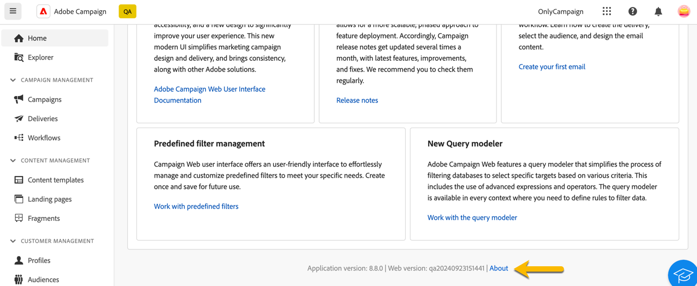

# Discover the interface {#user-interface}

The new Adobe Campaign Web interface provides a modern and intuitive user experience to simplify marketing campaign design and delivery. This interface integrates with Adobe Experience Cloud apps and solutions.

Learn how to connect to Adobe Campaign and explore Experience Cloud navigation basics [in this article](connect-to-campaign.md).

>[!NOTE]
>
>This documentation is frequently updated to reflect the latest changes in the product user interface. However, some screenshots may slightly differ from your user interface.

## Campaign home page {#user-interface-home}

>[!CONTEXTUALHELP]
>id="acw_homepage_recent"
>title="Recents"
>abstract="The **Recents** list provides shortcuts to the recently created and modified deliveries. This list shows their channel, status, owner, creation and modification dates."

The Campaign home page allows you to quickly and easily browse key resources, indicators, and components.

The upper section of the home page displays details about the latest updates and new capabilities available in the product, with links to Release Notes and detailed documentation. Use the left arrow to scroll through feature cards.

{zoomable="yes"}

The **Key performance indicators** section lets you check your platform's effectiveness through common KPIs. Learn more about these KPIs in [this page](../reporting/kpis.md).

The **Recents** list provides shortcuts to the recently created and modified deliveries. This list shows their channel, status, owner, creation, and modification dates. Click the **Show more** link to load additional deliveries.

Additionally, you can access Adobe Campaign Web key help pages from the **Learning** section of the page.

### About link {#user-interface-about}

>[!CONTEXTUALHELP]
>id="acw_about"
>title="About page"
>abstract="The About page provides details about your Adobe Campaign instance."

>[!CONTEXTUALHELP]
>id="acw_about_instance"
>title="About Instance"
>abstract="The Instance section provides key information about your console client, including both the version and the associated build number."

>[!CONTEXTUALHELP]
>id="acw_about_web"
>title="About Web"
>abstract="The Web section displays the version of your Campaign Web user interface, with the last update date of it, if available."

>[!CONTEXTUALHELP]
>id="acw_about_packages"
>title="About Installed Packages"
>abstract="The Installed packages section lists all the modules, features, and integrations present on your instance."

At the bottom of the page, the **[!UICONTROL About]** link provides details about your Adobe Campaign instance. These details are in read-only mode.

{zoomable="yes"}

The **Instance** section provides key information about your console client, including both the **version** and the associated **build** number.

* The **version** refers to the official release version you are using.
* The **build** refers to a specific iteration of that version.

Both version and build numbers are essential for troubleshooting, as they help determine the features and fixes present in your environment.

The **Web** section displays the version of your Campaign Web user interface, along with the last update date, if available. This helps track changes or improvements made to the Campaign Web user interface.

The **Installed packages** section lists all the modules, features, and integrations present on your instance. These packages extend Adobe Campaign's functionality, enabling specialized tasks such as integrating with other Adobe solutions or supporting specific workflows. Given the large number of packages, you can search within this section to quickly check if a particular module is installed on your instance.

{zoomable="yes"}

## Left navigation menu {#user-interface-left-nav}

Browse the links on the left to access Adobe Campaign Web capabilities. Several links display lists of objects that can be sorted and filtered. You can also configure columns to display all the information you need. See this [section](#list-screens). Some list screens are read-only. The items displayed in the left navigation menu and in the lists depend on your user permissions. Learn more about permissions in [this section](permissions.md).

### Explorer {#user-interface-explorer}

>[!CONTEXTUALHELP]
>id="acw_explorer"
>title="Explorer"
>abstract="The **Explorer** menu displays all Campaign components and objects with the same folder hierarchy as the one in the client console. Browse all your Campaign v8 components, folders, and schemas, check associated permissions, and create folders and sub-folders from this menu."

The **Explorer** menu displays all Campaign resources and objects with the same folder hierarchy as the one in the client console. Browse all your Campaign v8 components, folders, and schemas, and create deliveries, workflows, and campaigns.

The items displayed in the **Explorer** depend on your user permissions. You can also add folders and sub-folders if you have proper rights. Learn more about permissions in [this section](permissions.md).

You can configure columns to customize the display to view all the information you need. See this [section](#list-screens). You can also add folders and sub-folders, as detailed in [this section](permissions.md#folders).

For more information about the Campaign explorer, folder hierarchy, and resources, refer to this [Campaign v8 (console) documentation](https://experienceleague.adobe.com/docs/campaign/campaign-v8/new/campaign-ui.html#ac-explorer-ui){target="_blank"}.

### Campaign Management {#user-interface-campaign-management}

In the **Campaign management** section, you can access marketing campaigns, deliveries, and workflows.

* **Campaigns** - This is the list of your campaigns and campaign templates. By default, for each campaign, you can view the start, end, creation, and last modification dates, the current status, and the name of the Campaign operator who created it. You can filter the list by status, start/end dates, folder, or create an advanced filter to define your own filtering criteria. Learn more about campaigns [in this section](../campaigns/gs-campaigns.md).

* **Deliveries** - Browse through your list of deliveries. By default, you can view their state, last modification date, and key KPIs. You can filter the list by status, contact date, or channel. Click an email delivery to open its dashboard to get an overview of the delivery details. Deliveries on other channels are read-only. Learn more about deliveries [in this section](../msg/gs-messages.md).

    Use the **More actions** button to delete or duplicate a delivery.

    {zoomable="yes"}{width="70%" align="left"} [Screenshot showing the More actions button with options to delete or duplicate a delivery.]

* **Workflows** - In this screen, you can access the full list of workflows and workflow templates. You can check their status, last/next execution dates, and create a new workflow or a new workflow template. You can filter the list with the same criteria as for other objects. Additionally, you can filter workflows that belong to a campaign or not. Learn more about workflows [in this section](../workflows/gs-workflows.md).

### Content Management {#user-interface-content-management}

In the **Content management** section, you can view your content templates and fragments.

* **Content templates** - For an accelerated and improved design process, you can create standalone templates to easily reuse custom content across [!DNL Adobe Campaign]. Only available for emails, this functionality enables content-oriented users to work on standalone templates so that marketing users can reuse and adapt them inside their own email campaigns. Learn more in [this section](../content/create-email-templates.md).

* **Fragments** - A fragment is a reusable component that can be referenced in one or more deliveries across campaigns. When modifying a fragment, every content using it is updated. [Learn how to work with fragments](../content/fragments.md).

This functionality allows you to prebuild multiple custom content blocks that marketing users can use to quickly assemble email contents in an improved design process.

### Customer Management {#user-interface-customer-management}

In the **Customer management** section, you can view your profiles, audiences, and subscriptions. These lists are read-only.

* **Profiles** - Create and manage profiles, and access your recipient database. By default, you can view their email address, first name, and last name. Learn more about profiles in [this section](../audience/about-recipients.md).
* **Audiences** - This is your list of audiences. By default, you can view their type, origin, creation, last modification dates, and label. You can filter the list by origin. Learn more about audiences and lists in [this section](../audience/about-recipients.md).
* **Subscription services** - Browse through your subscription lists. By default, you can view their type, mode, and label. Learn how to manage subscriptions and unsubscriptions in [Adobe Campaign v8 (console) documentation](https://experienceleague.adobe.com/docs/campaign/campaign-v8/campaigns/send/subscriptions.html){target="_blank"}.
* **Predefined filters** - Predefined filters are custom filters created and saved to be available for future use. They can be used as shortcuts during any filtering operations with the query modeler, for example, when filtering a list of data or creating the audience of a delivery. Learn more in [this section](predefined-filters.md).

### Decision Management {#decision-management}

>[!CONTEXTUALHELP]
>id="acw_offers_list"
>title="Offers"
>abstract="Browse through the lists of offers and offer templates that have been created in the console using the **Interaction** module. These lists are read-only."
>additional-url="https://experienceleague.adobe.com/en/docs/campaign-web/v8/start/offers" text="Add offers to a delivery"

In the **Decision management** section, you can view the offers and offer templates. These lists are read-only.

* **Offers** - Browse through the list of offers and offer templates created in the console using the **Interaction** module. By default, you can view their status, start/end dates, and environment. You can filter the list by status and start/end dates. Offer templates are also available.

Learn how to create and send offers in emails and SMS in [this section](../msg/offers.md).

### Reporting {#left-nav-reporting}

* **Reports** - The **Report** entry offers a consolidated overall summary of traffic and engagement metrics for each channel within your Campaign environment. These reports consist of various widgets, each offering a distinct perspective on your campaign or delivery performance. Learn more in [this section](../reporting/global-reports.md).

### Administration {#left-nav-admin}

* **Audit trail** - The **Audit trail** entry provides users with full visibility into all modifications made to important entities within your instance, typically those that significantly impact the smooth operation of the instance. [Learn more](../reporting/audit-trail.md).

* **External accounts** - Create new external accounts using the Web User Interface to meet your specific needs and ensure seamless data transfers. [Learn more](../administration/external-account.md).

* **Schemas** - Custom fields are additional attributes added to the out-of-the-box schemas through the Adobe Campaign console. [Learn more](../administration/custom-fields.md).

<!--* **Delivery Alerting** - Delivery Alerting is an alert management system that enables groups of users to automatically receive email notifications with information on their delivery executions. [Learn more](../msg/delivery-alerting.md).-->

## Learn more {#learn-more}

Learn how to browse, search, and filter lists available in your Campaign environment [in this page](list-filters.md).

<!--CONTEXTUAL HELP TO DISPATCH IN DOCS ONCE FEATURE LIVE-->

>[!CONTEXTUALHELP]
>id="acw_orchestration_notification"
>title="Continuous delivery"
>abstract="Continuous delivery"
