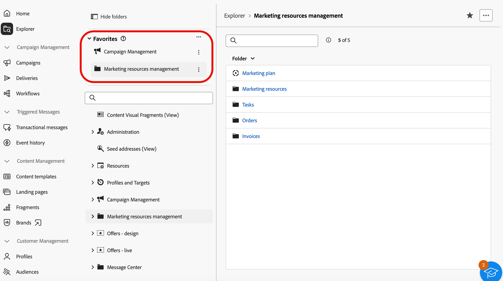
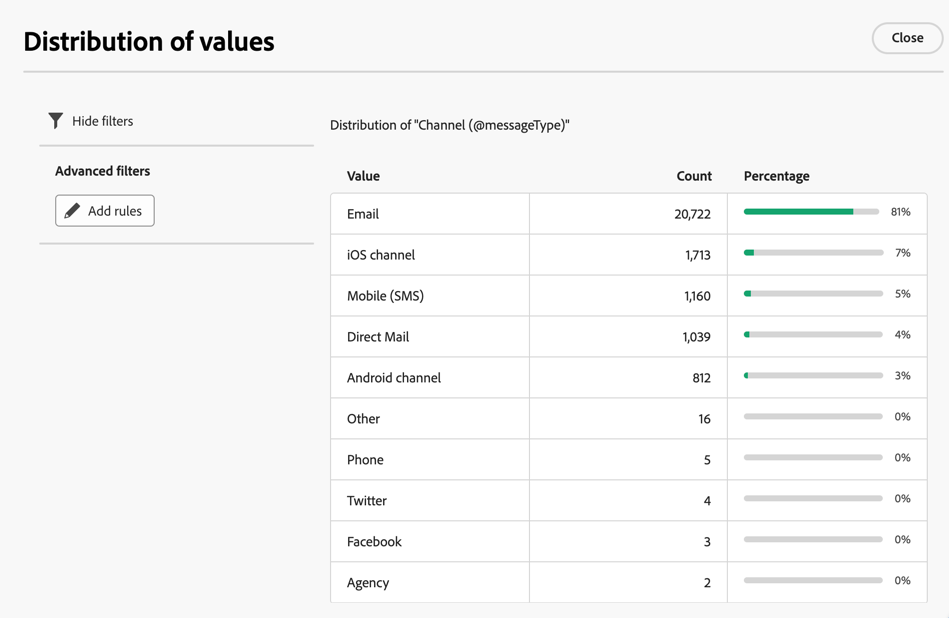

# Work with folders {#folders}

>[!CONTEXTUALHELP]
>id="acw_folder_properties"
>title="Folder properties"
>abstract="Folder properties"

>[!CONTEXTUALHELP]
>id="acw_folder_security"
>title="Folder security"
>abstract="Folder security"

>[!CONTEXTUALHELP]
>id="acw_folder_schedule"
>title="Folder schedule"
>abstract="Folder schedule"

## About folders {#about-folders}

Folders are objects in Adobe Campaign that allow you to organize your components and data.

You can create, rename, reorder, and move folders in the navigation tree. You can also delete them based on your rights.

{zoomable="yes"}

You can set up a folder type. For example, a folder of deliveries. The folder icon changes according to its type.

>[!CONTEXTUALHELP]
>id="acw_folder_restrictions"
>title="Folder restrictions"
>abstract="The folders Objects created automatically and Technical workflows are restricted, and cannot be viewed on the left side panel."

>[!IMPORTANT]
>
>The folders **[!UICONTROL Objects created automatically]** and **[!UICONTROL Technical workflows]** are restricted, and cannot be viewed on the left side panel. 

## Create a new folder {#create-a-folder}

To create a new folder in Adobe Campaign Web UI, follow these steps:

1. In **[!UICONTROL Explorer]**, go to the folder where you want to create your new folder. Under the **[!UICONTROL ...]** menu, select **[!UICONTROL Create new folder]**.

{zoomable="yes"}

When you create a new folder, the folder type defaults to the type of the parent folder. In this example, a folder is created in the **[!UICONTROL Deliveries]** folder.

{zoomable="yes"}

1. Change the folder type by clicking on the folder type icon if needed, and select the desired type from the list presented, as shown below:

{zoomable="yes"}

Set up the folder type by clicking the **[!UICONTROL Confirm]** button.

If you want to create a folder with no specific type, select the **[!UICONTROL Generic Folder]** type.

You can also [create and manage folders in Adobe Campaign console](https://experienceleague.adobe.com/en/docs/campaign/campaign-v8/config/configuration/folders-and-views).

## Reorder folders {#reorder-folders}

You can reorder folders based on your needs. To do so, click on **[!UICONTROL Reorder folders]**, as shown below.

In this example, the **Deliveries** folder contains four subfolders.

{zoomable="yes"}

You can change the order of folders either by **drag and drop** or by using **up and down arrows**.

{zoomable="yes"}

### Favorite folders {#favorite-folders}

>[!CONTEXTUALHELP]
>id="acw_folder_favorites"
>title="Favorites"
>abstract="Your favorite folders will be displayed at the top of the left tab."

The folders that have been marked as "Favorite" will always be shown at the top of the left tab.

You can add folders as favorite by clicking on the star button at the top-right corner when viewing a folder.

{zoomable="yes"}

## Delete a folder {#delete-a-folder}

>[!CAUTION]
>
>When deleting a folder, all data stored in the folder is also deleted.

To delete a folder, select it in your **[!UICONTROL Explorer]** tree, and click on the **[!UICONTROL ...]** menu. Choose **[!UICONTROL Delete folder]**.

{zoomable="yes"}

## Distribution of values in a folder {#distribution-values-folder}

The distribution of values helps you understand the percentage of a value in a column within a table.

To view the distribution of values in a folder, proceed as explained below.

For example, among the deliveries, you may want to know the distribution of values in the **Channel** column.

To get this information, go to the **[!UICONTROL Deliveries]** folder and click the **[!UICONTROL Configure columns]** icon.

In the **[!UICONTROL Configure columns]** window, click the **[!UICONTROL Information]** icon related to the column you want to analyze. Then, click on the **[!UICONTROL Distribution of values]** button.

{zoomable="yes"}

You will see the percentage of values in the **[!UICONTROL Channel]** column.

{zoomable="yes"}

>[!NOTE]
>
>For columns with many values, only the first twenty values are displayed. A notification **[!UICONTROL Partial load]** warns you.

You can also view the distribution of values for a link.

In the attributes list, click the **+** button next to the desired link, as shown below. This adds the link to the **[!UICONTROL Output columns]**. You can now access the **[!UICONTROL Information]** icon, allowing you to view the distribution of its values. If you do not want to keep the link in the **[!UICONTROL Output columns]**, click the **[!UICONTROL Cancel]** button.

{zoomable="yes"}

It is also possible to view the distribution of values in a query modeler. [Learn more here](../query/build-query.md#distribution-of-values-in-a-query).

### Filter the values {#filter-values}

By using the **[!UICONTROL Advanced filters]** in the distribution of values window, you can filter results based on specified conditions.

In the example of the delivery list above, which shows the distribution per channel, you can filter it to display only deliveries with a status of **Finished**.

{zoomable="yes"}