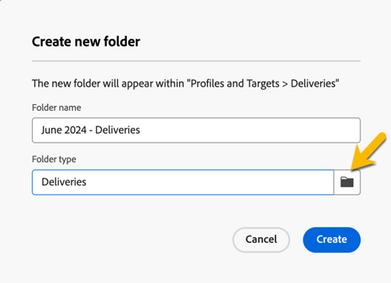

# Work with folders {#folders}

>[!CONTEXTUALHELP]
>id="acw_folder_properties"
>title="Folder properties"
>abstract="Folder properties"

>[!CONTEXTUALHELP]
>id="acw_folder_security"
>title="Folder security"
>abstract="Folder security"

>[!CONTEXTUALHELP]
>id="acw_folder_restrictions"
>title="Folder restrictions"
>abstract="Folder restrictions"

>[!CONTEXTUALHELP]
>id="acw_folder_schedule"
>title="Folder schedule"
>abstract="Folder schedule"

## About folders

Folders are objects in Adobe Campaign that allow you to organize your components and data.

You can create, rename, reorder, and move folders in the navigation tree. You can also delete them according to your rights. 

  {zoomable="yes"}

You can set up a folder type. For example: a folder of deliveries. 
The icon of the folder will change according to this type.

## Create a new folder

To create a new folder in Adobe Campaign Web UI, follow these steps: 

1. In **[!UICONTROL Explorer]**, go to the folder in which you want to create your new folder.
Under the **[!UICONTROL ...]** menu, You have **[!UICONTROL Create new folder]**

  {zoomable="yes"}

When you create a new folder, by default, the folder type is the type of the folder parent. 
In our example, we create a folder in the **[!UICONTROL Deliveries]** folder.

  {zoomable="yes"}

1. Change the type of your folder by clicking on the icon of Folder type if needed, and choose it in the list presented, as below: 

  {zoomable="yes"}

Set up the folder type by clicking on **[!UICONTROL Confirm]** button.

If you want to create a folder with no specific type, choose **[!UICONTROL Generic Folder]** type.

You can also [create and manage folders in Adobe Campaign console](https://experienceleague.adobe.com/en/docs/campaign/campaign-v8/config/configuration/folders-and-views).

## Reorder folders

You can reorder the folders according to your needs. To do so, click on the  **[!UICONTROL Reorder folders]** as shown below.

In our example, the folder **Deliveries** contains 4 folders.

{zoomable="yes"}

You can change the order of your folders either by **drag and drop**, or by using **up and down arrows**.

{zoomable="yes"}

## Delete a folder

>[!CAUTION]
>
>When deleting a folder, all data stored in the folder is also deleted.

To delete a folder, select it in your **[!UICONTROL Explorer]** tree, and click on the **[!UICONTROL ...]** menu. 
Choose **[!UICONTROL Delete folder]**.

{zoomable="yes"}

## Distribution of values in a folder {#distribution-values-folder}

The distribution of values helps to know the percentage of a value in a column within a table. 

To know the distribution of values in a folder, proceed as below :

For example, among the deliveries, we want to know the distribution of values of the **Channel** column.

To get this information, go to the **[!UICONTROL Deliveries]** folder and click on **[!UICONTROL Configure columns]** icon.

In the **[!UICONTROL Configure columns]** window, click on the **[!UICONTROL Information]** icon of the column you want to know. Then, click on the **[!UICONTROL Distribution of values]** button.

{zoomable="yes"}

You will get the percentage of the values in the **[!UICONTROL Channel]** column.

{zoomable="yes"}

>[!NOTE]
>
> For columns with many values, only the first twenty values will be displayed. A notification **[!UICONTROL Partial load]** will warn you.

You can also have the distribution of values of a link. 

In the attributes list, click the **+** button next to the desired link, as shown below. This adds the link to the **[!UICONTROL Output columns]**. You can have now the **[!UICONTROL Information]** icon, allowing you to view the distribution of its values. If you do not want to keep the link in the **[!UICONTROL Output columns]**, make sure to click on the **[!UICONTROL Cancel]** button.

{zoomable="yes"}

It is also possible to have the distribution of values in a query modeler. [Learn more here](../query/build-query.md#distribution-of-values-in-a-query).
