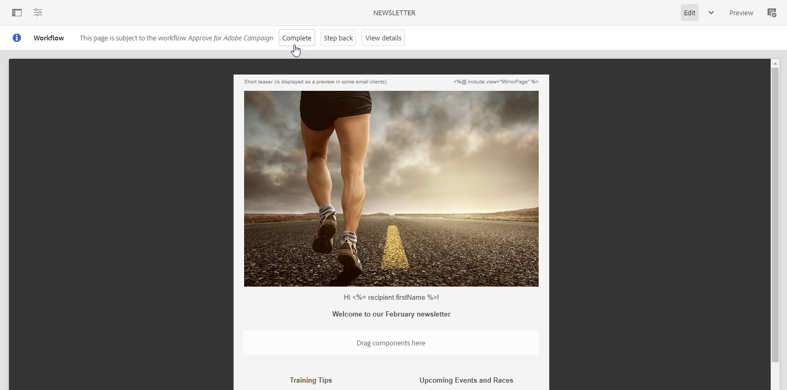
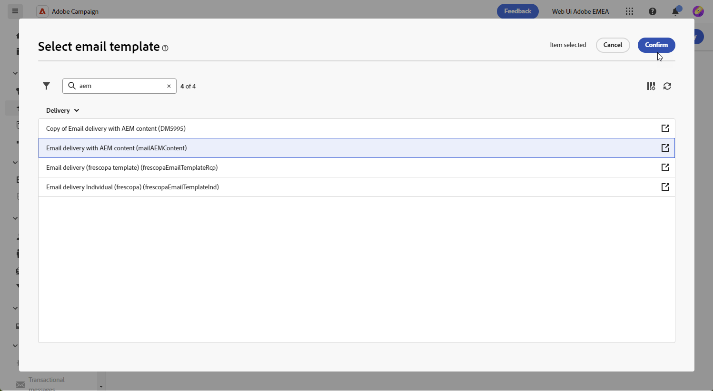

# Manage templates with [!DNL Adobe Experience Manager as a Cloud Service]{#aem-assets}

## Get started with [!DNL Adobe Experience Manager as a Cloud Service]{#create-aem}

The integration of the Adobe Campaign Web interface with Adobe Experience Manager enables streamlined management of email delivery content and forms directly within the Adobe Experience Manager platform.

[Learn more on Adobe Experience Manager as a Cloud Service](https://experienceleague.adobe.com/docs/experience-manager-cloud-service/content/sites/authoring/getting-started/quick-start.html?lang=en)

## Create a template in [!DNL Adobe Experience Manager as a Cloud Service]{#create-aem-template}

1. Navigate to your [!DNL Adobe Experience Manager] author instance, and click Adobe Experience at the upper left corner of the page. Choose **[!UICONTROL Sites]** from the menu.

1. Access **[!UICONTROL Campaigns > Name of your brand > Main Area > Name of your page]**.

1. Click **[!UICONTROL Create]**, and select **[!UICONTROL Page]** from the dropdown menu.

    [Screenshot showing the "Create" button and "Page" option in the dropdown menu.]

1. Select the **[!UICONTROL Adobe Campaign Email]** template, and name your newsletter.

    [Screenshot showing the "Adobe Campaign Email" template selection and naming field.]

1. Customize your email content by adding components, such as personalization fields from Adobe Campaign. [Learn more](https://experienceleague.adobe.com/docs/experience-manager-65/content/sites/authoring/aem-adobe-campaign/campaign.html?lang=en#editing-email-content)

1. Once your email is ready, navigate to the **[!UICONTROL Page information]** menu, and click **[!UICONTROL Start workflow]**.

    [Screenshot showing the "Page information" menu and "Start workflow" option.]

1. From the first dropdown, select **[!UICONTROL Approve Adobe Campaign]** as the workflow model, and click **[!UICONTROL Start workflow]**.

1. A disclaimer will appear at the top of your page stating, `This page is subject to the workflow Approve for Adobe Campaign`. Click **[!UICONTROL Complete]** next to the disclaimer to confirm the review, and click **[!UICONTROL Ok]**.

    [Screenshot showing the disclaimer and "Complete" button.]

1. Click **[!UICONTROL Complete]** again, and select **[!UICONTROL Newsletter approval]** in the **[!UICONTROL Next Step]** dropdown.

Your newsletter is now ready and synchronized in Adobe Campaign.

## Import an Adobe Experience Manager as a Cloud Service template{#aem-templates-perso}

Once the Experience Manager template is available in Adobe Campaign Web as a content template, you can identify and incorporate the necessary content for the email, including personalization.

1. In Campaign Web, from the **[!UICONTROL Deliveries]** menu, click **[!UICONTROL Create delivery]**.

1. In the email template window, select the built-in **[!UICONTROL Email delivery with AEM content]** template.

    [Screenshot showing the "Email delivery with AEM content" template selection.]

1. Enter a **[!UICONTROL Label]** for the delivery, and configure additional options based on your needs:

    * **[!UICONTROL Internal name]**: Assign a unique identifier to the delivery.
    * **[!UICONTROL Folder]**: Store the delivery in a specific folder.
    * **[!UICONTROL Delivery code]**: Use this field to organize your deliveries based on your own naming convention.
    * **[!UICONTROL Description]**: Specify a description for the delivery.
    * **[!UICONTROL Nature]**: Specify the nature of the email for classification purposes.

1. Define an **[!UICONTROL Audience]** for your email. [Learn more](../email/create-email.md#define-audience)

1. Click **[!UICONTROL Edit content]**.

1. From the **[!UICONTROL Edit content]** menu, click **[!UICONTROL Select AEM content]**.

    [Screenshot showing the "Select AEM content" option in the "Edit content" menu.]

1. Browse through your AEM template, and select the one to import to Campaign Web.

    [Screenshot showing the AEM template selection interface.]

1. Note that content is not automatically synchronized. If changes are made to your templates directly in Adobe Experience Manager, select **[!UICONTROL Refresh AEM content]** to update to the latest version of your template.

1. To remove linkage between Experience Manager and Campaign, or to further personalize your Experience Manager template in the Email designer, click **[!UICONTROL Unlink AEM content]**.

    [Screenshot showing the "Unlink AEM content" option.]

1. If you added personalized content to your Experience Manager template, click **[!UICONTROL Simulate Content]** to preview how it will appear in the message using test profiles.

    [Learn more on preview and test profiles](../preview-test/preview-content.md)

1. When viewing the message preview, any personalized elements are automatically replaced with the corresponding data from the selected test profile. 

    If needed, add additional test profiles through the **[!UICONTROL Manage test profiles]** button.

Your delivery is now ready to be sent.