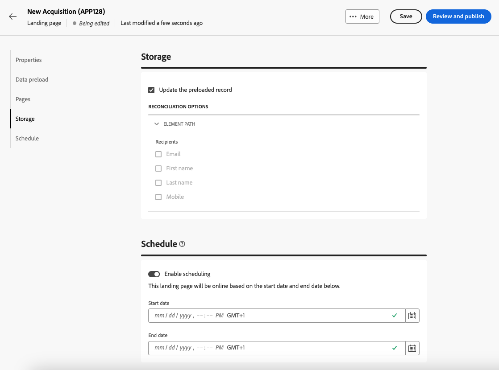
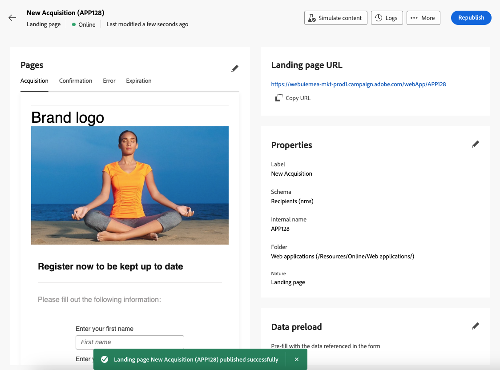

# Create and publish landing pages {#create-lp}

>[!CONTEXTUALHELP]
>id="acw_landingpages_menu"
>title="Create and manage landing pages"
>abstract="Adobe Campaign allows you to create and design landing pages to direct your users to online forms where they can opt in or opt out from receiving your communications, or subscribe to a specific service such as a newsletter."

To direct your customers to a defined web page that you want to display when they click a specific link, create a landing page in [!DNL Adobe Campaign], design its content, test it and publish it.

## Access landing pages {#access-landing-pages}

To access the landing page list, select **[!UICONTROL Campaign management]** > **[!UICONTROL Landing pages]** from the left menu.

The **[!UICONTROL Landing pages]** inventory displays all the created items. You can filter them using the **Show filters** button. You can restrict the results to a specific [folder](../get-started/permissions.md#folders) using the drop-down list, or add rules using the [query modeler](../query/query-modeler-overview.md).

<!--From this list, you can access the [landing page Live report](../reports/lp-report-live.md) or [landing page Global report](../reports/lp-report-global.md) for published items.-->

>[!NOTE]
>
>You cannot display landing pages created from the client console in Campaign Web. Learn more in the [Campaign console documentation](https://experienceleague.adobe.com/docs/campaign/campaign-v8/content/webapps.html){target="_blank"}.

<!--If you unpublish a landing page which is referenced in a message, the link to the landing page will be broken and an error page will be displayed. You cannot delete a published landing page. To delete it, you must first unpublish it.-->

You can duplicate or delete a landing page. Click the three dots next to a landing page to select the desired action.

## Create a landing page {#create-landing-page}

>[!CONTEXTUALHELP]
>id="acw_landingpages_properties"
>title="Define the landing page properties"
>abstract="Fill in the properties fields such as the label and modify the schema if needed. Additionally, you can edit the internal name, change the folder where the landing page is stored, and provide a description."

>[!CONTEXTUALHELP]
>id="acw_landingpages_pages_list"
>title="Define the pages' content"
>abstract="Edit the content of each page that is part of this landing page."

>[!CONTEXTUALHELP]
>id="acw_landingpages_schedule"
>title="Schedule your landing page"
>abstract="You can define a start date and an end date for your landing page. When the page is expired, the **Expiration** page is displayed."

>[!CONTEXTUALHELP]
>id="acw_landingpages_primarypage"
>title="Define the primary page settings"
>abstract="The primary page is immediately displayed to the users after they click the link to your landing page, such as from an email or a website."

>[!CONTEXTUALHELP]
>id="acw_landingpages_subscription"
>title="Set your subscription landing page"
>abstract="A subscription page allows your customers to subscribe to a service."

<!--The main steps to create landing pages are as follows:

-->

1. From the **[!UICONTROL Landing pages]** inventory, click **[!UICONTROL Create landing page]**.

    

1. Select a template:
    * **[!UICONTROL Acquisition]**: This is the default template for landing pages, which enables you to capture and update profile data.
    * **[!UICONTROL Subscription]**: Use this template to offer subscriptions to a service.
    * **[!UICONTROL Unsubscription]**: This template can be linked from an email sent to subscribers to a service, to allow them to unsubscribe from this service.
    * **[!UICONTROL Denylist]**: This template should be used when a profile no longer wants to be contacted by Campaign. Learn more about denylist management

    

1. Click **[!UICONTROL Create]**.

1. Fill in the properties fields such as the label. By default, landing pages are stored in the **[!UICONTROL Web applications]** folder. You can change it by browsing to the desired location in the **[!UICONTROL Additional options]**. [Learn how to work with folders](../get-started/permissions.md#folders)

    

1. In the **[!UICONTROL Data preload]** section, the two options below are selected by default:

    * The **[!UICONTROL Pre-fill with the data referenced in the form]** option lets you automatically preload the data that matches input and merge fields in the form.

    * The **[!UICONTROL Skip preloading if no ID]** option must be selected if you do not wish to update profiles. In this case, each profile entered will be added to the database after approval of the form. This option is used, for example, when the form is posted on a website.

1. In the **[!UICONTROL Pages]** section, click the **[!UICONTROL Edit content]** button for each page that you want to design for this landing page. The content of each page is already pre-filled. Edit them as needed. [Learn more](lp-content.md)

    

1. The **[!UICONTROL Update the preloaded record]** is selected by default. If you wish to update the profiles stored in the database via the landing page, you can use a preloading box. The preloading box lets you indicate how to find the record to be updated in the database. You can also choose from the fields in the current context of the landing page, those that will be used to find the corresponding profile in the database.

    

1. You can define a start date and an end date for your landing page. Select **[!UICONTROL Enable scheduling]** and set the dates. When the page is expired, the **[!UICONTROL Expiration]** page is displayed.

1. Click **[!UICONTROL Review and publish]**.

Once you configured and designed all the pages, you can [test](#test-landing-page) and [publish](#publish-landing-page) your landing page.

## Test the landing page {#test-landing-page}

>[!CONTEXTUALHELP]
>id="acw_landingpages_simulate"
>title="Simulate your landing page"
>abstract="You can see a preview of your landing page in the Campaign Web user interface or open it in a new web browser tab."

>[!CONTEXTUALHELP]
>id="ac_preview_lp_profiles"
>title="Preview and test your landing page"
>abstract="Once you defined your landing page settings and content, you can use test profiles to preview it."

Once your landing page settings and content have been defined, you can use test profiles to preview it. If you inserted [personalized content](../personalization/gs-personalization.md), you will be able to check how this content is displayed in the landing page, using test profile data.

>[!CAUTION]
>
>You must have test profiles available to be able to preview your messages and send proofs. Learn how to [create test profiles](../audience/test-profiles.md).

1. From the landing page interface, click the **[!UICONTROL Simulate content]** button to access the test profile selection.

    

1. From the **[!UICONTROL Simulate]** screen, select one or more test profiles.

    The steps to select test profiles are the same as when testing a message. They are detailed in the [Preview and test](../preview-test/preview-test.md) section.

1. Select **[!UICONTROL Open preview]** to test your landing page.

    

1. The preview of your landing page opens in a new tab. Personalized elements are replaced by the selected test profile data.

    

1. Select other test profiles to preview the rendering for each variant of your landing page.

<!--Can you preview Confirmation/Error/Expiration pages?-->

## Publish the landing page {#publish-landing-page}

Once your landing page is ready, you can publish it to make it available for use in a message.

Once your landing page is published, it is added to the landing page list with the **[!UICONTROL Published]** status. It is now live and ready to be used.

Once published, you can copy-paste the **[!UICONTROL Landing page URL]** that is displayed on top of the page into a web browser. 

You can monitor your landing page impacts through logs and specific reports.
