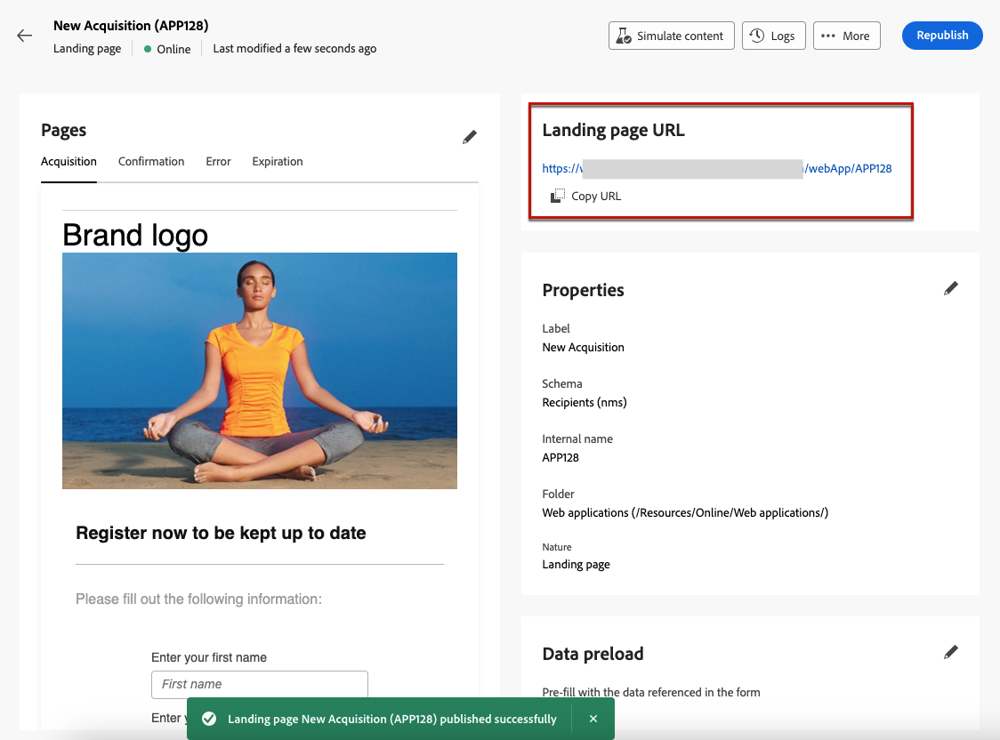

# Create and publish landing pages {#create-lp}

>[!CONTEXTUALHELP]
>id="acw_landingpages_menu"
>title="Create and manage landing pages"
>abstract="Adobe Campaign allows you to create, design, and share landing pages to direct your users to online web pages where you can manage acquisition, subscription/unsubscription and denylist use cases, based on built-in templates."

The Campaign Web user interface allows you to create, design, and publish landing pages. Once published, you can insert a link to your form in a delivery. After the recipients click that link, they are directed to the corresponding landing page.

[!DNL Adobe Campaign] comes with four templates to manage the following use cases: **acquisition**, **subscription**, **unsubscription**, and **denylist**. [Learn more](lp-use-cases.md)

## Access landing pages {#access-landing-pages}

To access the landing page list, select **[!UICONTROL Campaign management]** > **[!UICONTROL Landing pages]** from the left menu.

{zoomable="yes"}

The **[!UICONTROL Landing pages]** inventory displays all the created items. You can filter them using the **Show filters** button. You can restrict the results to a specific [folder](../get-started/permissions.md#folders) using the drop-down list, or add rules using the [query modeler](../query/query-modeler-overview.md).

{zoomable="yes"}

<!--From this list, you can access the [landing page Live report](../reports/lp-report-live.md) or [landing page Global report](../reports/lp-report-global.md) for published items.-->

>[!CAUTION]
>
>You cannot display or edit landing pages created from the client console (web forms) in the Campaign Web user interface. Learn more in the [Campaign console documentation](https://experienceleague.adobe.com/docs/campaign/campaign-v8/content/webapps.html){target="_blank"}.

<!--If you unpublish a landing page which is referenced in a message, the link to the landing page will be broken and an error page will be displayed. You cannot delete a published landing page. To delete it, you must first unpublish it.-->

You can duplicate or delete a landing page. Click the ellipsis next to a landing page to select the desired action.

## Create a landing page {#create-landing-page}

>[!CONTEXTUALHELP]
>id="acw_landingpages_properties"
>title="Define the landing page properties"
>abstract="Fill in the properties fields such as the label and modify the schema if needed. Additionally, you can edit the internal name, change the folder where the landing page is stored, and provide a description."

>[!CONTEXTUALHELP]
>id="acw_landingpages_pages_list"
>title="Define the content of each page"
>abstract="Adjust the content of each page that is part of this landing page, such as the form itself, the confirmation page that is displayed upon submitting the form, or the page users are directed to in case an error occurs."

>[!CONTEXTUALHELP]
>id="acw_landingpages_schedule"
>title="Schedule your landing page"
>abstract="You can define a start date and an end date for your landing page. When the page reaches the end of the validity period, the form is no longer available. The **Expiration** page is displayed instead."

>[!CONTEXTUALHELP]
>id="acw_landingpages_preload"
>title="Define pre-loading options"
>abstract="When the **Pre-fill with the data referenced in the form** option is selected, if the visitor of the landing page matches a profile from the database, the profile's information is automatically preloaded in the form. With the **Authorize absence of ID** option selected, any visitor, including anonymous users, can access the landing page."

<!--With the **Skip preloading if no ID** option selected, each profile entered will be added to the database after approval of the form."-->

>[!CONTEXTUALHELP]
>id="acw_landingpages_storage"
>title="Define storage options"
>abstract="The preloading section lets you indicate how to find the record to be updated in the database."

<!--The main steps to create landing pages are as follows:

{zoomable="yes"}-->

To create a landing page, follow these steps:

1. From the **[!UICONTROL Landing pages]** inventory, click **[!UICONTROL Create landing page]**.

    {zoomable="yes"}

1. Select a template:
    * **[!UICONTROL Acquisition]**: This is the default template for landing pages, which allows you to capture and update profile data.
    * **[!UICONTROL Subscription]**: Use this template to enable users to subscribe to a specific [service](../audience/manage-services.md).
    * **[!UICONTROL Unsubscription]**: This template can be used in a delivery sent to the subscribers of a service, to allow them to unsubscribe from this [service](../audience/manage-services.md).
    * **[!UICONTROL Denylist]**: This template should be used when a profile clicks on an opt-out link in a delivery, and no longer wants to be contacted.

    {zoomable="yes"}

    >[!NOTE]
    >
    >Learn how to implement the different use cases corresponding to each template in [this page](lp-use-cases.md).

1. Click **[!UICONTROL Create]**.

1. Fill in the **[!UICONTROL Properties]** fields such as the label.

    By default, landing pages are stored in the **[!UICONTROL Web applications]** folder. You can change it by browsing to the desired location in the **[!UICONTROL Additional options]**. [Learn how to work with folders](../get-started/permissions.md#folders)

    {zoomable="yes"}

1. In the **[!UICONTROL Data preload]** section, the two options below are available:

    * When the **[!UICONTROL Pre-fill with the data referenced in the form]** option is selected, if the visitor of the landing page matches a profile from the database, the profile's information is automatically preloaded in the form. The user just has to fill in the missing fields, and update the existing values if needed. This allows to merge data for existing profiles instead of creating duplicates.

        >[!NOTE]
        >
        >This option is selected by default for all landing page templates.

    <!--* The **[!UICONTROL Skip preloading if no ID]** option must be selected if you do not wish to update profiles. In this case, each profile entered will be added to the database after approval of the form. This option is used, for example, when the form is posted on a website.-->

    * The **[!UICONTROL Authorize absence of ID]** option allows any visitor to access the landing page. Unselecting this option prevents anonymous visitors to use it, meaning that only identified users can access and submit the form.

        >[!AVAILABILITY]
        >
        >This capability is in Limited Availability (LA). It is restricted to customers migrating **from Adobe Campaign Standard to Adobe Campaign v8**, and cannot be deployed on any other environment.
    
        For the **[!UICONTROL Acquisition]** and **[!UICONTROL Subscription]** templates, this option is selected by default. For the **[!UICONTROL Unsubscription]** and **[!UICONTROL Denylist]** templates, this option is unselected by default and cannot be modified<!--as per ticket - TBC? in that case, is it greyed out or doesn't display?-->.

1. A landing page can have subsequent pages. To add pages, browset the **[!UICONTROL Pages]** section, and click the **[!UICONTROL Edit content]** button for each page that you want to design for this landing page. The content of each page is already pre-filled. Edit them as needed. [Learn more](lp-content.md)

    {zoomable="yes"}

1. In the **[!UICONTROL Storage]** section, the **[!UICONTROL Update the preloaded record]** option is selected by default. It enables to update the profiles stored in the database via the landing page. The preloading box lets you indicate how to find the record to be updated in the database. 
    
    You can also choose from the fields in the current context of the landing page, those that will be used to find the corresponding profile in the database. To do so, unselect the **[!UICONTROL Update the preloaded record]** option and check the desired fields under **[!UICONTROL Reconciliation options]**.

    {zoomable="yes"}

1. Create **[!UICONTROL Additional data]** to store internal data when the landing page is being submitted. This data is not visible to users who visit the page. Only constant values are taken into account.

    >[!AVAILABILITY]
    >
    >This capability is in Limited Availability (LA). It is restricted to customers migrating **from Adobe Campaign Standard to Adobe Campaign v8**, and cannot be deployed on any other environment.

    {zoomable="yes"}

1. You can define a start date and an end date for your landing page. Select **[!UICONTROL Enable scheduling]** and set the dates.

    {zoomable="yes"}

    * The landing page is automatically published on the specified start date/time.

        >[!NOTE]
        >
        >If no start date is defined, the landing page becomes live as soon as it is published.

    * When the page reaches the end date, <!--the landing page is automatically unpublished and -->the form is no longer available. The **[!UICONTROL Expiration]** page is displayed instead.

        >[!NOTE]
        >
        >For security reasons and platform performances, Adobe recommends that you set an end date.

1. Click **[!UICONTROL Review and publish]**.

Once you defined all the settings and [designed](lp-content.md) all the pages, you can [test](#test-landing-page) and [publish](#publish-landing-page) your landing page as detailed below.

## Test the landing page {#test-landing-page}

>[!CONTEXTUALHELP]
>id="acw_landingpages_simulate"
>title="Simulate your landing page"
>abstract="You can see a preview of your landing page in the Campaign Web user interface or open it in a new web browser tab."

>[!CONTEXTUALHELP]
>id="ac_preview_lp_profiles"
>title="Preview and test your landing page"
>abstract="Once you defined your landing page settings and content, you can use test profiles to preview it."

Once your landing page settings and content have been defined, you can use test profiles to preview it. If you inserted [personalized content](../personalization/gs-personalization.md), you will be able to check how this content is displayed in the landing page, using test profile data.

>[!CAUTION]
>
>You must have test profiles available to be able to preview your messages and send proofs. [Learn more on test profiles](../audience/test-profiles.md)

To test your landing page, follow these steps:

1. After you click **[!UICONTROL Review and publish]**, select the **[!UICONTROL Simulate content]** button from the landing page dashboard to access the test profile selection.

    {zoomable="yes"}

1. From the **[!UICONTROL Simulate]** screen, select one or more test profiles.

    The steps to select test profiles are the same as when testing a message. They are detailed in the [Preview and test](../preview-test/preview-test.md) section.

1. When testing a dynamic landing page (with the **[!UICONTROL Service from URL]** option selected - [learn more](../landing-pages/create-lp.md#define-actions-on-form-submission)

1. Select **[!UICONTROL Open preview]** to test your landing page.

    {zoomable="yes"}

1. The preview of your landing page opens in a new tab. Personalized elements are replaced by the selected test profile data.

    If you selected the **[!UICONTROL Pre-fill with the data referenced in the form]** option in the landing page settings, the form fields are automatically pre-filled with the corresponding test profile data.<!--TBC-->

    {zoomable="yes"}

1. Select other test profiles to preview the rendering for each variant of your landing page.

<!--Can you preview Confirmation/Error/Expiration pages?-->

## Publish the landing page {#publish-landing-page}

Once your landing page is ready and validated, publish it to make it available for use in a delivery using the corresponding button.

Once published:

* The landing page is added to the landing page list with the **[!UICONTROL Published]** status. It is now live and ready to be referenced in your contents.

* You can copy-paste the **[!UICONTROL Landing page URL]** that is displayed on top of the page into a web browser to preview your landing page.

>[!CAUTION]
>
>To fully test or leverage your landing page, you cannot copy-paste this link directly into a web browser or into your deliveries. Instead, use the [Simulate content](#test-landing-page) function to test it, and follow the steps described in [this section](lp-use-cases.md) to make proper use of your landing page.

{zoomable="yes"}

You can monitor your landing page impacts through logs<!--and specific reports-->. Click the **[!UICONTROL Logs]** button.
