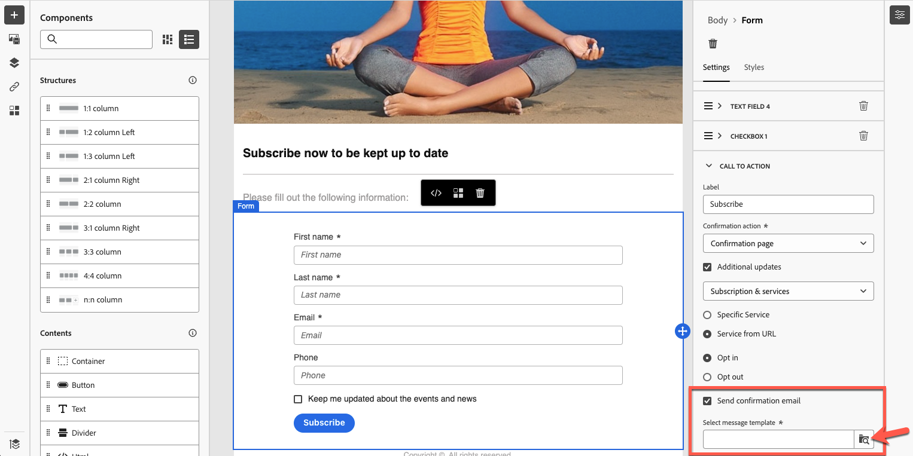

# Define landing page-specific content {#lp-content}

>[!CONTEXTUALHELP]
>id="ac_lp_components"
>title="Use content components"
>abstract="Content components are empty content placeholders that you can use to create the layout of a landing page. To define specific content that will enable users to select and submit their choices, use the form component."

>[!CONTEXTUALHELP]
>id="acw_landingpages_primarypage"
>title="Define the primary page settings"
>abstract="The primary page is immediately displayed to the users after they click the link to your landing page, such as from an email or a website."

You can edit the content of any page of your landing page.

The first page, which is immediately displayed to the users after they click the link to your landing page, is already pre-filled with the [landing page-specific form component](#use-form-component) for the selected template<!-- to enable users to select and submit their choices-->.

The content of the **[!UICONTROL Confirmation]**, **[!UICONTROL Error]** and **[!UICONTROL Expiration]** pages is also pre-filled. Edit them as needed.

You can also define [styles for your landing page](#lp-form-styles).

To further design your landing page content:

* You can use the same components as the ones used to design an email. [Learn more](../email/content-components.md#add-content-components)

* You can add conditional content to your landing pages, in the same way as you would do for an email. [Learn more](../personalization/conditions.md#condition-condition-builder)

    >[!AVAILABILITY]
    >
    >This capability is in Limited Availability (LA). It is restricted to customers migrating **from Adobe Campaign Standard to Adobe Campaign v8**, and cannot be deployed on any other environment.

## Use the form component {#use-form-component}

>[!CONTEXTUALHELP]
>id="ac_lp_formfield"
>title="Set the form component fields"
>abstract="Define how your recipients will see and submit their choices from your landing page."

>[!CONTEXTUALHELP]
>id="acw_landingpages_calltoaction"
>title="What happens when clicking the button"
>abstract="Define what will happen upon users submitting the landing page form."

To define specific content that will enable users to select and submit their choices from your landing page, edit the **[!UICONTROL Form]** component. To do so, follow the steps below.

1. The landing page-specific **[!UICONTROL Form]** component is already displayed in the canvas for the selected template.

    >[!NOTE]
    >
    >The **[!UICONTROL Form]** component can only be used once on the same page.

1. Select it. The **[!UICONTROL Form content]** tab displays in the right palette to let you edit the different fields of the form.

    {zoomable="yes"}

    >[!NOTE]
    >
    >Switch to the **[!UICONTROL Styles]** tab at any time to edit the styles of your form component content. [Learn more](#lp-form-styles)

1. Expand the first text field if any, or add one using the **[!UICONTROL Add]** button. From the **[!UICONTROL Text field 1]** section, you can edit the field type, the database field to be updated, the label, and the text that will be displayed inside the field before users enter a value.

    {zoomable="yes"}

1. Check the **[!UICONTROL Make form field mandatory]** option if needed. In that case, the landing page can only be submitted if the user has filled in this field.

    >[!NOTE]
    >
    >If a mandatory field is not filled in, an error message will display when the user submits the page.

1. Expand the checkbox if any, or add one using the **[!UICONTROL Add]** button. Select if that checkbox should update a service or a field from the database.

    {zoomable="yes"}

    If you select **[!UICONTROL Subscription & services]**, select a [service](../audience/manage-services.md) from the list, and choose between the two options below:

    * **[!UICONTROL Subscribe in if checked]**: Users need to check the box to consent (opt-in).
    * **[!UICONTROL Unsubscribe if checked]**: Users need to check the box to remove their consent (opt-out).

    If you select **[!UICONTROL Field]**, select a field from the attributes list, and choose between the two options below:

    * **[!UICONTROL Yes if checked]**.<!--TBC-->

    * **[!UICONTROL No if checked]**.<!--TBC-->

1. You can delete and add as many fields (such as text fields, radio buttons, checkboxes, dropdown list, etc.) as needed.

1. Once all the fields added or updated, click **[!UICONTROL Call to action]** to expand the corresponding section. It enables you to define the behavior of the button in the **[!UICONTROL Form]** component. [Learn how](#define-actions-on-form-submission)

    {zoomable="yes"}

1. Save your content to go back to the [landing page properties](create-lp.md#create-landing-page).

### Define actions on form submission {#define-actions-on-form-submission}

1. Define what will happen upon clicking the button:

    * **[!UICONTROL Confirmation page]**: By default, the user will be redirected to the **[!UICONTROL Confirmation]** page set for the current landing page.

    * **[!UICONTROL Redirect URL]**: Enter the URL of the page the users will be redirected to.

    * **[!UICONTROL Landing page]**: You can select another landing page for users to be redirected to. Make sure you configure the selected landing page accordingly.

1. If you want to make additional updates upon submitting the form, select **[!UICONTROL Additional updates]**, and select the item you want to update:
    * A subscription [service](../audience/manage-services.md) - in that case, define if you want to opt in or opt out users upon submitting the form. When designing an email, if you define a **[!UICONTROL Landing page]**-type link to this landing page, the selected service will be automatically used. [Learn more on inserting links](../email/message-tracking.md)

        >[!NOTE]
        >
        >If you want to use several services with this landing page, use the **[!UICONTROL Service from URL]** option described below.

    * The channel - the email addressed used when filling the form.
    * All channels - upon submitting the form, users will be opted in or out (depending on the selected template) to/from all communications from your brand on all channels.
    * A field from the database - select a field from the attributes list, and define if it should be set to True or False upon submitting the form.

    {zoomable="yes"}

1. Select the **[!UICONTROL Service from URL]** option to allow the landing page to be used for several services, making it dynamic. Define if you want to opt in or opt out users upon submitting the form.

    >[!AVAILABILITY]
    >
    >This capability is in Limited Availability (LA). It is restricted to customers migrating **from Adobe Campaign Standard to Adobe Campaign v8**, and cannot be deployed on any other environment.

    {zoomable="yes"}

    When designing an email, if you define a **[!UICONTROL Landing page]**-type link to this landing page, you will be able to select any service from the list. You can then select other services when defining other links to this landing page. [Learn more on inserting links](../email/message-tracking.md)

    {zoomable="yes"}

1. You can send a message on the submission of your landing page. To do this, follow these steps : 
    1. In the **[!UICONTROL CALL TO ACTION]** section, check the **[!UICONTROL Send confirmation email]** option.
    1. In the associated drop-down list, choose the transactional message template that needs to be sent out.

    {zoomable="yes"}

## Define landing page form styles {#lp-form-styles}

1. To modify the styles of your form component content, switch at any time to the **[!UICONTROL Styles]** tab.

1. The **[!UICONTROL Text field]** section is expanded by default. It enables you to edit the appearance of the text fields, such as the label font, the position of the label, the field background color, or the field border.

    {zoomable="yes"}

1. Expand the **[!UICONTROL Checkbox]** section to define the appearance of the checkboxes and corresponding text. For example, you can adjust the font family and size, or the checkbox border color.

    {zoomable="yes"}

1. Expand and edit any other section corresponding to other fields you may have added (radio button, dropdown list, date and time, etc.) to your form.

1. Expand the **[!UICONTROL Call to action]** section to modify the appearance of the button in the component form. For example, you can change the font, add a border, edit the label color on hover, or adjust the alignment of the button.

    {zoomable="yes"}

    You can preview some of your settings such as button label color on hover by using the **[!UICONTROL Simulate content]** button. [Learn more](create-lp.md#test-landing-page)

1. Save your changes.
