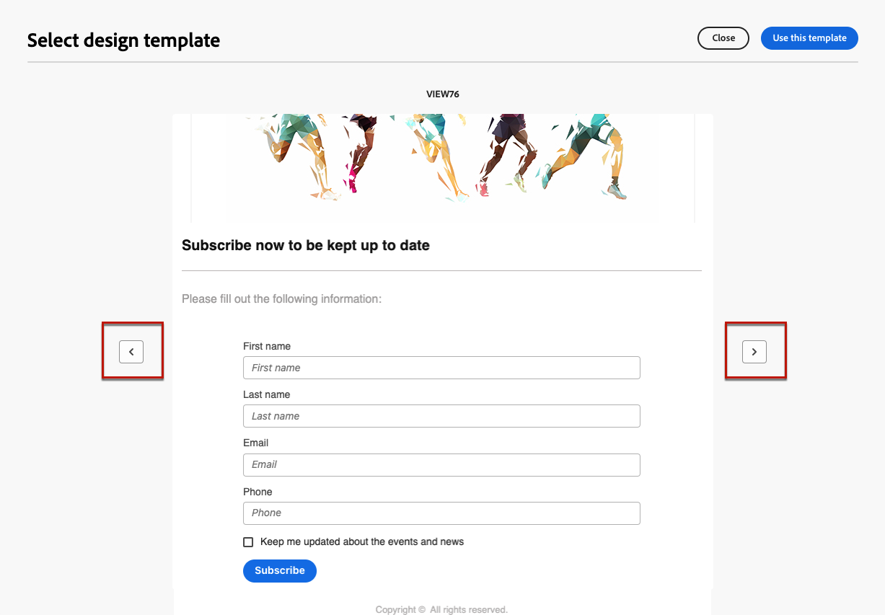

# Work with landing page content templates {#work-with-templates}

## Save a page as template {#save-as-template}

Once you design your [landing page content](lp-content.md), you can save it for future reuse. To save a page as a template, follow the steps below.

1. Click the **[!UICONTROL More]** button on the top right of the screen.

1. Select **[!UICONTROL Save as content template]** from the drop-down menu.

    {zoomable="yes"}

1. Add a name for this template.

1. Click **[!UICONTROL Save]**.

You can use this template to build your content the next time you create a landing page. Learn how in the [section](#use-saved-template) below.

{zoomable="yes"}

## Use a saved template {#use-saved-template}

<!--Not for GA?-->

1. When editing landing page content, click the **[!UICONTROL More]** button and select **[!UICONTROL Change your design]**.

    {zoomable="yes"}

1. Confirm your choice.

    >[!NOTE]
    >
    >This action deletes and replaces the current content with the content from the new template.

1. The list of all previously saved templates appears in the **[!UICONTROL Saved templates]** tab. You can sort them **[!UICONTROL By name]**, **[!UICONTROL Last modified]**, and **[!UICONTROL Last created]**.

    {zoomable="yes"}

1. Select the template of your choice from the list. Once selected, navigate between all saved templates using the right and left arrows.

    {zoomable="yes"}

1. Click **[!UICONTROL Use this template]**.

1. Edit your content as desired using the landing page designer.

<!--Primary page templates and subpage templates are managed separately, meaning that you cannot use a primary page template to create a subpage, and vice versa. TBC in Web user interface-->