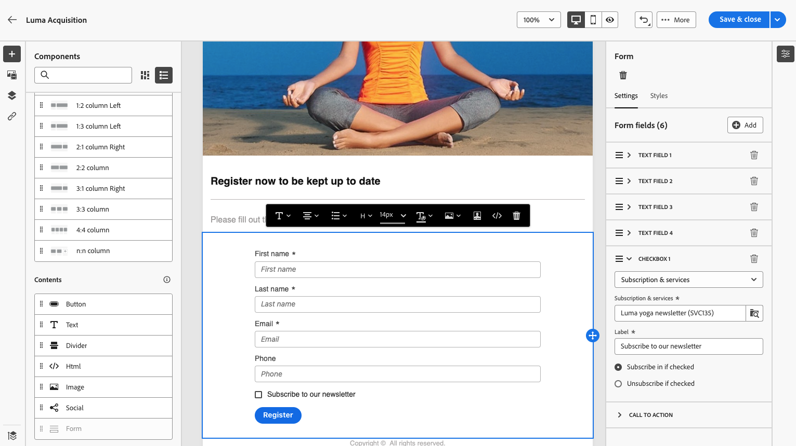
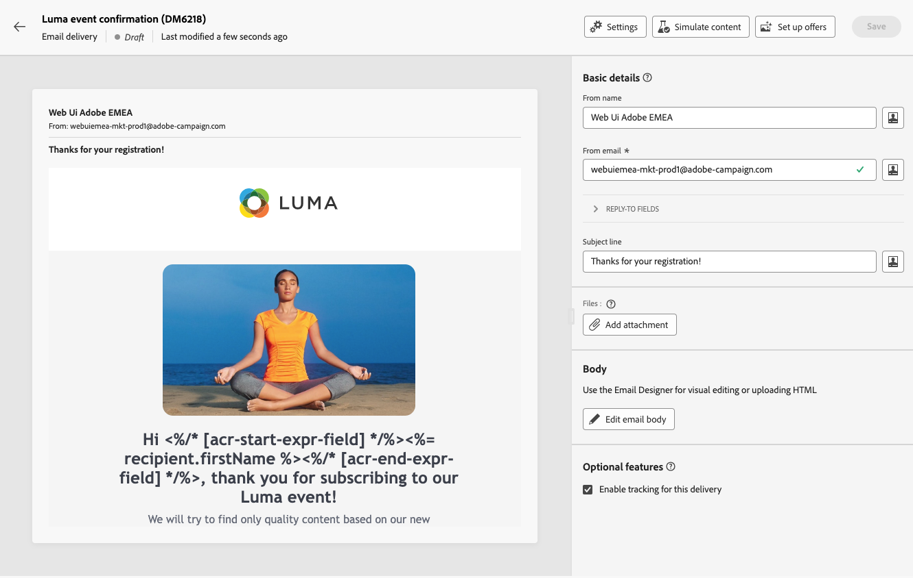

# How to use a landing page {#lp-use-cases}

>[!CONTEXTUALHELP]
>id="acw_landingpages_url"
>title="Copy URL with caution"
>abstract="To fully test or leverage your landing page, you cannot copy-paste this link directly into a web browser or into your deliveries. Instead, use the **Simulate content** function to test it, and follow the steps described in documentation to make proper use of your landing page."

To make proper use of your landing page, you should reference it as a link in a delivery using the dedicated option.

>[!CAUTION]
>
>To fully leverage your landing page, you cannot copy-paste the link displayed in the published delivery dashboard directly into your deliveries or into a web page.

In the [!DNL Adobe Campaign Web] inferface, four out-of-the-box templates allow you to implement different use cases. However, the main steps remain the same and are detailed below.

1. [Create a landing page](create-lp.md#create-landing-page) and select the template of your choice, according to your use case.

1. Define the landing page properties and settings.

    {zoomable="yes"}

1. According to your case, select the **[!UICONTROL Acquisition]**, **[!UICONTROL Subscription]**, **[!UICONTROL Unsubscription]** or **[!UICONTROL Denylist]** page.

1. The content of the page is displayed. Select the part corresponding to the landing page form.

    {zoomable="yes"}

1. Edit your content according to the selected template:

    * [Acquisition](#lp-acquisition)
    * [Subscription](#lp-subscription)
    * [Unsubscription](#lp-unsubscription)
    * [Denylist](#lp-denylist)

1. Modify the rest of your content as needed, save your changes and close.

1. Edit the **[!UICONTROL Confirmation]** page as needed, as well as the **[!UICONTROL Error]** and **[!UICONTROL Expiration]** pages. The **[!UICONTROL Confirmation]** page will be displayed to your recipients once they submit the form.

    {zoomable="yes"}

1. [Test](create-lp.md#test-landing-page) and [publish](create-lp.md#publish-landing-page) your landing page.

1. Create an [email](../email/create-email.md) delivery to drive traffic to the landing page.

1. [Insert a link](../email/message-tracking.md#insert-links) into your message content. Select **[!UICONTROL Landing page]** as the **[!UICONTROL Link type]** and choose the landing page that you created.

    {zoomable="yes"}

    >[!NOTE]
    >
    >To be able to send your message, make sure the landing page you select is not expired yet. [Learn more](create-lp.md#create-landing-page)

Once they receive the email, if your recipients click the link to the landing page and submit the form:

* They will be directed to the confirmation page.

* Any other action defined in your landing page will be applied. For example, users will be subscribed to your service, or they will not receive any more communications from you.

Below are some examples of how you can use [!DNL Adobe Campaign] landing pages in the different possible use cases.

## Profile acquisition {#lp-acquisition}

The first template enables you to add or update a profile to the Campaign database. 

1. When [creating your landing page](create-lp.md#create-landing-page), select the **[!UICONTROL Acquisition]** template.

1. In the landing page properties, make sure to select the **[!UICONTROL Pre-fill with the data referenced in the form]** option in order to preload any existing information from the profile and avoid creating duplicates.

1. Select the **[!UICONTROL Acquisition]** page to edit its content.

1. Edit the text fields as needed, according to the information you want to gather on your profiles.

1. Additionally, you can add a checkbox inviting your customers to subscribe to your newsletter service. [Learn how to create a service](../audience/manage-services.md)

    {zoomable="yes"}

1. Adjust your content as needed and save your changes.

1. Review and [publish](create-lp.md#publish-landing-page) your landing page.

1. Create an [email](../email/create-email.md) and [add a link](../email/message-tracking.md#insert-links) to your landing page.

Once they receive the email, if your recipients click the link to the landing page and submit the form, their profile will be added to the Campaign database, or updated with the information they provided.

{zoomable="yes"}

If they opted in to receive your newsletter, they will be subscribed to the corresponding service.

{zoomable="yes"}

## Subscription to a service {#lp-subscription}

One of the most common use cases consists in inviting your customers to [subscribe to a service](../audience/manage-services.md) (such as a newsletter or an event) through a landing page. Follow the steps below.

<!--For example, let's say you organize an event next month and you want to launch an event registration campaign. To do this, you're going to send an email including a link to a landing page that will enable your recipients to register for this event. The users who register will be added to the subscription list that you created for this purpose.-->

1. Start by creating a confirmation template for users subscribing to your event, so that you can select it easily when creating the service. [Learn more](../audience/manage-services.md#create-confirmation-message)

    {zoomable="yes"}

1. Create a subscription service, which will store the registered users to your event. [Learn how to create a service](../audience/manage-services.md)

1. Select the template that you created as the confirmation email the users will receive upon subscribing.

    {zoomable="yes"}

1. [Create a landing page](create-lp.md#create-landing-page) to enable your recipients to register for your event. Select the **[!UICONTROL Subscription]** template.

1. Select the **[!UICONTROL Subscription]** page to edit its content.

1. The content of the page is displayed. Select the part corresponding to the landing page form and expand the **[!UICONTROL Checkbox 1]** section.

1. In the **[!UICONTROL Subscriptions & services]** field, select the service that you created for your event. Leave the **[!UICONTROL Subscribe in if checked]** option enabled.

    {zoomable="yes"}
<!--
1. You can add an additional checkbox to offer subscription to your newsletter for example.-->

1. Adjust your content as needed and save your changes.

1. Review and [publish](create-lp.md#publish-landing-page) your landing page.

1. Create an [email](../email/create-email.md) and [add a link](../email/message-tracking.md#insert-links) to drive traffic to the registration landing page.

1. Design the email to announce that registration is now open for your event.

Once they receive the email, if your recipients click the link to the landing page, and submit the form, they will be directed to the confirmation page and they will be added to the subscription list.

## Unsubscription {#lp-unsubscription}

You can enable your customers to unsubscribe from a service using a landing page.

1. Make sure you have created a confirmation template for users unsubscribing from your service, so that you can select it easily when creating the service. [Learn more](../audience/manage-services.md#create-confirmation-message)

1. In your [subscription service](../audience/manage-services.md), select the template that you created as the confirmation email the users will receive upon unsubscribing.

1. [Create a landing page](create-lp.md#create-landing-page). Select the **[!UICONTROL Unsubscription]** template.

1. Select the **[!UICONTROL Unsubscription]** page to edit its content.

1. The content of the page is displayed. Select the part corresponding to the landing page form.

1. You can add a **[!UICONTROL Checkbox]** section, select the service and select the **[!UICONTROL Unsubscribe if checked]** option.

    {zoomable="yes"}

1. You can also expand the **[!UICONTROL Call to action]** section and select the **[!UICONTROL Additional updates]** option. Select the service and check the **[!UICONTROL Opt out]** option.

    {zoomable="yes"}

1. Adjust your content as needed and save your changes.

1. Review and [publish](create-lp.md#publish-landing-page) your landing page.

1. Create an [email](../email/create-email.md) and [add a link](../email/message-tracking.md#insert-links) to the landing page.

Once they receive the email, if your recipients click the link to the landing page, and submit the form, they will be directed to the unsubscription confirmation page and they will be removed from the corresponding subscription service.

## Denylist {#lp-denylist}

Providing the capability to recipients to unsubscribe from receiving communications from a brand is a legal requirement. Therefore, you must always include an **unsubscribe link** in every email sent out to recipients. Upon clicking this link, the recipients will be directed to a landing page including a button to confirm opting out.

You can set up a **[!UICONTROL Denylist]** landing page that will enable users to opt out from all deliveries.

1. When [creating your landing page](create-lp.md#create-landing-page), select the **[!UICONTROL Denylist]** template.

1. Select the **[!UICONTROL Denylist]** page to edit its content.

1. Expand the **[!UICONTROL Call to action]** section and select the **[!UICONTROL Additional updates]** option.

1. From the corresponding drop-down list, select **[!UICONTROL Channel (email)]** to enable your recipients to opt out from email communications only. You can also select **[!UICONTROL By all channel]** for opting them all from all communications on all channels.

    {zoomable="yes"}

1. Adjust your content as needed and save your changes.

1. Review and [publish](create-lp.md#publish-landing-page) your landing page.

1. Create an [email](../email/create-email.md) and [add a link](../email/message-tracking.md#insert-links) to your landing page in order to enable users to opt out from receiving communications.

Once they receive the email, if your recipients click the link to the landing page and submit the form, they will be directed to the denylist confirmation page and their profile will be updated with the information they provided.

To check that the corresponding profile's choice has been updated, browse to the **[!UICONTROL Profiles]** menu and select that profile.

For example, if you chose to update the **[!UICONTROL Channel (email)]** option in your landing page, the **[!UICONTROL No longer contact by email]** option will be checked.

{zoomable="yes"}

This profile will not receive email communications from your brand unless subscribed again.

