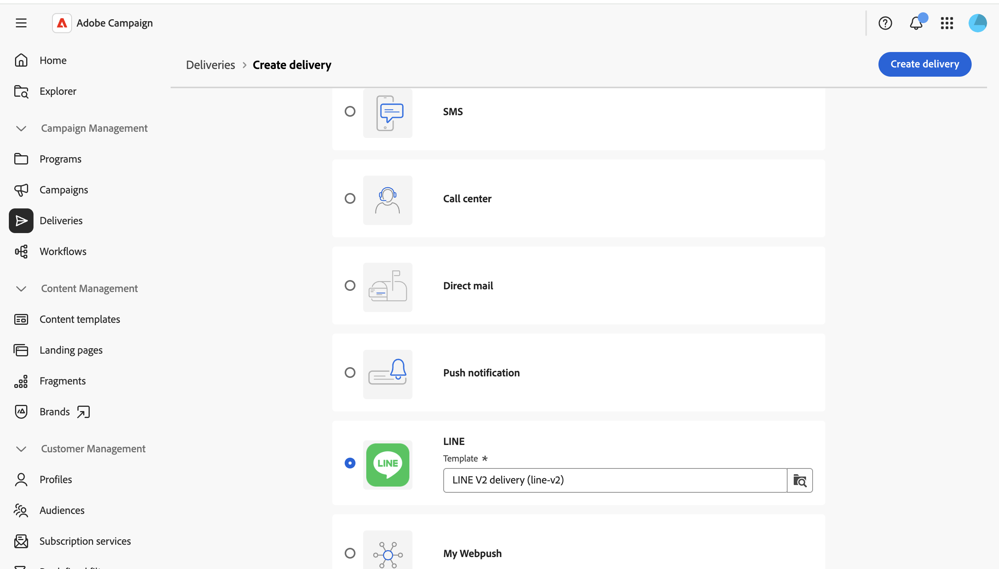
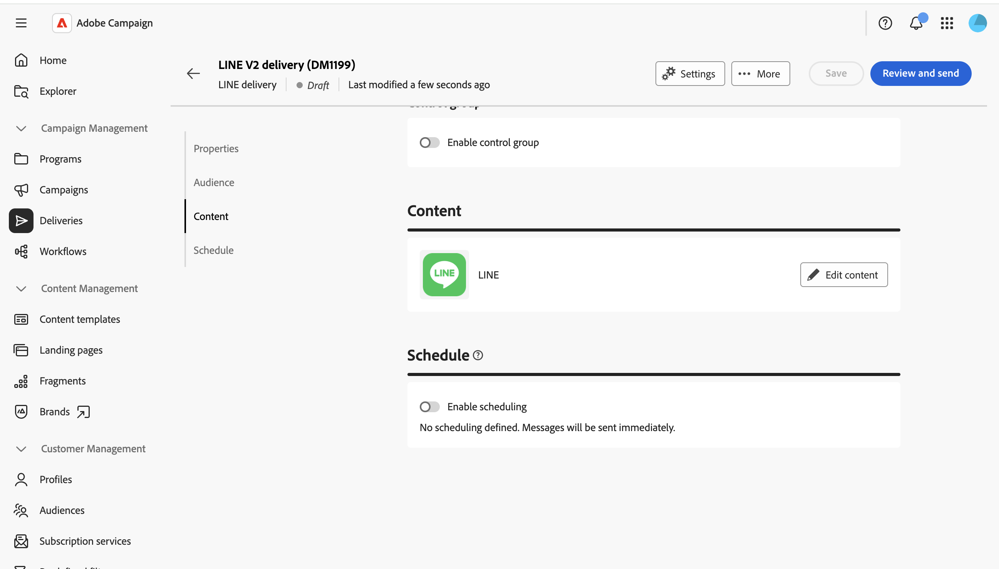
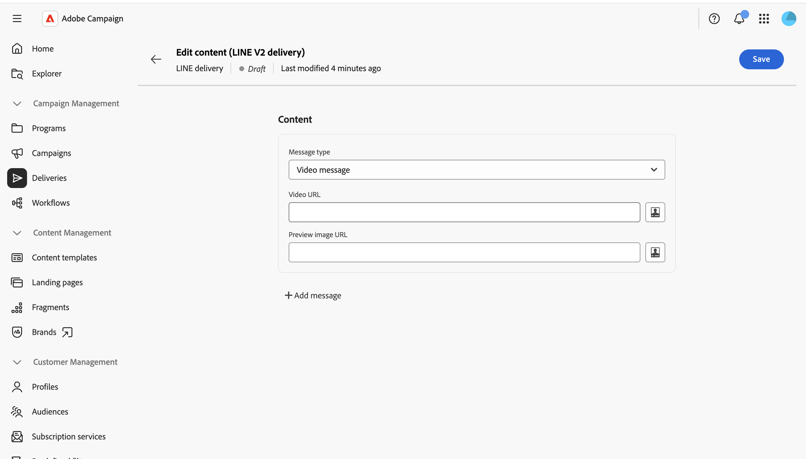

# Send a LINE message {#send-line}

You can create and send LINE messages to your subscribers, using text, image, or video content. LINE deliveries can be created as standalone deliveries or added to a workflow.

This page walks through creating a standalone LINE delivery, but the same steps apply when configuring a LINE channel activity in a workflow.

>[!IMPORTANT]
>
>Message preview is not currently supported for LINE deliveries. Review your content carefully in the editor before sending, since you cannot preview the rendered message beforehand.

## Create a LINE delivery {#create-line-delivery}

1. Browse to the **[!UICONTROL Deliveries]** menu, and click **[!UICONTROL Create delivery]**.

1. Choose **[!UICONTROL LINE]** and select a delivery template, such as the default **[!UICONTROL LINE V2 delivery]** template. [Learn more about templates](../msg/delivery-template.md).

   

1. Click **[!UICONTROL Create delivery]** to confirm and display the delivery configuration screen.

1. Enter a **[!UICONTROL Label]** for the delivery, and define additional or custom options, if needed. [Learn more](../push/create-push.md#configure-push-settings).

   

## Select the audience {#audience}

1. Click **[!UICONTROL Select audience]** to target an existing audience or build one. Targeting for LINE deliveries is based on **[!UICONTROL Visitor subscriptions]**. [Learn more about audiences](../audience/about-recipients.md).

1. Switch on the **[!UICONTROL Enable control group]** option to set a control group and measure the impact of your delivery. Messages are not sent to that control group, so you can compare the behavior of the population that received the message with the behavior of contacts that did not. [Learn more](../audience/control-group.md)

## Define the content {#content}

Click **[!UICONTROL Edit content]**. 

The LINE content editor displays. 

A LINE delivery can contain up to five messages. Click **[!UICONTROL Add message]** to add another message to the delivery, or **[!UICONTROL Remove message]** to delete one. 

You can use, when available, the personalization editor to insert dynamic content. [Learn more](../personalization/personalize.md).

Each message uses one of the following types.

>[!NOTE]
>
>Only image and video URLs are supported. Uploading a local file is not available, matching the behavior of the Client Console.

### Text message {#text-message}

A text message is a simple message sent in text form. Simply type the message in the related field and use personalization fields, if needed.

### Image message {#image-message}

An image message lets you send an image, optionally divided into clickable regions, each linking to a different URL.

* **[!UICONTROL Personalized image]**: define the image dynamically per recipient.
* **[!UICONTROL Image URL]**: provide the URL of your image. The recommended size is 1040 x 1040 px. Enable **[!UICONTROL Define images per device screen size]** to provide different image resolutions optimized for different screen sizes.
* **[!UICONTROL Alt text]**: mandatory alternative text, displayed if the image cannot be loaded.
* **[!UICONTROL Links]**: choose a layout to divide your image into one or more clickable regions, then assign a URL to each region.

### Video message {#video-message}

A video message lets you send a video to your recipients.

* **[!UICONTROL Video URL]**: the URL of your video. Only MP4 format is supported.
* **[!UICONTROL Preview image URL]**: the URL of an image displayed before the video is played.

## Schedule and send {#schedule-send}

1. After defining the content, click **Save** then click the back icon to return to the delivery configuration screen.

1. Enable **[!UICONTROL Enable scheduling]** to send on a specific date and time. [Learn more](../msg/create-deliveries.md#gs-schedule).

   

1. Once your content is ready, click **[!UICONTROL Review and send]**. This opens the delivery dashboard.

   

1. Click **[!UICONTROL Prepare]**, then confirm. If there are any errors, fix them and click **[!UICONTROL Prepare]** again.

1. Click **[!UICONTROL Send]**. You can then track results from the delivery **[!UICONTROL Reports]** and **[!UICONTROL Logs]** entry points.
