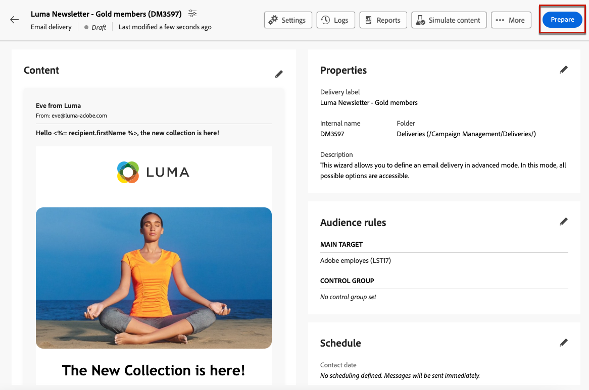

# Prepare and send your email {#prepare-send}

## Prepare the send {#prepare}

When you have defined your [content](../content/edit-content.md), [audience](../audience/add-audience.md) and schedule, you're ready to prepare your email delivery.

During the preparation, the target population is calculated and the message content generated for each profile included in the target. Once the preparation is finished, the messages are ready to be sent, either immediately or at the scheduled date and time. 

The validation rules used during delivery preparation are described in the [Campaign v8 (client console) documentation](https://experienceleague.adobe.com/docs/campaign/campaign-v8/campaigns/send/validate/delivery-analysis.html){target="_blank"}.

The main steps to prepare the send are listed below.

1. From the delivery dashboard, click **[!UICONTROL Review and send]**.

    

1. Click the **[!UICONTROL Prepare]** button located in the top right corner and confirm.

    

    >[!NOTE]
    >
    >If you scheduled your delivery and disabled the **[!UICONTROL Enable confirmation before sending]** option, the preparation and sending steps are grouped together under the **[!UICONTROL Prepare and send]** button. [Learn more on scheduling](../email/create-email.md#schedule)

1. The preparation progress is displayed. Depending on the size of the targeted population, this operation may take some time.

    You can stop the preparation at any time using the **[!UICONTROL Stop preparation]** button.

    

    >[!NOTE]
    >During the preparation phase, no messages are sent. You can therefore start or stop this without risk of impacting anything.

1. When the preparation is finished, check the KPIs. If the number of messages to send does not match your expectations, modify your audience and restart the preparation.

    
    
    Here are the different KPIs displayed:

    * **[!UICONTROL Targeted]**: the number of recipients targeted.
    * **[!UICONTROL To deliver]**: the number of messages that will be sent.
    * **[!UICONTROL To exclude]**: the number of messages excluded by a [typology rule](../advanced-settings/delivery-settings.md#typology).

1. Click the **[!UICONTROL Logs]** button and check that there is no error. The last log message displays any error messages and the number of errors. [Learn more](delivery-logs.md)

    

1. If the preparation detects a critical error preventing the delivery from being sent, the preparation status appears as failed in the delivery dashboard.

    

1. If you make any changes to your delivery after the preparation, you must restart the preparation for those changes to be taken into account. 

Once the preparation is complete with no error, your message is ready to be sent.

## Send the message {#send}

>[!CONTEXTUALHELP]
>id="acw_deliveries_email_metrics_delivered"
>title="Delivered"
>abstract="The number of messages successfully delivered. This indicator is updated every 5 minutes. The percentage displayed is based on the total number of sent messages."

>[!CONTEXTUALHELP]
>id="acw_deliveries_email_metrics_opens"
>title="Opens"
>abstract="The number of opened messages. This indicator is updated every 5 minutes. The percentage displayed is the ratio of the number of distinct opens compared with the number of delivered messages."

>[!CONTEXTUALHELP]
>id="acw_deliveries_email_metrics_clicks"
>title="Clicks"
>abstract="The number of recipient who clicked at least once in the email. This indicator is updated every 5 minutes. The percentage displayed is the ratio of the number of distinct clicks compared with the number of delivered messages."

Once the [preparation](#prepare) is complete, you can now send your email.

If the message is scheduled, it will be sent at the defined date and time. [Learn more](#schedule-the-send)

### Send immediately {#send-immediately}

To immediately send an email, follow the steps below.

1. From the delivery dashboard, click the **[!UICONTROL Send]** button in the top right corner.

    

1. Confirm this action to immediately send the message to the main target.

1. The sending progress is displayed.

### Schedule the send {#schedule-the-send}

If you scheduled your email to send it at a later date and time, follow the steps below.

1. Before you hit the **[!UICONTROL Review and send]** button, make sure you defined a schedule for your email. [Learn more](../email/create-email.md#schedule)

1. From the delivery dashboard, click the **[!UICONTROL Send as scheduled button]** button in the top right corner.

    

1. Click **[!UICONTROL Confirm sending]**. The delivery will be sent on the scheduled date to the main target.

    >[!NOTE]
    >
    >If you disabled the **[!UICONTROL Enable confirmation before sending]** option, the preparation and sending steps are grouped together under the **[!UICONTROL Prepare and send]** button. [Learn more on scheduling](../email/create-email.md#schedule)

## Pause or stop the sending {#pause-stop-sending}

Whether your delivery is scheduled or not, two actions can be performed at any time during the sending process:

* Click **[!UICONTROL Pause sending]** to interrupt the sending of the messages. You can resume sending at any time.

* Click **[!UICONTROL Stop sending]** to immediately interrupt sending. Neither preparation nor sending can be resumed once stopped.

## Check the KPIs {#check-kpis}

>[!CONTEXTUALHELP]
>id="acw_deliveries_email_metrics_sent"
>title="Sent Metrics"
>abstract="Total number of messages processed during the delivery analysis."

>[!CONTEXTUALHELP]
>id="acw_deliveries_email_metrics_errors"
>title="Errors Metrics"
>abstract="Total of errors cumulated during delivery and automatic return processing in relation to the total number of sent messages."

Once the send is complete, you can check the KPIs displayed:

* **[!UICONTROL Sent]**: the number of messages delivered. The percentage displayed is based on the total number of messages to deliver.

* **[!UICONTROL Delivered]**: the number of messages successfully delivered. The percentage displayed is based on the total number of sent messages.

* **[!UICONTROL Opens]**: the number of opened messages. The percentage displayed is the number of distinct opens compared with the number of delivered messages.

* **[!UICONTROL Clicks]**: the number of recipients who clicked at least once in the email. The percentage displayed is the number of distinct clicks compared with the number of delivered messages.

* **[!UICONTROL Errors]**: the number of emails with the error status. The percentage displayed is based on the total number of sent messages.

>[!NOTE]
>
>All the indicators are updated every 5 minutes after the delivery start. The delivery preparation indicators are real-time.

You can also check the logs. [Learn more](delivery-logs.md)