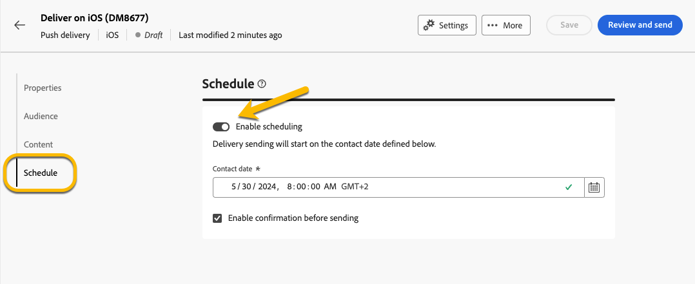

# Schedule the sending of a delivery {#schedule-sending}

You can schedule the sending of a delivery. The steps for this will depend on whether it is a standalone (one-shot) delivery, or if you are working in the context of a campaign workflow.

## Standalone delivery

For standalone deliveries, you can schedule directly the date and time in the delivery.
See below examples for each type of delivery : email, sms, push notification.

### Email {#schedule-email-standalone}

For an email delivery, follow the steps below :

1. In the **[!UICONTROL Schedule]** section of your delivery properties, click on the **[!UICONTROL Enable scheduling]** toggle to activate it

2. Set the desired date and time for sending, and click on **[!UICONTROL Review and send]** button.

    {zoomable="yes"}

>[!NOTE]
By default, the **[!UICONTROL Enable confirmation before sending]** option is enabled. This option requires you to confirm the sending before the delivery is sent at the scheduled date and time. If you need to **send the delivery automatically** on the scheduled date and time, you need to disable this option.

3. You can check that the schedule is taken into account in the new window, and you can click on **[!UICONTROL Prepare]** button. The delivery will be sent on the scheduled date to the main target.

{zoomable="yes"}

4. The new window will display a **[!UICONTROL Send as scheduled]** button. By clicking on this button, you allow the delivery to be sent on the scheduled date and time to the main target.

{zoomable="yes"}

### Sms

To schedule your sms delivery to a specific date and time, the steps are the same as for email deliveries, [see above](#schedule-email-standalone).

{zoomable="yes"}

You can also check that the schedule is taken into account :

{zoomable="yes"}

### Push notification

To schedule a standalone push delivery to a specific date and time, the steps are the same as for email deliveries, [see above](#schedule-email-standalone).

{zoomable="yes"}

You can also check that the schedule is taken into account : 

{zoomable="yes"}

### Standalone delivery in a campaign

You can create a standalone delivery within a campaign without using a workflow. You can setup date and time schedule for this delivery as explained above.
The campaign may have its schedule, with a beginning date and an end date. This schedule will not interfere with your delivery schedule. 

{zoomable="yes"}

## Schedule a delivery in a campaign workflow

In the context of a campaign workflow, the **best practice** is to use the **[!UICONTROL Scheduler]** activity to apply a date and time which will launch of the workflow, involving the sending of the delivery. [Learn more about Scheduler](../workflows/activities/scheduler.md)

{zoomable="yes"}

You need to configurate the date and time in the **[!UICONTROL Scheduler]** activity.

{zoomable="yes"}

>[!NOTE] 
When you use the **[!UICONTROL Scheduler]** activity to schedule the sending of your delivery in a workflow, **do not activate** the **[!UICONTROL Enable scheduling]** toggle in the **[!UICONTROL Delivery]** activity settings. You delivery will be sent automatically.

In the case you activate the **[!UICONTROL Enable scheduling]** toggle in the **[!UICONTROL Delivery]** activity settings, and setup a date and time there, the delivery will wait to be sent at this date and time. This means that if there is a delay between the date of launch of the workflow and the date of the sending, the audience may be not up to date. 

