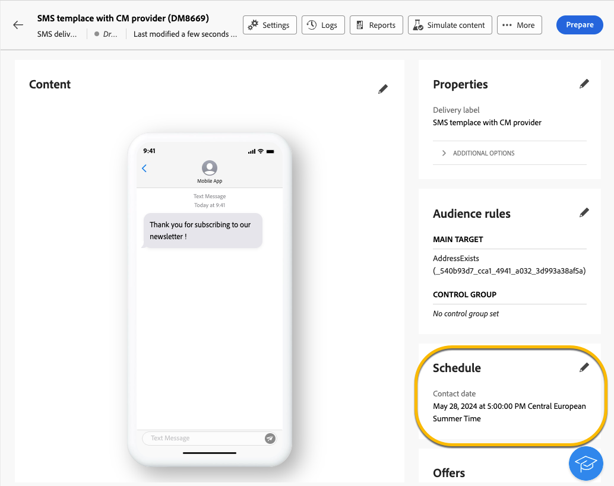
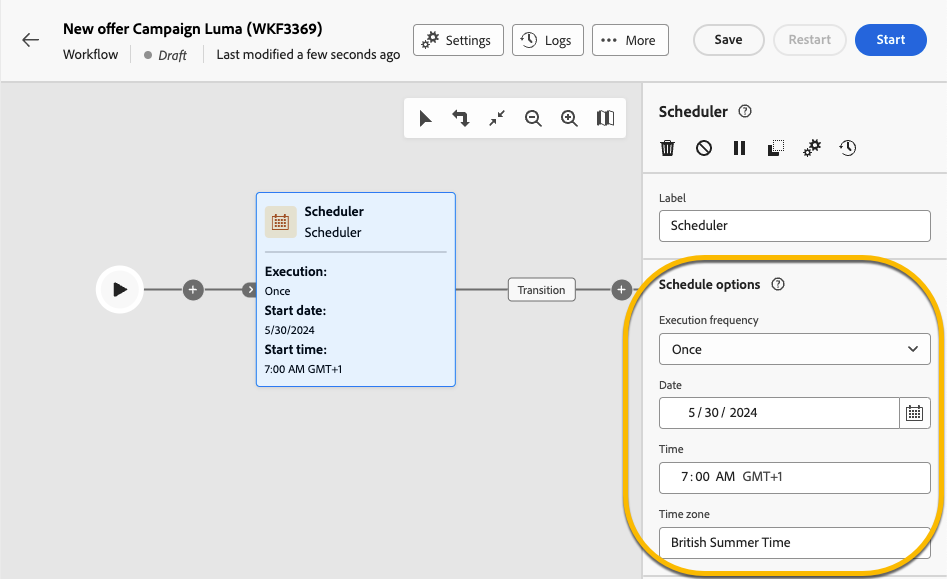

# Schedule the sending of a delivery {#schedule-sending}

You can schedule the sending of a delivery. The steps depend on whether it is a standalone (one-shot) delivery or if you are working in the context of a campaign workflow.

## Standalone delivery

For standalone deliveries, schedule the date and time directly in the delivery. See examples below for each type of delivery: email, SMS, and push notification.

### Email {#schedule-email-standalone}

To schedule the sending of an email delivery, follow these steps:

1. In the **[!UICONTROL Schedule]** section of your delivery properties, activate the **[!UICONTROL Enable scheduling]** toggle.

1. Set the desired date and time for sending, and click the **[!UICONTROL Review and send]** button.

    {zoomable="yes"}

>[!NOTE]
>
>By default, the **[!UICONTROL Enable confirmation before sending]** option is enabled. This option requires you to confirm the sending before the delivery is sent at the scheduled date and time. If you need to send the delivery automatically on the scheduled date and time, disable this option.
>

1. Check that the schedule is correct, and click the **[!UICONTROL Prepare]** button.

{zoomable="yes"}

1. Once the preparation is complete, messages are ready to be sent. Key metrics for the delivery are displayed, including total target population, number of messages to deliver, and number of excluded recipients. Click the **[!UICONTROL Send as scheduled]** button to confirm the delivery will be sent on the scheduled date and time to the main target.

{zoomable="yes"}

### SMS

To schedule your SMS delivery for a specific date and time, follow the same steps as for email deliveries. [See above](#schedule-email-standalone).

{zoomable="yes"}

You can also check that the schedule is applied:

{zoomable="yes"}

### Push notification

To schedule a standalone push delivery for a specific date and time, follow the same steps as for email deliveries. [See above](#schedule-email-standalone).

{zoomable="yes"}

You can also check that the schedule is applied:

{zoomable="yes"}

### Standalone delivery in a campaign

You can create a standalone delivery within a campaign without using a workflow. Set up the date and time schedule for this delivery as explained above. The campaign may have its own schedule, including a beginning date and an end date. This schedule does not interfere with your delivery schedule.

{zoomable="yes"}

## Schedule a delivery in a campaign workflow

In the context of a campaign workflow, the best practice is to use the **[!UICONTROL Scheduler]** activity to apply a date and time for launching the workflow, which involves sending the delivery. [Learn more about Scheduler](../workflows/activities/scheduler.md).

{zoomable="yes"}

Configure the date and time in the **[!UICONTROL Scheduler]** activity.

{zoomable="yes"}

>[!NOTE]
>
>When you use the **[!UICONTROL Scheduler]** activity to schedule the sending of your delivery in a workflow, do not activate the **[!UICONTROL Enable scheduling]** toggle in the **[!UICONTROL Delivery]** activity settings. Your delivery will be sent automatically.
>

If you activate the **[!UICONTROL Enable scheduling]** toggle in the **[!UICONTROL Delivery]** activity settings and set up a date and time there, the delivery will wait to be sent at this date and time. This means that if there is a delay between the workflow launch date and the sending date, the audience may not be up to date.