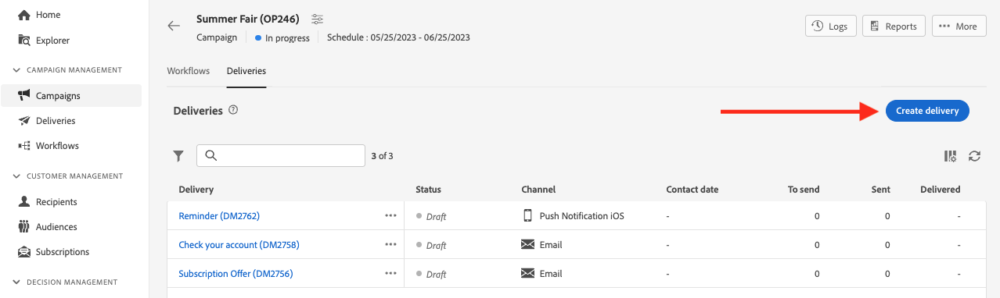

# Create a delivery {#create-delivery}

<!-- /NEO-92684 / DOCAC-13767-->

>[!CONTEXTUALHELP]
>id="acw_deliveries_profile_enrichment_settings"
>title="Enable profile enrichment"
>abstract="Select the fields for profile enrichment."

You can create standalone deliveries from the **[!UICONTROL Deliveries]** left menu, or create deliveries in the context of a workflow, included or not in a campaign.

Browse the tabs below to learn how to create a delivery:

>[!BEGINTABS]

>[!TAB Create a standalone delivery]

To create a standalone delivery, follow these steps:

1. Browse to the **[!UICONTROL Deliveries]** menu on the left navigation, and click the **[!UICONTROL Create delivery]** button.

    {zoomable="yes"}
    
1. Choose a channel for the delivery.
1. Define the delivery audience for the main target and the control group. [Learn more about audiences](../audience/about-recipients.md).

    {zoomable="yes"}{width="70%" align="left"}

1. Define the message content. Learn more about delivery channels and how to define delivery content in these sections: 

    * [Email channel](../email/create-email.md)
    * [Push notification channel](../push/gs-push.md)
    * [SMS channel](../sms/create-sms.md)

1. (Optional) Define the delivery [schedule](#gs-schedule). If no schedule is defined, messages are sent immediately after clicking the **[!UICONTROL Send]** button.
1. Click the **[!UICONTROL Review and send]** button to check your settings.
1. Use the **[!UICONTROL Simulate content]** button to test your delivery and personalization settings. Learn more about message simulation in [this section](../preview-test/preview-test.md).
1. Click the **[!UICONTROL Prepare]** button to compute the target population and generate the messages. The preparation step can take a few minutes. When preparation is complete, messages are ready for sending. In case of an error, browse to the **Logs** to check alerts and warnings.
1. Check results, and click the **[!UICONTROL Send]** button to start sending messages.
1. Once messages are sent, browse to the **Reports** section to access key metrics. Learn more about delivery reports in [this section](../reporting/delivery-reports.md).

>[!TAB Create a delivery in a workflow]

To create a delivery in a workflow, follow these steps:

1. Create a workflow or open an existing workflow. [Learn more about workflows](../workflows/gs-workflow-creation.md#gs-workflow-steps)
1. Add and configure a [**[!UICONTROL Build audience]**](../workflows/activities/build-audience.md) activity.
1. Click the `+` icon, and select a delivery activity: **[!UICONTROL Email]**, **[!UICONTROL SMS]**, **[!UICONTROL Push notification (Android)]**, or **[!UICONTROL Push notification (iOS)]**. Learn more about delivery channel activities in a workflow and how to define delivery content in [this section](../workflows/activities/channels.md).

    {zoomable="yes"}
    
1. Start the workflow, and check logs.

You can also add deliveries in a campaign without creating a workflow. To achieve this, browse to the **[!UICONTROL Deliveries]** tab of your campaign and click the **[!UICONTROL Create delivery]** button.

{zoomable="yes"}

Configuration steps are similar to those for standalone deliveries.

For more information on how to configure a campaign and manage deliveries that belong to a campaign, refer to [this section](../campaigns/gs-campaigns.md).

>[!ENDTABS]

## Add personalization {#personalization}

Messages delivered by Adobe Campaign can be personalized in various ways. [Learn more about personalization capabilities](../personalization/gs-personalization.md).

Use Campaign to create dynamic content and send personalized messages. Personalization capabilities can be combined to improve your messages and create a custom user experience.

You can personalize the message content by:

* Inserting dynamic **personalization fields**

    Personalization fields are used for first-level personalization of your messages. You can select any field available in the database from the personalization editor. For a delivery, you can select any field related to the recipient, the message, or the delivery. These personalization attributes can be inserted in the subject line or the body of your messages. [Learn more](../personalization/personalize.md)
    
* Inserting pre-defined **expression fragments**
    
    Campaign comes with a set of expression fragments that contain specific renderings you can insert into your deliveries. For example, you can add a logo, a greeting message, or a link to the mirror page of the message. Expression fragments are available from a dedicated entry in the personalization editor. Additionally, you can create your own expression fragments to suit your needs. [Learn how to use expression fragments](../content/use-expression-fragments.md)

* Creating **conditional content**

    Configure conditional content to add dynamic personalization based on the recipient's profile, for example. Text blocks and/or images are inserted when a particular condition is true. [Learn more](../personalization/conditions.md)

* Adding **personalized offers**
    
    Insert personalized offers in your message content, depending on the recipient's location, the current weather, or the last purchase order. [Learn more](../msg/offers.md)

## Preview and test your deliveries

Once your message content has been defined, you can preview it to control the rendering of your messages and check personalization settings with test profiles. [Learn more](../preview-test/preview-test.md)

## Schedule the delivery sending {#gs-schedule}

>[!CONTEXTUALHELP]
>id="acw_deliveries_email_schedule"
>title="Set a contact date and time"
>abstract="Define the date and the exact time for sending your delivery. By choosing the most appropriate time for your marketing message, you can maximize open rates."

You can set the date and the exact time for sending your messages. By choosing the most appropriate time for your marketing message, you can maximize open rates.

To schedule the sending of a delivery, open your delivery and browse to the **[!UICONTROL Schedule]** section. Use the **[!UICONTROL Enable scheduling]** toggle to activate it, and set the desired date and time for sending. Once you send the delivery, the actual sending starts on the contact date you have defined.

{zoomable="yes"}

By default, the **[!UICONTROL Enable confirmation before sending]** option is enabled. This option requires you to confirm the sending before the delivery is sent at the scheduled date and time. If you need to send the delivery automatically on the scheduled date and time, you can disable this option.

Learn steps to send a scheduled delivery in [this section](../monitor/prepare-send.md#schedule-the-send).

## Monitoring and tracking logs {#gs-tracking-logs}

Monitoring your deliveries after they have been sent is a key step to ensure your marketing campaigns are efficient and reach your customers.

You can monitor after sending a delivery, as well as understand how delivery failures and quarantines are managed.

Learn more about monitoring and tracking capabilities in [this section](../reporting/gs-reports.md).