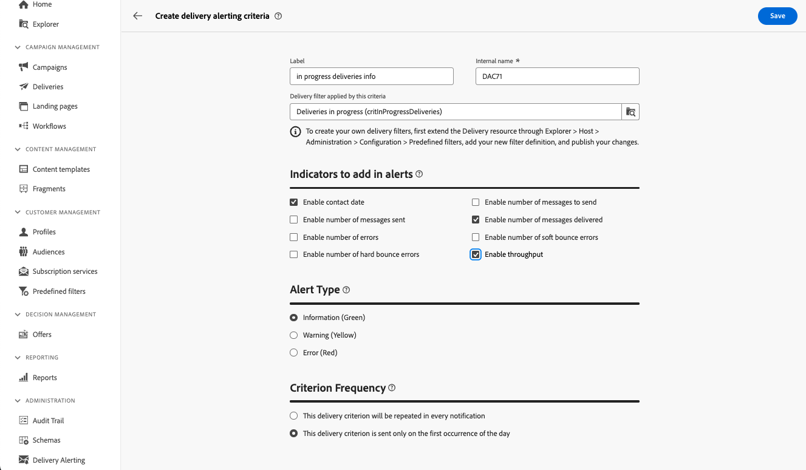

# Delivery alerting criteria {#delivery-alerting-criteria}

>[!CONTEXTUALHELP]
>id="acw_delivery_alerting_criteria"
>title="Delivery alerting criteria dashboard"
>abstract="Delivery alerting criteria dashboard"

Campaign Web User Interface provides pre-defined alerting criteria (deliveries with low throughput, deliveries whose preparation failed...) that you can add to your dashboard. You can also create your own criteria to suit your needs.

Alerting criteria are accessible from the **Delivery Alerting** menu in the left navigation pane, under the **Criteria** tab.

## Pre-defined alerting criteria {#ootb-criteria}

Pre-defined alerting criteria are available in Campaign Web User Interface. These criteria cover a range of scenarios, listed below:

* **Deliveries failed**: Any delivery scheduled within a defined range, with an erroneous status.
* **Deliveries with preparation failed**: Any delivery modified within a defined range, for which the preparation step (target calculation and content generation) has failed. 
* **Delivery with bad error ratio for soft bounces**: Any delivery scheduled within a defined range, with a status at least In progress, with a soft bounce error ratio greater than a defined percentage.
* **Delivery with bad error ratio for hard bounces**: Any delivery scheduled within a defined range, with a status at least In progress, with a hard bounce error ratio greater than a defined percentage.
* **Deliveries with long start pending**: Any delivery scheduled within a defined range, with a Start pending status for longer than a defined duration, Start pending status meaning that the messages have not been taken into account by the system yet.
* **Deliveries with low throughput**: Any delivery started for longer than a defined duration, with less than a defined percentage of processed messages, with a throughput lower than a defined value.
* **Deliveries in progress**: Any delivery scheduled within a defined range, with the In progress status.

>[!NOTE]
>
>Default values are applied to all parameters for the above criteria. These values can be customized in the **Criteria Parameters** section of the delivery alerting dashboards where they are being used. [Learn how to work with dashboards](../msg/delivery-alerting-dashboards.md)

## Create an alerting criterion {#criteria}

>[!CONTEXTUALHELP]
>id="acw_delivery_alerting_criteria_create"
>title="Create delivery alerting critera"
>abstract="Create delivery alerting critera"

>[!CONTEXTUALHELP]
>id="acw_delivery_alerting_criteria_create_indicators"
>title="Indicators to add in alerts"
>abstract="Indicators to add in alerts"

>[!CONTEXTUALHELP]
>id="acw_delivery_alerting_criteria_create_alert"
>title="Alert type"
>abstract="Alert type"

>[!CONTEXTUALHELP]
>id="acw_delivery_alerting_criteria_create_frequency"
>title="Criterion frequency"
>abstract="Criterion frequency"

To create a new criterion, follow these steps:

1. Navigate to the **Delivery Àlerting** menu in the left navigation pane and select the **Criteria** tab.
1. Click the **Create delivery alerting criteria** button.
1. Provide a label for the criterion. The internal name is automatically populated and read-only.
1. The **Delivery filter applied by this criteria** allows you to refine the criterion's scope by applying a predefined filter to it.

    In the example below, the **Deliveries in progress (critInProgressDeliveries)** filter has been selected, meaning that the criterion only takes into account deliveries with the "In progress" status.

    

    >[!NOTE]
    >
    >If none of the predefined filters suit your needs, you can reach out to your administrator in order to create your own filter.  Detailed in formation on how to create predefined filters in the Campaign console is available in the [Adobe Campaign v8 (console) documentation](https://experienceleague.adobe.com/en/docs/campaign/campaign-v8/audience/create-audiences/create-filters){target="_blank"}
    >
    >This operation must be performed by advanced users only.

1. In the **Indicators to add in alerts** section, choose the indicators to display as columns in the "Details" section of the email alerts.

1. Specify the **Alert Type** for the criterion, meaning the label and color to display next to the delivery criterion in the "Summary" section of the alerts.

1. The **Criteria Frequency** section allows you to control the frequency of alerts per day for each delivery meeting the criterion:

    * **This delivery criterion will be repeated in every notification**: Display a delivery meeting the criterion in every email alert of the day.
    * **This delivery criterion is sent only on the first occurence of the day**: Display a delivery meeting the criterion in the first report of the day only, not repeated in subsequent email alerts.
