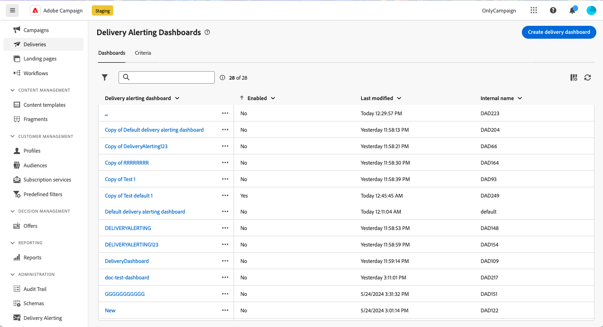
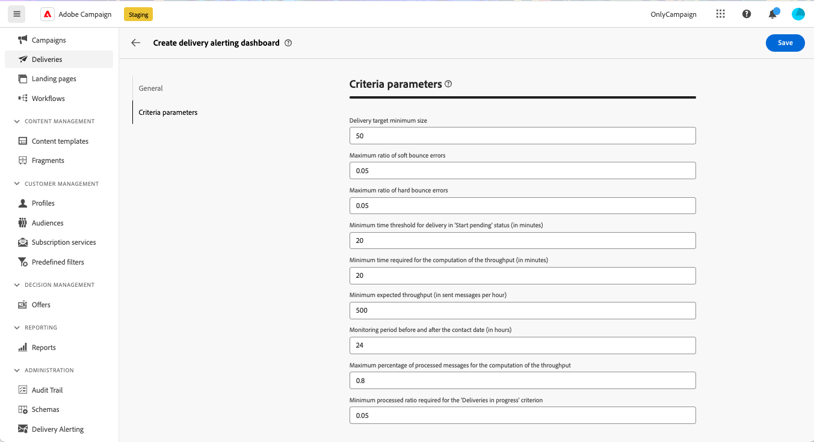
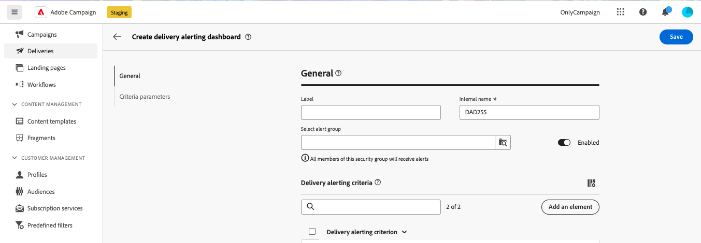
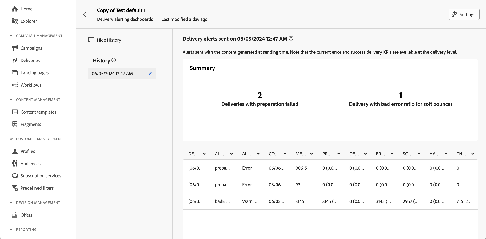

# Delivery alerting dashboards {#delivery-alerting-dashboards}

>[!CONTEXTUALHELP]
>id="acw_delivery_alerting_dashboards"
>title="Delivery alerting dashboards"
>abstract="Delivery Alerting is an alert management system that enables groups of users to automatically receive email notifications with information on their delivery executions. Delivery alerting dashboards allow you to specify who will receive email alerts, choose and configure the alerting criteria to use to send those alerts, and access the history of all sent notifications."

Delivery alerting dashboards allow you to specify who will receive email alerts, choose and configure the alerting criteria to use to send those alerts, and access the history of all sent notifications. They are accessible from the **Delivery Alerting** menu in the left navigation pane, under the **Dashboards** tab.

>[!AVAILABILITY]
>
>This capability is in Limited Availability (LA). It is restricted to customers migrating **from Adobe Campaign Standard to Adobe Campaign v8**, and cannot be deployed on any other environment.

## Create a delivery dashboard {#dashboards}

>[!CONTEXTUALHELP]
>id="acw_delery_alerting_dashboard_create"
>title="Create delivery alerting dashboard"
>abstract="Creating a delivery alerting dashboard allows you to specify who will receive email alerts, choose and configure the alerting criteria to use to send those alerts, and access the history of all sent notifications."

>[!CONTEXTUALHELP]
>id="acw_delivery_alerting_create_general"
>title="Delivery alerting general parameters"
>abstract="Specify the delivery alerting dashboard's general properties. The **Select alert group** field allows you to specify the **operator group** to receive the alerts sent by this dashboard."

>[!CONTEXTUALHELP]
>id="acw_delivery_alerting_create_criteria_add"
>title="Delivery alerting criteria"
>abstract="In this section, add criteria that you want to use to send alerts from this dashboard. Choose from pre-defined criteria or create your own criteria to align with specific needs."

>[!CONTEXTUALHELP]
>id="acw_delivery_alerting_create_criteria_parameters"
>title="Criteria parameters"
>abstract="Criteria have default parameters values that define how they must be applied. You can change these values to suit your needs from this section."

To create a delivery dashboard, follow these steps: 

1. Navigate to the **Delivery Alerting** menu in the left navigation pane, and click **Create delivery dashboard**.

    

1. Name your dashboard in the **Label** field. The **Internal name** field is automatically populated and read-only.

1. In the **Select alert group** field, specify the **operator group** to receive the alerts sent by this dashboard. All members of the selected operator group will receive the alerts.

    Learn more about permissions and operator groups in the [Adobe Campaign v8 (console) documentation](https://experienceleague.adobe.com/en/docs/campaign/campaign-v8/admin/permissions/gs-permissions){target="_blank"}

1. In the **Delivery alerting criteria** section, add criteria that you want to use to send alerts. Choose from pre-defined criteria or create your own criteria to align with specific needs. [Learn how to work with criteria](../msg/delivery-alerting-criteria.md)

1. Criteria have default parameter values that define how they must be applied. You can change these values to suit your needs from the **Criteria parameters** section. 

    

    For example, by default, the **Delivery target minimum size** criteria parameter is set to 50, meaning that a delivery will be included in the alert sent by this dashboard only if it targets at least 50 profiles. You can change this parameter if you want to include deliveries targeting fewer than 50 profiles.
    
    Expand the section below for more information on each criteria parameter:

    +++Available criteria parameters

    * **Delivery target minimum size**: For example, if you enter 100 in this field, a notification is sent only for deliveries with a target equal to or greater than 100 recipients. This parameter applies to all criteria.
    * **Monitoring period before and after the contact date (in hours)**: Number of hours before and after the current time. Only the deliveries having a contact date in this time range are taken into account. This parameter applies to all criteria. By default, the value of this field is set to 24 hours.
    * **Maximum ratio of soft bounce errors**: A notification is sent for all deliveries with a soft bounce error ratio greater than the specified value. By default, the value of this field is set to 0.05 (5%).
    * **Maximum ratio of hard bounce errors**: A notification is sent for all deliveries with a hard bounce error ratio greater than the specified value. By default, the value of this field is set to 0.05 (5%).
    * **Minimum time threshold for delivery in 'Start pending' status (in minutes)**: A notification is sent for all deliveries with a Start pending status for longer than the duration specified in this field, Start pending status meaning that the messages have not been taken into account by the system yet.
    * **Minimum time required for the computation of the throughput (in minutes)**: Only deliveries started (with In progress status) for more than the specified duration are taken into account for the Deliveries with low throughput criterion.
    * **Maximum percentage of processed messages for the computation of the throughput**: Only deliveries with a percentage of processed messages lower than the specified percentage are taken into account for the Deliveries with low throughput criterion.
    * **Minimum expected throughput (in sent messages per hour)**: Only deliveries with a throughput lower than the specified value are taken into account for the Deliveries with low throughput criterion.
    * **Minimum processed ratio required for 'Deliveries in progress' criterion**: Only deliveries with a percentage of processed messages higher than the specified percentage are taken into account.

    +++

1. By default, alerting dashboards are disabled, meaning that email alerts linked to this dashboard are not sent. To enable the dashboard immediately, toggle the **Enabled** option in the **General** section, next to the alert group selection field.

    You can also save the dashboard and enable it later.

    

1. To save the alerting dashboard, click the **Save** button.

The alerting dashboard opens with blank data. When you are ready to activate it and send notifications, click the **Settings** button and toggle the **Enabled** option if you haven't done so previously.

Now, each time a delivery meets the criteria defined in this dashboard, an alerting notification is sent to the specified operator group.

## Manage alerting dashboards

>[!CONTEXTUALHELP]
>id="acw_delivery_alerting_dashboard_alerts"
>title="Delivery alerts sent"
>abstract="This section allows you to visualize information related to the latest sent alerts."

>[!CONTEXTUALHELP]
>id="acw_delivery_alerting_dashboard_history"
>title="Delivery alerts history"
>abstract="The **History** pane contains all the alerts sent from this dashboard. Click an item to access the corresponding alerts sent at that particular time."

All created alerting dashboards are accessible from the **Delivery Alerting** menu, in the **Dashboards** tab.

You can duplicate or delete a dashboard using the **More actions** button located next to its name. 

To access a detailed view of a dashboard, click on its name from the list. From this screen, you can visualize the latest sent alert. All sent alerts are listed in the left pane. Click an item to access the corresponding alerts sent at that particular time.

To edit the dashboard, click the **Settings** button in the upper-right corner and make the desired changes.