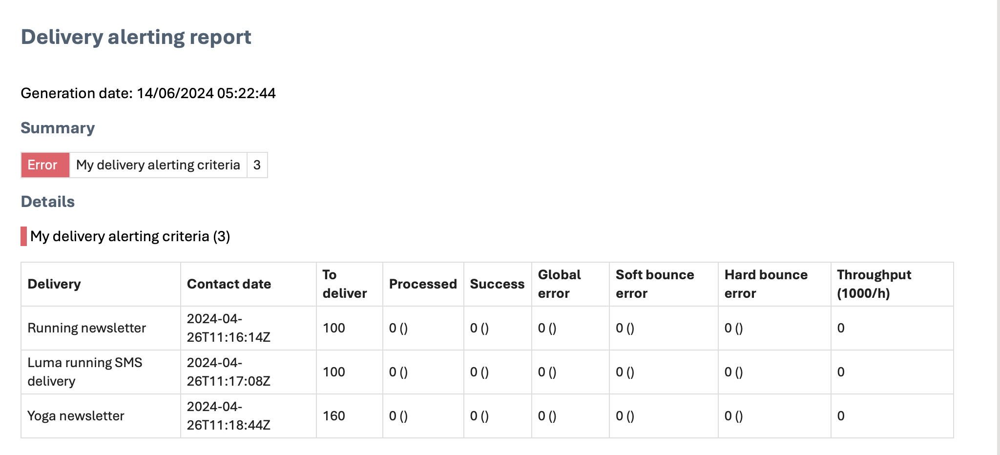

# Get started with delivery alerting {#gs-delivery-alerting}

Delivery alerting is an alert management system that enables groups of users to automatically receive email notifications with information on their delivery executions. Recipients monitor ongoing deliveries processed by Adobe Campaign and take appropriate actions if issues arise.

Notifications are customized based on specific alerting criteria defined through the Adobe Campaign Web User Interface.

For more information on managing delivery failures, refer to the [Adobe Campaign v8 (console) documentation](https://experienceleague.adobe.com/en/docs/campaign/campaign-v8/send/failures/delivery-failures#send){target="_blank"}.

## Email notification contents {#content}

Email notifications include the following sections:

* **Summary**: Displays the number of deliveries meeting your defined criteria, with labels and colors for each criterion.
* **Details**: Lists all defined delivery criteria for the dashboard and the corresponding deliveries for each criterion.

## Set up delivery alerts {#set-up}

To set up these alerts, the Campaign Web User Interface allows you to create and manage:

* **Delivery alerting dashboards**: Specify recipients, set alerting criteria to include in the dashboard, and access a history of sent alerts. [Learn how to work with dashboards](../msg/delivery-alerting-dashboards.md).
* **Delivery alerting criteria**: The Campaign Web User Interface provides predefined alerting criteria, such as deliveries with low throughput or deliveries whose preparation failed. You can add these criteria to your dashboard or create your own criteria to suit your needs. [Learn how to work with criteria](../msg/delivery-alerting-criteria.md).

For example, notify users with administration rights only about failed deliveries, and notify marketing users about deliveries with a high soft bounce error ratio. To achieve this, create two separate dashboards with the appropriate criteria for each group of recipients.

>[!NOTE]
>
>To access and configure dashboards and alerting criteria, you must have **administration rights** or be part of the **Delivery Supervisors** security group. Standard users cannot access dashboards in the Adobe Campaign interface but can receive alerting notifications. [Learn more about access and permissions](../get-started/permissions.md).