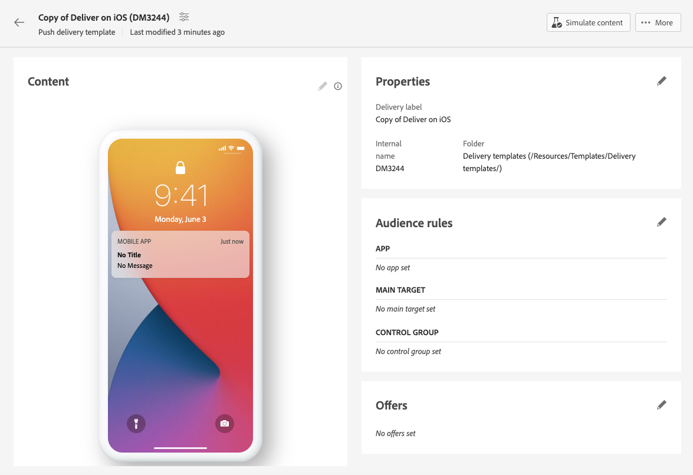
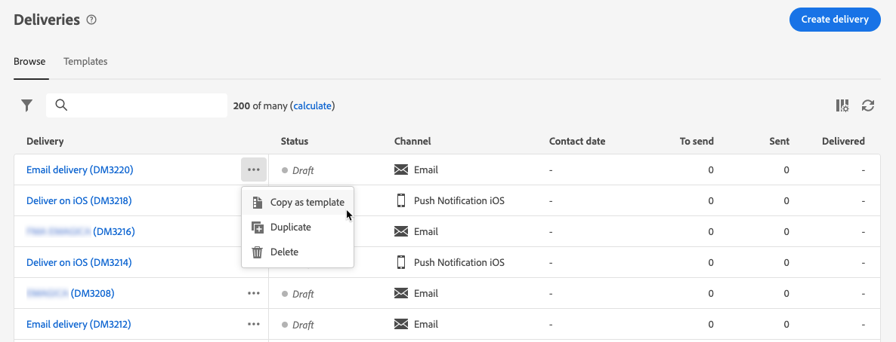

# Use delivery templates {#work-with-delivery-templates}

>[!CONTEXTUALHELP]
>id="acw_delivery_template_for_campaign"
>title="Delivery templates"
>abstract="To accelerate and improve the design process, create delivery templates to reuse custom content and settings across your campaigns. This functionality standardizes the creative look and feel, enabling quicker execution and launch of campaigns."

To accelerate and improve the design process, create delivery templates to reuse custom content and settings across your campaigns. This functionality standardizes the creative look and feel, enabling quicker execution and launch of campaigns.

A template includes:

* The **folder** and **execution folder** of the template. The folder is the location where the delivery template is saved. The execution folder is the folder where deliveries created based on this template are saved.
* [Typologies](../advanced-settings/delivery-settings.md#typology),
* The sender address,
* An [audience](../audience/about-recipients.md), including [control groups](../audience/control-group.md),
* Custom [content](../email/edit-content.md),
* [Personalized fields](../personalization/personalize.md) and [conditional content](../personalization/conditions.md),
* Links to [mirror page](../email/mirror-page.md) and unsubscription [links](../email/message-tracking.md),
* Other delivery properties, such as resource validity, retry parameters, or quarantine settings.

>[!NOTE]
>
>Delivery templates differ from [content templates](../content/create-email-templates.md), which allow you to reuse only the content of your emails and start building content with one of the sample email templates provided out-of-the-box.

## Access and manage delivery templates {#access-manage-templates}

>[!CONTEXTUALHELP]
>id="acw_delivery_templates"
>title="Work with delivery templates"
>abstract="Use delivery templates to create and save delivery settings for future use across your campaigns. Create delivery templates from scratch, duplicate an existing template, or convert a delivery into a template."

To access the content template list, select **[!UICONTROL Campaign Management]** > **[!UICONTROL Deliveries]** from the left menu, and browse to the **Templates** tab.

{zoomable="yes"}  

All templates created in the current environment are displayed.

You can filter content templates by channels and folders. You can also set advanced filters by building a rule using delivery attributes. [Learn more about the query modeler](../audience/../query/query-modeler-overview.md)

{zoomable="yes"}  

To edit a template, click the desired item from the list. From there:

* Modify its content, properties, audience, and any offers attached to it.
* Test your template. [Learn more](#test-template)

{zoomable="yes"}  

To delete or [duplicate](#copy-an-existing-template) a template, select the corresponding action from the **[!UICONTROL More actions]** menu, either from the **[!UICONTROL Templates]** list or from a template edition screen.

{zoomable="yes"}  

>[!NOTE]
>
>When a template is edited or deleted, deliveries created using this template are not impacted.

## Create a delivery template {#create-a-delivery-template}

To create a delivery template, you can:

* Duplicate an existing template - [Learn more](#copy-an-existing-template)
* Convert an existing delivery into a template - [Learn more](#convert-an-existing-delivery)
* Create a delivery template from scratch - [Learn more](#create-a-new-template)

### Duplicate an existing delivery template {#copy-an-existing-template}

Campaign includes built-in templates for each channel: email, push, and SMS. The easiest way to create a delivery template is to duplicate and customize a built-in template.

>[!NOTE]
>
>You can also duplicate any custom template.

To duplicate a delivery template, follow these steps:

1. Browse to the **Templates** tab from the **Deliveries** left menu. [Learn more](#access-manage-templates)
1. Click the **[!UICONTROL More actions]** button to the right of the desired template name, and select **[!UICONTROL Duplicate]**.

    You can also select a template from the list and choose this option from the template edition screen.

1. Confirm duplication.

    {zoomable="yes"}  

1. The new template dashboard opens in the central screen. Edit the template settings as needed.

    {zoomable="yes"}  

1. Click the **[!UICONTROL Review]** button to save and review your template. You can still edit all its settings, delete, and duplicate it.

    {zoomable="yes"}  

1. Test the template rendering if needed. [Learn more](#test-template)

The new template is added to the [**Templates** list](#access-manage-templates). You can now select it when creating a new delivery.

### Convert a delivery to a template {#convert-an-existing-delivery}

Any delivery can be converted to a template for future repeated delivery actions.

To save a delivery as a template, follow these steps:

1. Browse to the **[!UICONTROL Campaign management]** > **[!UICONTROL Deliveries]** menu.
1. From the **[!UICONTROL Browse]** tab, click the **[!UICONTROL More actions]** button to the right of the desired delivery name, and select **[!UICONTROL Copy as a template]**.

    {zoomable="yes"}  

    You can also select a template from the list and choose this option from the template edition screen.

1. Confirm duplication.

1. The new template dashboard opens in the central screen. Edit the template settings as needed.

1. Click the **[!UICONTROL Review]** button to save and review your template. You can still edit all its settings, delete, and duplicate it.

1. Test the template rendering if needed. [Learn more](#test-template)

The new template is added to the [**Templates** list](#access-manage-templates). You can now select it when creating a new delivery.

### Create a new delivery template {#create-a-new-template}

>[!NOTE]
>
>To avoid configuration errors, Adobe recommends [duplicating a built-in template](#copy-an-existing-template) and customizing its properties rather than creating a new template.

To configure a delivery template from scratch, follow these steps:

1. Browse to the **Templates** tab from the **Deliveries** left menu. [Learn more](#access-manage-templates)
1. Click the **[!UICONTROL Create template]** button.

    {zoomable="yes"}  

1. Select the channel you want to use for your template.
1. The built-in delivery template for that channel is used by default to help you build your own template. Use the dedicated button to the right of the selected channel to select another template if needed.

    {zoomable="yes"}  
    

1. Click the **[!UICONTROL Create template]** button again.

1. Define the template properties, [audience](../audience/add-audience.md), and content depending on the selected channel.

    >[!NOTE]
    >
    >Learn more about delivery channels and how to design respective contents in the sections below:
    >
    > * [Email channel](../email/create-email.md)
    > * [Push notification channel](../push/gs-push.md)
    > * [SMS channel](../sms/create-sms.md)

1. Additionally, for email templates, advanced settings, such as typology rules and target mappings, can be accessed via the **[!UICONTROL Settings]** button located on the top right of the screen. [Learn more](../advanced-settings/delivery-settings.md)

1. Click the **[!UICONTROL Review]** button to save and review your template. You can still edit all its settings, delete, and duplicate it.

1. Test the template rendering if needed. [Learn more](#test-template)

The new template is added to the [**Templates** list](#access-manage-templates). You can now select it when creating a new delivery.

## Test a delivery template {#test-template}

You can test the rendering of any delivery template, whether created from scratch or from an existing content. To do so, follow these steps:

1. Browse to the **Templates** tab through the **[!UICONTROL Campaign management]** > **[!UICONTROL Deliveries]** menu and select any template. [Learn more](#access-manage-templates)

1. Click the **[!UICONTROL Simulate content]** button on the top right of the screen.

    {zoomable="yes"}  

1. Select one or more test profiles to check your email rendering. You can also select real profiles from your database. [Learn more about test profiles](../audience/test-profiles.md)

1. Toggle between the different profiles to get a personalized representation of the message according to the selected profile. You can also adjust the zoom level and choose the desktop or mobile view.

    [Learn more about previewing content](../preview-test/preview-content.md)

    {zoomable="yes"}  

1. Close the window to return to the template edition screen.

>[!NOTE]
>
>You cannot use email rendering or send proofs in a delivery template.