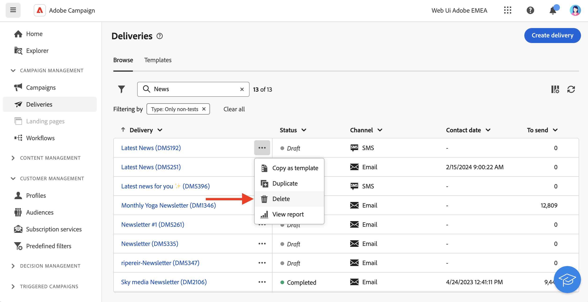

# Access deliveries {#work-with-deliveries}

>[!CONTEXTUALHELP]
>id="acw_deliveries_list"
>title="Deliveries"
>abstract="A delivery is a communication which is sent to an audience on a specific channel: email, SMS, or Push. In this screen, you can edit, duplicate, and delete existing deliveries. You can also view reports for completed deliveries. Click the **Create delivery** button to add a new delivery."

## Access deliveries {#access}

>[!CONTEXTUALHELP]
>id="acw_deliveries_additional_target"
>title="Additional target"
>abstract="These rules can only be changed in the client console."

Deliveries are accessible from the **[!UICONTROL Deliveries]** menu on the left navigation. All deliveries created either from the client console or the Web User Interface display in this list. From this screen, you can monitor all existing deliveries, duplicate or delete them, or create new ones.

To open a delivery, click its name from the list. The delivery opens, allowing you to perform various actions such as editing its parameters, checking its execution or monitoring its performances using dedicated reports.

>[!NOTE]
>
>If you open a delivery created in the client console, the **[!UICONTROL Additional target]** section may display for the audience. This means that multiple targets have been configured for this delivery. These parameters can be modified in the console only.
>
>{zoomable="yes"}

## Duplicate a delivery {#delivery-duplicate}

You can create a copy of an existing delivery, either from the delivery list or from the delivery dashboard. 

To duplicate a delivery from the list of deliveries, follow these steps:

1. Click the three dots button on the right, next to the name of the delivery to duplicate.
1. Select  **[!UICONTROL Duplicate]**.
1. Confirm duplication: the new delivery dashboard opens in the central screen.

To duplicate a delivery from its dashboard, follow these steps:

1. Open the delivery and click the  **[!UICONTROL ...More]** button on the top section of the screen. 
1. Select **[!UICONTROL Duplicate]**. 
1. Confirm duplication: the new delivery replaces the current delivery in the central screen.

## Delete a delivery {#delivery-delete}

Deliveries are deleted from the delivery list - either from the main delivery entry in the left rail, or from the delivery list of a campaign. 

To delete a delivery from the list of deliveries, follow these steps:

1. Click the three dots button on the right, next to the name of the delivery to duplicate.
1. Select  **[!UICONTROL Delete]**.
1. Confirm deletion.

All deliveries are available in these lists, but deliveries created in a workflow cannot be deleted from there. To delete a delivery created in the context of a workflow, you must delete the delivery activity from the workflow.

To delete a delivery from a workflow, follow these steps:

1. Select the delivery activity .
1. Click the  **[!UICONTROL Delete]** icon on the right panel.
1. Confirm deletion. If the delivery has child nodes, you can choose to delete them as well, or to keep them.

