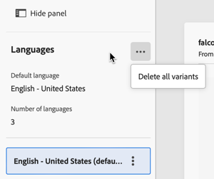

# Configure a multilingual delivery {#multilingual-delivery}

>[!CONTEXTUALHELP]
>id="acw_homepage_welcome_rn1"
>title="Multilingual deliveries"
>abstract="You can now send messages in multiple languages in Campaign Web UI. For push notifications, populate all language variants by uploading a CSV file."
>additional-url="https://experienceleague.adobe.com/docs/campaign-web/v8/release-notes/release-notes.html" text="See release notes"

>[!CONTEXTUALHELP]
>id="acw_deliveries_email_multilingual"
>title="Add languages"
>abstract="In this tab, you will find a list of languages in which the delivery is to be sent in. You can add more languages by clicking the Add Language button, or by duplicating another language via this tab."

>[!CONTEXTUALHELP]
>id="acw_multilingual_file_upload"
>title="Import language variants"
>abstract="Use this dialog to add a language variant by importing a CSV file. The file automatically populates all available fields for the selected language. You can drag and drop your file or choose it from your computer before confirming."

In Campaign Web UI, you can set up your deliveries as multilingual, which allows you to send messages based on a profile's preferred language. When no preference is defined, the message is sent in the default language. 

In a multilingual delivery, the language management is based on variants. Each variant represents one language. During delivery creation, you can add multiple language variants to match the number of required languages in your message. You can also change the default language at any time after adding these variants.

The multilingual capability is currently available for email, push notifications, transactional messages and SMS. 

To set up multilingual deliveries, follow these main steps:

1. Add a language variant, [read more](#add-variant)
1. Define the content for each variant, [read more](#define-content)
1. Manage language variants, [read more](#manage-variant)

## Add a language variant{#add-variant}

To create language variants, follow these steps:

1. From the delivery dashboard, click the pencil icon to access the delivery content edition screen, then click **[!UICONTROL Add language]**.

    >[!IMPORTANT]
    >
    >The **[!UICONTROL Add language]** button is only available if the target dimension contains the **Language** schema. To learn more about schemas and target dimensions, please refer to the [detailed documentation](../audience/targeting-dimensions.md).

    {zoomable="yes"}

1. From the **Add language** drop-down, select the language to add, then confirm. For push notifications, you can also [upload a CSV file](#csv-upload) to import all language variants at once. 

    The first language you add is automatically set as the default, and the existing content becomes the default version. When additional languages are added, their content is initially copied from the default language.

    {zoomable="yes"}

    >[!NOTE]
    >
    >The languages available through this list depend on the values that have been defined by the **Language** attribute (values such as: system, user, dbenum, etc.). Learn more about enumeration management in this [section](../administration/enumerations.md).
    
1. Repeat this operation to add other languages. The **[!UICONTROL Languages]** panel, on the left, shows the list of languages you have chosen, the number of languages and the default language.

    For example, if you have chosen English, French, and Swedish, you can see these 3 languages as shown below:

    {zoomable="yes"}

    To learn how to manage language variants, refer to this [section](#manage-variant).

## Define the content for each variant{#define-content}

Once languages are set, define the content of the delivery for each language.

1. From the delivery content edition screen, select a language from the **[!UICONTROL Languages]** panel, on the left.

    {zoomable="yes"}

1. Define the content of your message for this language. Learn more in this [section](../msg/create-deliveries.md).

1. Repeat this operation for each language.

<!--
>[!BEGINTABS]

>[!TAB Email delivery]

1. From the delivery content edition screen, choose a language and click the **[!UICONTROL Edit email body]** button. You can also hover over the email preview and select **[!UICONTROL Open email designer]**.

    {zoomable="yes"}

1. Define the content of your email for this language. [Read more](../email/get-started-email-designer.md#start-authoring)

1. Repeat this operation for each language.

>[!TAB SMS delivery]

1. From the delivery content edition screen, choose a language.

1. Edit the content of the SMS message for this language. [Read more](../sms/create-sms.md)

    {zoomable="yes"}

1. Repeat this operation for each language.

>[!ENDTABS]

-->

To preview the delivery, click the **[!UICONTROL Simulate content]** button, and choose profiles. Make sure the right content is displayed for each profile.

{zoomable="yes"}

## Manage language variants{#manage-variant}

In the left panel, all language variant information is displayed. To delete all languages, click the expand button, and click **[!UICONTROL Delete all variants]**.

{zoomable="yes"}

In the list of language variants, you can perform the following actions:

* **Edit**: change the language while keeping the associated content.
* **Set as default**: set the language as the default one. When a profile has no language defined, the message is sent in the default language.
* **Duplicate**: duplicate the content defined for this language and choose a different variant.
* **Delete**: delete the variant and its associated content.

{zoomable="yes"}

## Import language variants from CSV (Push notifications) {#csv-upload}

For push notifications, you can quickly populate all language variants by uploading a CSV file containing your multilingual content. This feature streamlines the creation of multilingual campaigns by allowing you to prepare content offline and import it in bulk.

* **Efficiency**: add multiple languages and their content in a single operation
* **Consistency**: ensure uniform messaging across all language variants
* **Collaboration**: enable content teams to prepare translations in familiar spreadsheet tools
* **Bulk management**: easily manage and update large numbers of language variants

### Prerequisites {#csv-best-practices}

Follow these best practices to ensure successful CSV import:

* **Use the exact column structure**: All 14 columns must be present in your CSV file, even if you leave some blank. Missing columns will cause import failure. You can use a different order but all colums must be present.
* **Match column names exactly**: Column names are case-sensitive. Use `title` not `Title`, `badge` not `Bbadge`, `locale` not `Locale`.
* **Use lowercase locale codes**: Format locale codes as `en_us`, `fr_fr`, `de_de` (lowercase with underscore), not `en_US` or `en-us`.
* **Fill mandatory columns**: The `locale` and `language` columns must contain values for every row. Empty values will cause import failure.
* **Keep locales unique**: Each locale code must appear only once in your CSV file. Duplicate locales will be rejected.
* **Save as UTF-8**: Always save your CSV file with UTF-8 encoding to support international characters correctly.
* **Quote comma-containing content**: If your title or message body contains commas, enclose the entire field in double quotes: `"Hello, welcome!"`.
* **Use numeric values correctly**: For flag columns (isContentAvailable, isMutableContent, silentPush), use `1` for true, `0` for false, or leave blank for default.
* **Validate JSON format**: If using the customFields column, ensure your JSON is properly formatted: `{"key":"value"}` with correct quotes and brackets.
* **Test with minimal data first**: Start with a simple 2-3 language CSV to verify your format before creating large files.

>[!NOTE]
>
>Column structure is detailed in this [section](#csv-columns).

### Import the CSV file {#csv-steps}

To import language variants from a CSV file, follow these steps:

1. From the delivery content editor, click **[!UICONTROL Add language]**.

   {zoomable="yes"}

1. Select your CSV file by dragging and dropping it into the upload area, or click to browse your computer.

   The system validates your file format and content. If validation fails, error messages indicate which columns or data are incorrect. Fix the issues in your CSV file and upload again. See this [section](#csv-troubleshooting).

   {zoomable="yes"}

1. Review the imported content in the language variants panel to confirm all translations loaded correctly.

   {zoomable="yes"}

### Column structure {#csv-columns}

Here is the correct column structure to be used:

>[!NOTE]
>
>You can use a different order but all colums must be present. For more best practices, see this [section](#csv-best-practices). 

1. **title**: Notification title (required)
1. **messageBody**: Notification message body (required)
1. **sound**: Sound file name (e.g., `default`, `custom_sound.mp3`) - leave blank for default
1. **badge**: Badge number to display on app icon (iOS) - use numbers only
1. **deeplinkURI**: Deep link URL to open when notification is tapped - leave blank if not used
1. **category**: Notification category identifier for custom actions (iOS) - leave blank if not used
1. **iosMediaAttachmentURL**: URL of media attachment for iOS notifications - leave blank if not used
1. **androidMediaAttachmentURL**: URL of media attachment for Android notifications - leave blank if not used
1. **isContentAvailable**: Content available flag (iOS) - use `1` for true, `0` for false, leave blank for default (0)
1. **isMutableContent**: Mutable content flag (iOS) - use `1` for true, `0` for false, leave blank for default (0)
1. **customFields**: Custom data in JSON format (e.g., `{"key1":"value1","key2":"value2"}`) - leave blank if not used
1. **locale**: Language code (required) - e.g., `en_us`, `fr_fr`, `de_de` - **mandatory, must be unique per row**
1. **language**: Language name (required) - e.g., `English-United States`, `French-France` - **mandatory**
1. **silentPush**: Silent push flag - use `1` for silent push, `0` for regular, leave blank for default (0)

### Example of CSV file {#csv-examples}

Here is a basic example with the mandatory fields:

```csv
title,messageBody,sound,badge,deeplinkURI,category,iosMediaAttachmentURL,androidMediaAttachmentURL,isContentAvailable,isMutableContent,customFields,locale,language,silentPush
Welcome!,Thank you for joining us,,,,,,,,,, en_us,English-United States,0
Bienvenue !,Merci de nous avoir rejoint,,,,,,,,,,fr_fr,French-France,0
Willkommen!,Vielen Dank für Ihre Anmeldung,,,,,,,,,, de_de,German-Germany,0
¡Bienvenido!,Gracias por unirte a nosotros,,,,,,,,,, es_es,Spanish-Spain,0
```

Here is an example with optional fields:

```csv
title,messageBody,sound,badge,deeplinkURI,category,iosMediaAttachmentURL,androidMediaAttachmentURL,isContentAvailable,isMutableContent,customFields,locale,language,silentPush
Welcome!,Thank you for joining us,default,1,,,https://example.com/welcome-en.jpg,https://example.com/welcome-en.jpg,,,, en_us,English-United States,0
Bienvenue !,Merci de nous avoir rejoint,default,1,,,https://example.com/welcome-fr.jpg,https://example.com/welcome-fr.jpg,,,, fr_fr,French-France,0
Willkommen!,Vielen Dank für Ihre Anmeldung,default,1,,,https://example.com/welcome-de.jpg,https://example.com/welcome-de.jpg,,,, de_de,German-Germany,0
¡Bienvenido!,Gracias por unirte a nosotros,default,1,,,https://example.com/welcome-es.jpg,https://example.com/welcome-es.jpg,,,, es_es,Spanish-Spain,0
```

Here is an example with custom fields

```csv
title,messageBody,sound,badge,deeplinkURI,category,iosMediaAttachmentURL,androidMediaAttachmentURL,isContentAvailable,isMutableContent,customFields,locale,language,silentPush
New Collection,Discover our latest products,default,1,,,,,,,"{"campaign":"summer2025","segment":"premium"}",en_us,English-United States,0
Nouvelle Collection,Découvrez nos derniers produits,default,1,,,,,,,"{"campaign":"summer2025","segment":"premium"}",fr_fr,French-France,0
```

>[!NOTE]
>
>For rich push notifications with carousels or action buttons, Campaign uses a different configuration method than CSV import. Configure rich push content directly in the delivery editor after importing basic multilingual content.

### Personalization in CSV files {#csv-personalization}

To use personalization fields in your CSV content, you need to use `<span>` tags:

```csv
title,messageBody,sound,badge,deeplinkURI,category,iosMediaAttachmentURL,androidMediaAttachmentURL,isContentAvailable,isMutableContent,customFields,locale,language,silentPush
"Hello <span class=""nl-dce-field nl-dce-done"" data-nl-expr=""recipient.firstName"">recipient.firstName</span>","Your order has shipped!",,,,,,,,,,en_us,English-United States,0
"Bonjour <span class=""nl-dce-field nl-dce-done"" data-nl-expr=""recipient.firstName"">recipient.firstName</span>","Votre commande a été expédiée !",,,,,,,,,,fr_fr,French-France,0
```

During delivery, Campaign replaces these placeholders with actual recipient data.

### Troubleshooting {#csv-troubleshooting}

| Error | Cause | Solution |
|-------|-------|----------|
| Missing required columns | CSV file doesn't contain all 14 columns | Ensure your CSV has all 14 columns in the exact order shown above. Use empty values for unused columns. |
| Invalid locale/language values | locale or language columns are empty | Both locale and language columns must have values for every row |
| Duplicate locales | Same locale code appears multiple times | Each locale value must be unique - remove duplicate rows |
| File encoding issues | CSV file uses incompatible encoding | Save your CSV file with UTF-8 encoding |
| Column mismatch | Rows have different number of columns than header | Ensure all rows have exactly 14 columns matching the header |
| Invalid numeric values | badge, isContentAvailable, isMutableContent, or silentPush contain non-numeric values | Use only numbers: 0 or 1 for flags, or leave blank for default |
| Malformed JSON | customFields column contains invalid JSON | Ensure JSON syntax is correct: `{"key":"value"}` or leave blank |
| Column name case mismatch | Column names don't match exactly | Column names are case-sensitive - use exact names shown above (e.g., `badge`, not `Badge` or `BADGE`) |

>Best practices are listed in this [section](#csv-best-practices). Column structure is detailed in this [section](#csv-columns).
