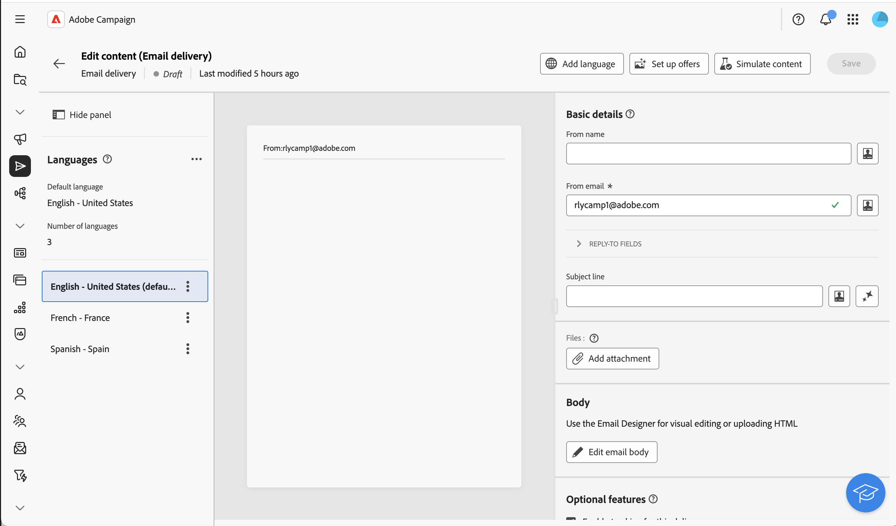

# Configure a multilingual delivery {#multilingual-delivery}

>[!CONTEXTUALHELP]
>id="acw_deliveries_email_multilingual"
>title="Add languages"
>abstract="In this tab, you will find a list of languages in which the delivery is to be sent in. You can add more languages by clicking the Add Language button, or by duplicating another language via this tab."

In Campaign Web UI, you can set up your deliveries as multilingual, which allows you to send messages based on a profile's preferred language. When no preference is defined, the message is sent in the default language.

In a multilingual delivery, the language management is based on variants. Each variant represents one language. During delivery creation, you can add multiple language variants to match the number of required languages in your message. You can also change the default language at any time after adding these variants.

The multilingual capability is currently available for email, push notifications and transactional messages. 

>[!AVAILABILITY]
>
>Multilingual push notifications, transactional messages and SMS are only available for a set of organizations (Limited Availability), and will be rolled out globally in a future release. Your server must be upgraded to 8.8.2 or later.

To set up multilingual deliveries, follow these main steps:

1. Add a language variant, [read more](#add-variant)
1. Define the content for each variant, [read more](#define-content)
1. Manage language variants, [read more](#manage-variant)

## Add a language variant{#add-variant}

To create language variants, follow these steps:

1. From the delivery dashboard, click the pencil icon to access the delivery content edition screen, then click **[!UICONTROL Add language]**.

    >[!IMPORTANT]
    >
    >The **[!UICONTROL Add language]** button is only available if the target dimension contains the **Language** schema. To learn more about schemas and target dimensions, please refer to the [detailed documentation](../audience/targeting-dimensions.md).

    {zoomable="yes"}

1. From the **Add language** drop-down, select the language to add, then confirm. 

    The first language you add is automatically set as the default, and the existing content becomes the default version. When additional languages are added, their content is initially copied from the default language.

    {zoomable="yes"}

    >[!NOTE]
    >
    >The languages available through this list depend on the values that have been defined by the **Language** attribute (values such as: system, user, dbenum, etc.). Learn more about enumeration management in this [section](../administration/enumerations.md).
    
1. Repeat this operation to add other languages. The **[!UICONTROL Languages]** panel, on the left, shows the list of languages you have chosen, the number of languages and the default language.

    For example, if you have chosen English, French, and Swedish, you can see these 3 languages as shown below:

    {zoomable="yes"}

    To learn how to manage language variants, refer to this [section](#manage-variant).

## Define the content for each variant{#define-content}

Once languages are set, define the content of the delivery for each language.

1. From the delivery content edition screen, select a language from the **[!UICONTROL Languages]** panel, on the left.

    {zoomable="yes"}

1. Define the content of your message for this language. Learn more in this [section](../msg/create-deliveries.md).

1. Repeat this operation for each language.

<!--
>[!BEGINTABS]

>[!TAB Email delivery]

1. From the delivery content edition screen, choose a language and click the **[!UICONTROL Edit email body]** button. You can also hover over the email preview and select **[!UICONTROL Open email designer]**.

    {zoomable="yes"}

1. Define the content of your email for this language. [Read more](../email/get-started-email-designer.md#start-authoring)

1. Repeat this operation for each language.

>[!TAB SMS delivery]

1. From the delivery content edition screen, choose a language.

1. Edit the content of the SMS message for this language. [Read more](../sms/create-sms.md)

    {zoomable="yes"}

1. Repeat this operation for each language.

>[!ENDTABS]

-->

To preview the delivery, click the **[!UICONTROL Simulate content]** button, and choose profiles. Make sure the right content is displayed for each profile.

{zoomable="yes"}

## Manage language variants{#manage-variant}

In the left panel, all language variant information is displayed. To delete all languages, click the expand button, and click **[!UICONTROL Delete all variants]**.

{zoomable="yes"}

In the list of language variants, you can perform the following actions:

* **Edit**: change the language while keeping the associated content.
* **Set as default**: set the language as the default one. When a profile has no language defined, the message is sent in the default language.
* **Duplicate**: duplicate the content defined for this language and choose a different variant.
* **Delete**: delete the variant and its associated content.

{zoomable="yes"}

