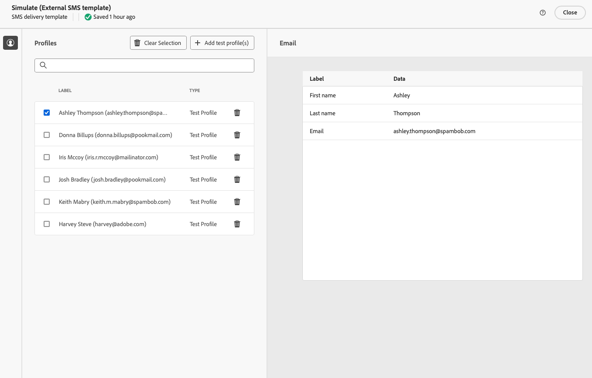

# Send external deliveries {#gs-direct-mail}

Adobe Campaign enables you to manage deliveries created outside Campaign to mass deliver personalized emails, SMS messages, or push notifications (iOS and Android) through an external system.

<!--The supported channels are Email, Mobile (SMS), and Push (iOS and Android).-->

When creating an external delivery, Adobe Campaign automatically generates an extraction file containing all the targeted profiles and selected data. This file is sent to the server of your choice, which handles the sending process.

## Create a dedicated external account {#routing-external-account}

You need to configure a specific external account to use in your external deliveries. It must be of the **[!UICONTROL Routing]** type.

>[!NOTE]
>
>Learn how to create a routing-type external account in [this section](../administration/external-account.md#routing).

For example, select the **[!UICONTROL Mobile (SMS)]** channel for the external account. **[!UICONTROL External]** is selected by default as the **[!UICONTROL Delivery mode]**.

{zoomable="yes"}

## Create and send the external delivery {#create-external-delivery}

Once the specific external account is configured, create the external delivery. Follow the steps below.

1. Create a delivery. [Learn how](create-deliveries.md)

    You have three options:

    * **In a workflow**: Add an external channel activity (email, SMS, or push) to your workflow. For detailed instructions on configuring workflows, refer to [this page](../workflows/gs-workflow-creation.md).
    * **In a campaign**: After creating a campaign, you can create an email, SMS, or push channel external delivery. For more information on setting up your campaign, refer to [this page](../campaigns/gs-campaigns.md).
    * **Stand-alone delivery**: Engage customers directly and instantly with an individual external delivery. [Learn how to create a delivery](../msg/gs-deliveries.md)

1. In the delivery or delivery template [settings](../advanced-settings/delivery-settings.md), select the external account created for the channel of your choice (in this example, the SMS channel) and save.

    {zoomable="yes"}

    >[!NOTE]
    >
    >If you are creating a delivery, ensure that you have selected a [delivery template](delivery-template.md) using an external account of the **[!UICONTROL Routing]** type. Otherwise, you will not be able to select the dedicated account created [above](#routing-external-account).

1. In the delivery **[!UICONTROL Content]** section, click **[!UICONTROL Edit content]**.

    {zoomable="yes"}

1. Unlike a standard delivery, you do not design the content of the message itself. Instead, define the properties and columns of the file that will be sent to the external system.

    {zoomable="yes"}

    Follow the same steps as when designing the content of the extraction file generated by [direct mail deliveries](../direct-mail/content-direct-mail.md):

    * Define the properties of the extraction file. [Learn more](../direct-mail/content-direct-mail.md#properties)
    * Select the columns containing the information to be exported into the file. [Learn more](../direct-mail/content-direct-mail.md#content)

1. Preview the file and send proofs<!--not in UI right now - to check-->. [Learn how](../direct-mail/send-direct-mail.md#preview-dm)

    {zoomable="yes"}

1. Send the delivery to generate the extraction file. [Learn how](../direct-mail/send-direct-mail.md#send-dm)

Once the delivery is sent, the extraction file is automatically generated and exported to the location specified in the [external account](../administration/external-account.md#create-ext-account) selected in the delivery template's settings.

Track the KPIs from the delivery page and data from the **[!UICONTROL Logs]** menu.