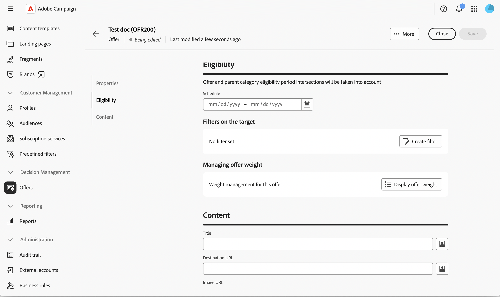
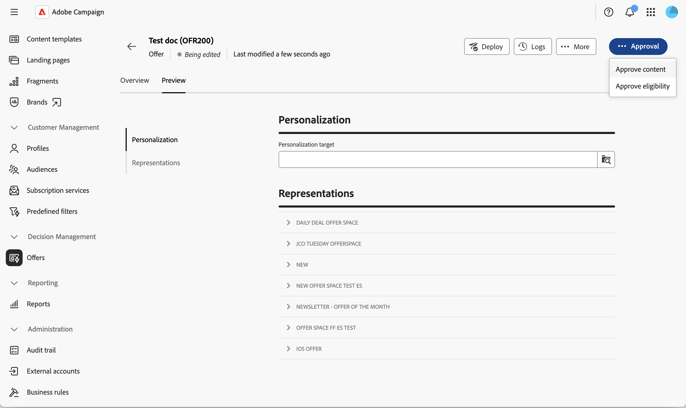
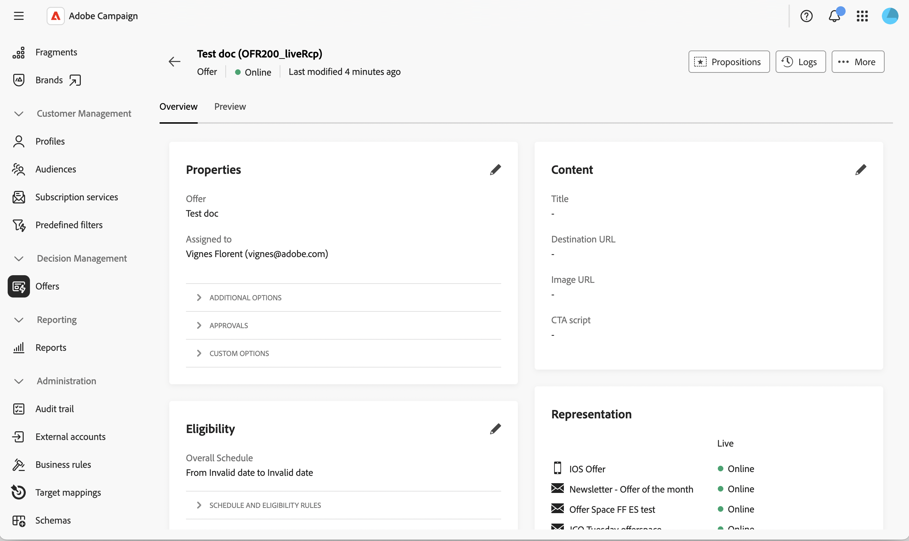

# Create and publish an offer {#create-offer}

An **offer** is an individual proposition with its own eligibility period, target filter, weight, and content. Offers are organized in the offer catalog through **categories** and are presented to recipients through an **offer space**.

Before creating an offer, make sure that the offer environment is configured and that at least one offer space is published. Learn more in [Configure an offer environment](offer-environment.md) and [Create and manage offer spaces](offer-space.md).

## Access the offer catalog {#access}

To browse and create offers, select **[!UICONTROL Offers]** from the left navigation rail. The list displays the existing offers. Use the search field, the folder selector, or the [query modeler](../query/query-modeler-overview.md) to filter the list.

{zoomable="yes"}

Click an offer name to open it for edition, or use the three dots next to it to **[!UICONTROL Duplicate]** or **[!UICONTROL Delete]** it.

## Create an offer {#create}

To create a new offer:

1. From the offers list, click **[!UICONTROL Create offer]**.

1. Select the **[!UICONTROL Template]** to create the offer from (for example, a blank offer or an anonymous offer template).

   {zoomable="yes"}

1. Enter a **[!UICONTROL Label]** and, optionally, assign the offer to an operator using **[!UICONTROL Assigned to]** and/or enter an **[!UICONTROL Offer code]**.

1. Expand **[!UICONTROL Additional options]** to edit the auto-generated **[!UICONTROL Internal name]**, select the **[!UICONTROL Category]** in which the offer is stored, or add a description. This step is optional.

1. Expand **[!UICONTROL Approvals]** to assign approvers to the **[!UICONTROL Eligibility approval]** and **[!UICONTROL Content approval]** groups. This step is optional.

1. Expand **[!UICONTROL Custom options]** to fill in any additional fields your organization has added to the offer schema. The fields shown in this section vary from one Campaign instance to another. This step is optional.

1. Click **[!UICONTROL Create]**. The full settings screen displays.

   {zoomable="yes"}

### Define the eligibility {#eligibility}

This section allows you to control when and to whom the offer can be presented. The following options are available:

* **[!UICONTROL Schedule]** — Set the start and end dates between which the offer can be presented.

    >[!NOTE]
    >
    >Eligibility period intersections with the parent category are taken into account: even if the offer's own schedule is wider, the offer is only presented while its parent category is also eligible.

* **[!UICONTROL Filters on the target]** — Click **[!UICONTROL Create filter]** to open the rule builder and restrict the offer to a specific audience. Leave the filter empty to make the offer eligible for the whole environment audience. To reuse a **predefined filter** declared at platform level, refer to the [Campaign v8 documentation](https://experienceleague.adobe.com/docs/campaign/campaign-v8/offers/interaction-predefined-filters.html){target="_blank"}. Predefined filters are created from the client console.

* **[!UICONTROL Managing offer weight]** — Click **[!UICONTROL Display offer weight]**, then **[!UICONTROL Add weight]** to influence the priority of the offer when several offers are eligible at the same time. Each weight has a start date, an end date, and an optional filter.

>[!NOTE]
>
>The Offer engine sorts eligible offers by decreasing weight and returns the highest weighted propositions first. The selection logic — referred to as **arbitrage** — also takes into account the eligibility rules and weights configured on the parent category and on the environment. Learn more about the arbitrage principle in the [Campaign v8 documentation](https://experienceleague.adobe.com/docs/campaign/campaign-v8/offers/interaction-best-practices.html){target="_blank"}.

### Define the content {#content}

From the offer, select the **[!UICONTROL Content]** tab. This tab defines the values that will be exposed by the rendering function.

1. Fill in the out-of-the-box attributes — **[!UICONTROL Title]**, **[!UICONTROL Destination URL]**, **[!UICONTROL Image URL]** and any custom attribute declared in the offer schema.

1. Use the [expression editor](../query/expression-editor.md) to personalize the values with profile data, offer attributes, or proposition fields.

1. For the HTML and text payloads, click **[!UICONTROL Edit content]** to open the content editor. You can design the content from scratch, code your own HTML, or import existing HTML, optionally starting from a sample template.

>[!IMPORTANT]
>
>The attributes available in the **[!UICONTROL Content]** section depend on the [!DNL nms:offer] schema. To expose custom attributes, extend the schema and select them in the **[!UICONTROL Offer content]** section. Learn more in [Work with schemas](../administration/schemas.md).

## Preview the offer {#preview}

You can preview the offer before submitting it.

1. From the offer, select the **[!UICONTROL Preview]** tab, next to **[!UICONTROL Overview]**.

   {zoomable="yes"}

1. Select a target profile and, if relevant, the offer space against which the preview should be run.

   The rendering function defined on the offer space is applied to the offer content, and the resulting representation is displayed.

>[!NOTE]
>
>If the preview returns an error or no content, check the rendering function of the offer space, the eligibility rules of the offer, and that all required content fields are filled.

## Approve and deploy the offer {#approve-deploy}

Offers are not immediately available in deliveries: they go through an approval and deployment cycle.

1. From the offer overview, click **[!UICONTROL Approval]**.

   {zoomable="yes"}

1. Approve the **[!UICONTROL Eligibility]** and the **[!UICONTROL Content]**. Content can be approved per offer space, so you can approve it for one offer space while leaving others pending.

1. Once both approvals are granted, click **[!UICONTROL Deploy]** to publish the offer to the live environment.

1. Refresh the offer view to confirm the **[!UICONTROL Live]** representation is up to date.

<!--
>[!NOTE]
>
>Once deployed, the design offer's status resets to **[!UICONTROL Being edited]** — its normal draft status, not a sign that someone is actively editing it. This just means the design offer is ready to accept further changes, which would then need to go through a new approval and deployment cycle. The live representation itself remains untouched until that happens.
-->

>[!CAUTION]
>
>Approving an offer's eligibility and content are two distinct actions. An offer can be partially approved (content only, for example) and remain unavailable for delivery until the eligibility approval is also granted.

## Monitor the offer dashboard {#dashboard}

The offer **[!UICONTROL Overview]** tab summarizes the offer status in **[!UICONTROL Properties]**, **[!UICONTROL Content]**, and **[!UICONTROL Eligibility]** cards, with a pencil icon on each to jump back into edition. A **[!UICONTROL Representation]** card lists every offer space the offer is linked to, along with its current design status.

   {zoomable="yes"}

Click **[!UICONTROL Logs]** to access the deployment logs, or the **···** (**[!UICONTROL More]**) menu to **[!UICONTROL Duplicate]** or **[!UICONTROL Delete]** the offer.

Once an offer is live, modifying any setting switches the design offer back to an editable state. The live representation remains untouched until the next approval and deployment cycle.

## Use the offer in a delivery {#use-in-delivery}

When the offer is live, it can be selected from any delivery that targets the matching offer space. Learn how to set up offers in a delivery in [Add offers to your messages](../msg/offers.md). 

For the full outbound delivery integration, including how the engine call is built and how tracking is applied to offer links, refer to the [Campaign v8 documentation offers in outbound deliveries](https://experienceleague.adobe.com/docs/campaign/campaign-v8/offers/interaction-send-offers.html){target="_blank"}.

