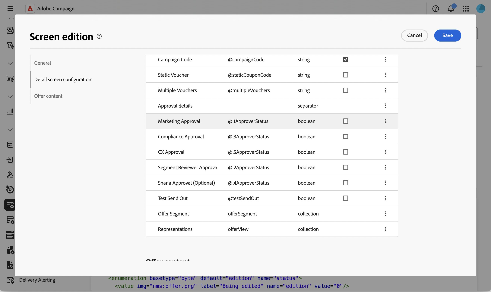

# Add an editable list to the offer schema {#offer-editable-list}

When you [extend the [!DNL nms:offer] schema](../administration/schemas.md) with a custom collection link, such as a set of segments linked to an offer, you can expose it as an editable list directly in the offer's **[!UICONTROL Custom options]** section. Instead of managing the related records through a separate screen, the collection is rendered as a list in the offer detail, and you can create new related records inline through a dedicated dialog.

>[!NOTE]
>
>This capability is currently available for the offer schema only.

## Add a collection link field {#add-field}

1. Extend the [!DNL nms:offer] schema with your custom collection, then browse to the **[!UICONTROL Schemas]** menu, open the **[!UICONTROL Marketing offers]** schema, and click **[!UICONTROL Screen edition]**. [Learn more](../administration/schemas-browse-access.md#screen-def).

   {zoomable="yes"}

1. In the **[!UICONTROL Detail screen configuration]** section, click the ellipsis icon above the **[!UICONTROL List of custom fields]** table and choose **[!UICONTROL Select attributes]**. [Learn more](../administration/schemas-custom-fields.md).

   {zoomable="yes"}

1. Browse the attributes and select your custom collection link, identified by its collection icon.

   {zoomable="yes"}

   >[!NOTE]
   >
   >Collection link fields cannot be made mandatory, and do not support sub-attributes. By default, they span two columns in the form.

1. Confirm your selection. The collection link is added to the **[!UICONTROL List of custom fields]** table, with **[!UICONTROL collection]** as its type.

   {zoomable="yes"}

## Configure the collection's editable list {#configure-list}

1. Click the ellipsis icon on the collection field's row and choose **[!UICONTROL Edit]** to open the **[!UICONTROL Collection link settings]** dialog.

   {zoomable="yes"}

1. In the **[!UICONTROL General]** tab, optionally set a **[!UICONTROL Visible if]** condition, or enable **[!UICONTROL Read-only]**.

   {zoomable="yes"}

1. In the **[!UICONTROL Screen configuration]** tab, click **[!UICONTROL Select attributes]** and select the attributes to use when adding a new element to the list, for example a segment name and a custom field.

   {zoomable="yes"}

1. In the **[!UICONTROL Layout]** tab, keep or clear **[!UICONTROL Span two columns]**.

1. Click **[!UICONTROL Confirm]**, then **[!UICONTROL Save]** the screen definition.

## Use the editable list in an offer {#use-list}

1. From the left menu, click **Offers** and open an offer. [Read more](create-offer.md#create)

   {zoomable="yes"}

1. Access the offer properties. The collection is rendered as a list in the **Custom options** section.

   {zoomable="yes"}

1. Click **[!UICONTROL Add]** to display the attributes you configured, fill them in, and click **[!UICONTROL Confirm]**. The new element is added to the list. 

   You can add multiple elements to the same list, and the offer detail can contain more than one editable list. 
   
1. Click **[!UICONTROL Save]**.

<!--
Each element added through the editable list creates a new related record. For instance, adding a segment to an offer generates the following payload:

```xml
<offer ...>
  <offerSegment segmentName="..." _operation="insert"/>
</offer>
```
-->