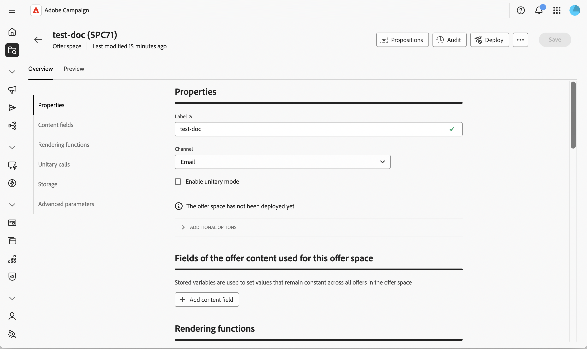

# Create and manage offer spaces {#offer-space}

An **offer space** defines where and how an offer is exposed to a contact: which channel it uses (email, direct mail, SMS, inbound web, etc.), which content fields the offer can use, and how the final representation is built. A single environment can contain multiple offer spaces — one for each exposition point.

An offer space is not a channel by itself. It represents a specific location where the offer is displayed on a channel. Two banners on the same web page typically correspond to two different offer spaces. For the full conceptual model, refer to the [Campaign v8 documentation](https://experienceleague.adobe.com/docs/campaign/campaign-v8/offers/interaction-offer-spaces.html){target="_blank"}.

## Create or modify an offer space{#create-offer-space}

Offer spaces are stored under the offer environment folder. To browse the offer spaces available on your platform, open the **[!UICONTROL Explorer]**, navigate to the offer environment and select the sub-folder that contains them. 

{zoomable="yes"}

From there, you can open an existing offer space or create a new one by clicking **[!UICONTROL Create offer space]**.

{zoomable="yes"}

### Define the properties {#properties}

This section allows you to:

* Enter a **[!UICONTROL Label]** for the offer space.
* Select the **[!UICONTROL Channel]** that matches the exposition point (email, direct mail, SMS, web, etc.).
* Select **[!UICONTROL Enable unitary mode]** if this offer space must also support unitary (real-time, single-offer) calls to the Offer engine, in addition to bulk delivery calls.

### Define the content fields {#content-fields}

The content fields list the attributes that can be edited at offer level and reused by the rendering function. The order in which you add the fields in the offer space drives the order in which they are exposed in the offer **[!UICONTROL Content]** section.

By default, every offer ships with the following out-of-the-box content fields: **[!UICONTROL Title]**, **[!UICONTROL Destination URL]**, **[!UICONTROL Image URL]**, **[!UICONTROL HTML content]**, and **[!UICONTROL Text content]**. You can extend this list with any custom field your rendering needs — for example, a **short content**, a **tracked URL**, or any attribute added through schema extension.

Click **[!UICONTROL Add content field]**, then select the attribute to expose from the offer schema, or click **[!UICONTROL Edit expression]** to define a custom expression instead.

>[!IMPORTANT]
>
>To make a custom attribute editable from the offer **[!UICONTROL Content]** section, the attribute must also be declared in the **[!UICONTROL Offer content]** section of the [!DNL nms:offer] schema. Learn more in [Work with schemas](../administration/schemas.md).

### Configure the rendering functions {#rendering}

The rendering functions build the final offer representation from the content fields. You can choose between the default rendering — which simply outputs the content as is — or a custom function that combines the fields with HTML, XML, or text.

Select the **[!UICONTROL HTML rendering]**, **[!UICONTROL XML rendering]**, or **[!UICONTROL Text rendering]** tab, and enable **[!UICONTROL Overload the rendering function]** to activate it.

Use the expression editor to write the rendering function. You can reference the content fields defined in the space, the offer attributes, and any function from the [expression editor](../query/expression-editor.md).

>[!NOTE]
>
>If no rendering function is defined, the offer content is returned as is using the out-of-the-box attributes. The XML rendering function can only be used when **[!UICONTROL Enable unitary mode]** is selected on the offer space.

### Configure the storage and proposition status {#storage}

This section allows you to control how propositions generated through this space are persisted and how their status evolves throughout their lifecycle:

* **[!UICONTROL Disable the inserting of propositions]** — Prevents propositions generated through this offer space from being inserted into the proposition storage table.

* **[!UICONTROL Status]** on proposition — Status applied to the proposition the moment the Offer engine returns it (typically **[!UICONTROL Presented]** for outbound deliveries).

* **[!UICONTROL Status]** on acceptance — Status applied when the recipient interacts with the offer (typically **[!UICONTROL Accepted]**).

The available status values match the list used by the Client Console.For more information, refer to [Campaign v8 documentation](https://experienceleague.adobe.com/docs/campaign/campaign-v8/offers/interaction-offer-spaces.html#offer-proposition-statuses){target="_blank"} in the console documentation.

<!--
>[!NOTE]
>
>Status updates run asynchronously through the tracking workflow. For an outbound delivery containing a tracked link, the status of the proposition is automatically switched to **[!UICONTROL Presented]** when the delivery reaches the **[!UICONTROL Sent]** state. To trigger the **[!UICONTROL Interested]** status from a click, add the `_urlType="11"` attribute to the link. The full **inbound interaction** URL syntax (for example to apply the **[!UICONTROL Rejected]** status from a web app) must be configured in the client console — see [Inbound interaction status update](https://experienceleague.adobe.com/docs/campaign/campaign-v8/offers/interaction-offer-spaces.html#configuring-the-status-when-the-proposition-is-accepted){target="_blank"}.
-->

### Configure advanced settings {#advanced}

This section allows you to define the **[!UICONTROL Target identification]**. Click **[!UICONTROL Add]** and select one or several **[!UICONTROL Recipient]** attributes or click **[!UICONTROL Edit expression]** to define a custom expression instead. This setting is optional for a basic offer space. For its full reference and behavior, refer to the [Campaign v8 documentation](https://experienceleague.adobe.com/docs/campaign/campaign-v8/offers/interaction-offer-spaces.html){target="_blank"}.

Offer spaces created on the **inbound web channel** also require the website to be configured to display the offer and to call the Offer engine. This integration is performed in the Client Console — see [Present offers in real time](https://experienceleague.adobe.com/docs/campaign/campaign-v8/offers/interaction-present-offers.html){target="_blank"} and [Configure the Offer engine integration](https://experienceleague.adobe.com/docs/campaign/campaign-v8/offers/interaction-integration.html){target="_blank"} in the Campaign v8 documentation.

## Deploy the offer space {#deploy}

An offer space must be deployed before it can be used in a delivery. Save your offer space, then click **Deploy**. The status of the deployment is reflected on the offer space.

{zoomable="yes"}

## Preview the offer space {#preview}

The preview lets you simulate how an offer is selected and rendered for a given target.

1. From the offer space, select the **[!UICONTROL Preview]** tab, next to **[!UICONTROL Overview]**.

   {zoomable="yes"}

1. Select a target profile and run the preview. The matching offers are returned with the representation produced by the rendering function.

>[!NOTE]
>
>If no propositions are returned, check the eligibility rules of the offers and the configuration of the space.

Next, [create an offer](create-offer.md) in the catalog and assign it to this space.
