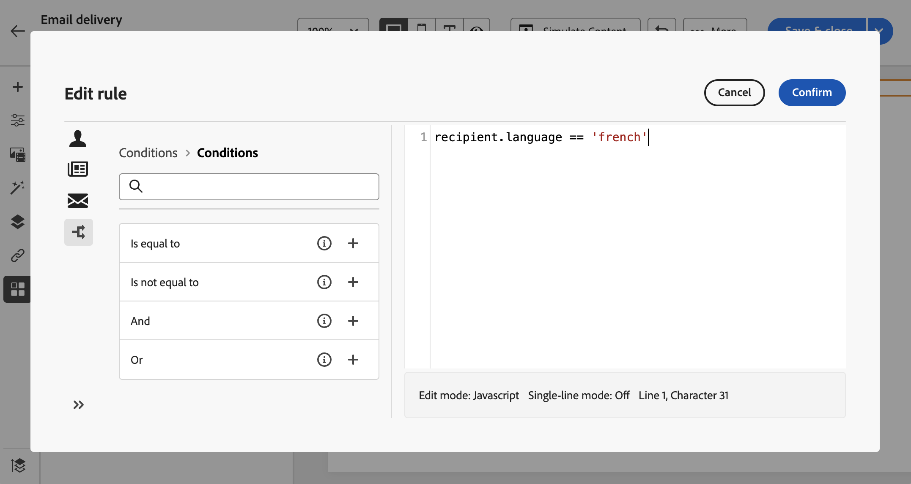

# Build conditional content{#add-conditions}

>[!CONTEXTUALHELP]
>id="acw_conditional_content"
>title="Add conditional content"
>abstract="Configure conditional content fields to create advanced dynamic personalization based on the recipient's profile data. Text blocks, links, subject line, and/or images are replaced in the message content when a particular condition is satisfied."

## Get started with conditional content {#gs}

Conditional content is a powerful feature that allows you to create dynamic personalization based on the recipient's profile data, automatically replacing text blocks and images when certain conditions are met. This feature can take your campaigns to new heights and deliver highly targeted, personalized experiences to your audience.

By configuring conditional content fields, you can create advanced dynamic personalization based on the recipient's profile for example. Text blocks, links, subject line, and/or images are replaced in the message content when a particular condition is satisfied. For example, you can display 'Mr' or 'Mrs' according to the value of the Gender field in Adobe Campaign database, or include a different link based on the recipient preferred language.

To create conditional content, you need to create conditions in the **expression editor** using specific helper functions. This method is available for all delivery channels, in any field where you can access the expression editor, such as the subject line, or email links and text/button content components. [Learn how to access the expression editor](gs-personalization.md#access)

In addition to the expression editor, you can leverage a dedicated **conditional content builder** when designing an email that allows you to create multiple variants for an element of your email body. [Learn how to create conditional content in emails](#condition-condition-builder)

## Create conditions in the expression editor {#condition-perso-editor}

>[!CONTEXTUALHELP]
>id="acw_personalization_editor_conditions"
>title="Conditions"
>abstract="This menu allows you to leverage helper functions to define conditional content."

To define conditional content for a delivery using the expression editor, follow the steps below. In this example, we want to create conditional content based on the recipients' language (French or English).

1. Open a delivery and navigate to the content editing section.

1. Locate the field where you want to add conditional content. For example, you can add conditional content to an SMS message.

1. Click the **[!UICONTROL Open personalization dialog]** icon next to the field to open the expression editor.

    {zoomable="yes"}

1. In the personalization editor, browse to the **[!UICONTROL Conditions]** menu on the left.

1. To start building your condition, click the '+' icon next to the **If** function. The following line is added to the central screen:`<% if (<FIELD>==<VALUE>) { %>Insert content here<% } %>`

    * Replace `<FIELD>` with a personalization field, such as the recipient's language: `recipient.language`.
    * Replace `<VALUE>` with the value to satisfy. For example, `'French'`.
    * Replace `Ìnsert content here` with the content that you want to display to the profiles that meet the specified condition.

        {zoomable="yes"}{width="800" align="center"}

1. Specify the content that should be displayed if the recipients do not meet the condition. To do this use an **else** helper function:

    1. Place your cursor before the expression closing tag `%>` and click the `+` next to the **Else** function.

    1. Replace `Ìnsert content here` with the content you want to display to the profiles that do not meet the if function's condition.

    {zoomable="yes"}{width="800" align="center"}

    You can also use the **else if** helper function to build conditions with multiple content variants. For example, the expression below displays three variants of a message depending on the recipients' language:

    {zoomable="yes"}{width="800" align="center"}

    >[!NOTE]
    >
    >Each time a helper function is added, opening (`<%`) and closing (`%>`) tags are automatically added before and after the function.
    >
    >Example after adding an "Else" helper function inside an expression: >
    >
    >`<% if (<FIELD>==<VALUE>) { %>Insert content here<% } <% else { %> Insert content here<% } %>%>`
    >
    >Make sure you remove these tags to avoid any syntax errors. In this example, the corrected expression after removing the **else** function tags is:
    >
    >`<% if (<FIELD>==<VALUE>) { %>Insert content here<% } else { %> Insert content here<% } %>`

1. Once your condition is ready, you can save your content and check its rendering by simulating your content.

## Create conditional content in emails {#condition-condition-builder}

Conditional content in emails can be created in two ways:
* In the expression editor by building a condition with helper functions,
* In a dedicated conditional content builder that is accessible when designing an email.

The following section provides step-by-step instructions on how to create conditions using the Email Designer's conditional content capability. Detailed information on how to create conditions using the expression editor is available [here](#condition-perso-editor).

In this example, we want to create an email message with multiple variants based on the recipients' language. Follow these steps:

1. Create or open an email delivery, edit its content, and click the **[!UICONTROL Edit email body]** button to open the email designing workspace.

1. Select a content component and click the **[!UICONTROL Enable conditional content]** icon.

    {zoomable="yes"}{width="800" align="center"}

1. The **[!UICONTROL Conditional Content]** pane opens on the left-hand side of the screen. In this pane, you can create multiple variants of the selected content component using conditions.

1. Configure your first variant. Hover over **[!UICONTROL Variant - 1]** in the **[!UICONTROL Conditional Content]** pane and click the **[!UICONTROL Add condition]** button.

    {zoomable="yes"}{width="800" align="center"}

1. The query modeler opens. It allows you to build a condition by filtering the recipient's profile data. [Learn how to work with the query modeler](../query/query-modeler-overview.md).

    Once the condition for the first variant of the message is ready, click **[!UICONTROL Confirm]**. In this example, we are creating a rule targeting recipients whose language is 'French'.

    {zoomable="yes"}{width="800" align="center"}

1. The rule is now associated to the variant. For better readability, we recommend renaming the variant by clicking the ellipsis menu.

1. Configure how the component should display if the rule is met when sending the message. In this example, we want to display the text in French if it is the recipient's preferred language.

    {zoomable="yes"}{width="800" align="center"}

1. Add as many variants as needed for the content component. You can switch between the variants at any time to check how the content component will display based on their conditional rules.

    >[!NOTE]
    >If none of the rules defined in the variants are met when sending the message, the content component will display the content defined in the **[!UICONTROL Default variant]** from the **[!UICONTROL Conditional Content]** pane.

## Use variables for conditional content {#variables-conditional}

The variables can be used for conditional content in your delivery.

Learn more about [adding variables to a delivery](../advanced-settings/delivery-settings.md#variables-delivery). 

Choose the element where you want to put a conditional content.

{zoomable="yes"}

To use your variable, configure the condition using the **[!UICONTROL Edit expression]** button, as shown below.
In this example, this image is displayed when the value of the variable is `launch`.

{zoomable="yes"}

You can also create another variant with the value `reminder`, for example, where a different image is displayed.
