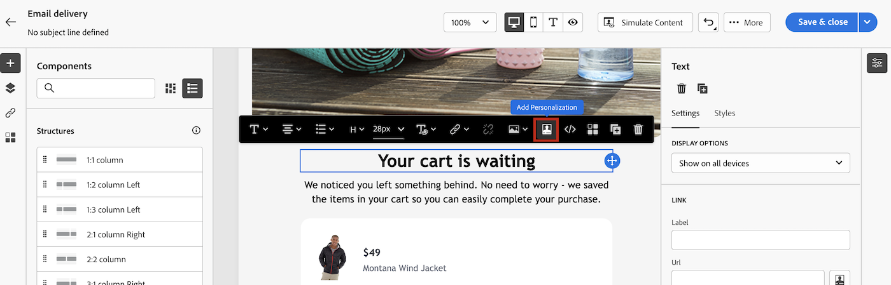

# Get started with dynamic content

To get the most out of every marketing campaign, Adobe Campaign gives you a way to deliver custom dynamic content that speaks to customers on their level. Based on profile data, use personalization capabilities to create a custom experience for different groups and individuals: you can adapt your messages to each specific recipient by leveraging the data and information you have about them. It can be their first name, interests, where they live, what they bought, and much more.

Use Campaign to create dynamic content and send personalized messages. Personalization capabilities can be combined to improve your messages and create a custom user experience.

You can make your message content dynamic by inserting:

* **Personalization fields**

    Personalization fields are used for first-level personalization of your messages. You can select any field available in the database from the personalization editor. For a delivery, you can select any field related to the recipient, the message or the delivery. These personalization attributes can be inserted in the subject line or the body of your messages.

    

    The following syntax inserts the city of the recipient in your content: <%= recipient.location.city %>.

* **Conditional content**

    Configure conditional content to add content based on the recipient’s profile for example. Text blocks and/or images are inserted when a particular condition is true. You can define the alternative version of the content when the condition is not true.

* **Built-in content blocks**
    
    Campaign comes with a set of personalization blocks which contain a specific rendering that you can insert into your deliveries. For example, you can add a logo, a greeting message, or a link to the mirror page of an email message. Content blocks are available from a dedicated entry in the personalization editor.

    

## Where can I add dynamic content?

Adobe Campaign V8 Web provides an expression editor where you can select, arrange, customize and validate all the data to create a customized experience for your content.

The expression editor is available for all channels, in every fields with the Open personalization dialog icon, such as the subject line field, or email links and text/button content components.

In addition, a dedicated conditional content builder is accessible when designing an email. [Learn how to build conditional content in emails](conditions.md)

## Let's dive deeper

Now that you have an understanding of how to make your content dynamic, it's time to dive deeper into these documentation sections to start working with the feature.

<table style="table-layout:fixed"><tr style="border: 0;">
<td>

<a href="personalize.md"><strong>Add personalization</strong></a>

</td>
<td>

<a href="conditions.md"><strong>Add conditional content</strong>

</td>
<td>

<a href="content-blocks.md"><strong>Add built-in content blocks</strong></a>

</td>
</tr></table>
