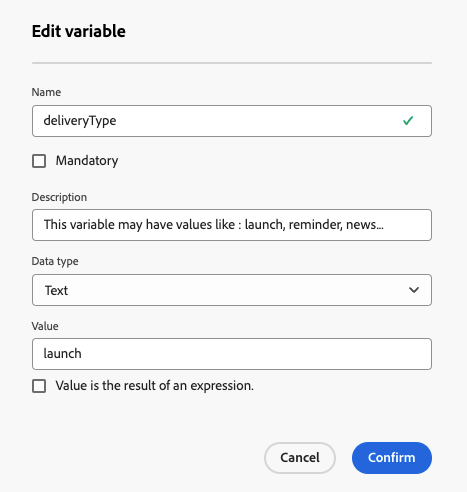

# Personalize your content {#add-personalization}

>[!CONTEXTUALHELP]
>id="acw_personalization_editor_add_current_date"
>title="Add current date"
>abstract="This menu provides functions related to date formatting that you can leverage to personalize your content."

Personalization of delivery content is a key feature that allows you to tailor messages to individual recipients, making communication more relevant and engaging.

In Adobe Campaign, by using [profile data](#data-personalization), such as the profile's name, location, or past interactions, and specific [variables of your delivery](#variables-personalization), you dynamically customize elements like text, images, and offers in your communication.

Delivery personalization enhances the user experience and improves engagement rates, leading to higher conversion and customer satisfaction.

## Using profile data for personalization {#data-personalization}

You personalize any delivery with profile data by using the expression editor, which is accessible in fields with the **[!UICONTROL Open personalization dialog]** icon, such as the subject line, email links, and text/button content components. [Learn how to access the expression editor](gs-personalization.md#access).

### Personalization syntax {#syntax}

Personalization tags follow a specific syntax: `<%= table.field %>`. For example, to insert the recipient's last name from the recipient table, use the `<%= recipient.lastName %>` syntax.

During the delivery preparation process, Adobe Campaign interprets these tags and replaces them with the corresponding field values for each recipient. You view the actual replacement by simulating your content.

When uploading contacts from an external file for a standalone email delivery, all fields in the input file are available for personalization. The syntax is as follows: `<%= dataSource.field %>`.

### Add personalization tags {#add}

To add personalization tags into a delivery, follow these steps:

1. Open the expression editor using the **[!UICONTROL Open personalization dialog]** icon, which is accessible from text-type editing fields, such as the subject line or the SMS body. [Learn how to access the expression editor](gs-personalization.md#access).

    {zoomable="yes"}{width="800" align="center"}

1. The expression editor opens. Personalization fields available in the Adobe Campaign database are organized into several menus on the left side of the screen:

    {zoomable="yes"}{width="800" align="center"}

    | Menu | Description |
    |------|-------------|
    | {zoomable="yes"} | The **[!UICONTROL Subscribers application]** menu lists fields related to the subscribers of an application, such as the used terminal or the operating system. *This menu is available for push notifications only.* |
    | {zoomable="yes"} | The **[!UICONTROL Recipient]** menu lists fields defined in the recipients table, such as recipients' names, ages, or addresses. When [uploading contacts from an external file](../audience/file-audience.md) for a standalone email delivery, this menu lists all fields available in the input file. |
    | {zoomable="yes"} | The **[!UICONTROL Message]** menu lists fields related to the delivery logs, including all messages sent to recipients or devices across all channels, such as the date of the last event with a given recipient. |
    | {zoomable="yes"} | The **[!UICONTROL Delivery]** menu lists fields related to the parameters required for performing deliveries, such as the delivery channel or label. |

    >[!NOTE]
    >
    >By default, each menu lists all fields within the selected table (Recipients, / Message / Delivery). If you want to include fields from tables linked to the selected table, enable the **[!UICONTROL Display advanced attributes]** option located below the list.

1. To add a personalization field, position your cursor at the desired location within your content, and click the `+` button to insert it.

1. Once your content is ready, save it and test the rendering of the personalization by simulating your content. The example below shows the personalization of an SMS message with recipients' first names.

    {zoomable="yes"}{width="800" align="center"}

    {zoomable="yes"}{width="800" align="center"}

## Using variables for personalization {#variables-personalization}

You also use variables to personalize your delivery. Learn more about [adding variables to a delivery](../advanced-settings/delivery-settings.md#variables-delivery).

For example, the variable `deliveryType` is defined as shown below.

{zoomable="yes"}

This variable is used in the content of the delivery by using the **[!UICONTROL Add Personalization]** icon and the expression `<%= variables.deliveryType %>` for this example.

{zoomable="yes"}

Check the use of your variable with the **[!UICONTROL Simulate Content]** button.

{zoomable="yes"}