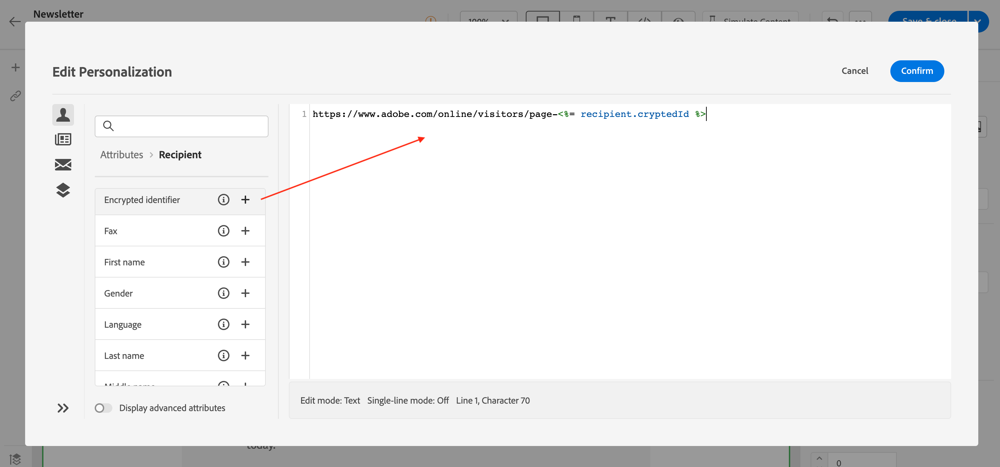

# Personalize your content{#add-personalization}

To get the most out of every marketing campaign, Adobe Campaign gives you a way to deliver custom content that speaks to customers on their level. Based on profile data, use personalization capabilities to create a custom experience for different groups and individuals: you can adapt your messages to each specific recipient by leveraging the data and information you have about them. It can be their first name, interests, where they live, what they bought, and much more.

Use Campaign to create dynamic content and send personalized messages. Personalization capabilities can be combined to improve your messages and create a custom user experience.

You can personalize the message content by:

* Inserting dynamic **personalization fields**

    Personalization fields are used for first-level personalization of your messages. You can select any field available in the database from the personalization editor. For a delivery, you can select any field related to the recipient, the message or the delivery. These personalization attributes can be inserted in the subject line or the body of your messages.

    

    The following syntax inserts the city of the recipient in your content: <%= recipient.location.city %>.
    
* Inserting pre-defined **content blocks**
    
    Campaign comes with a set of personalization blocks which contain a specific rendering that you can insert into your deliveries. For example, you can add a logo, a greeting message, or a link to the mirror page of an email message. Content blocks are available from a dedicated entry in the personalization editor.

    

* Create **conditional content**

    Configure conditional content to add dynamic personalization based on the recipient’s profile for example. Text blocks and/or images are inserted when a particular condition is true. You can define the alternative version of the content when the condition is not true.

## Personalize the subject line of a message {#personalize-subject-line}

To add personalization in the **[!UICONTROL Subject line]** field of the message, follow the steps below:

1. Open a delivery and click **[!UICONTROL Edit content]**.
1. Click the **[!UICONTROL Open personalization dialog]** icon on the right of the **[!UICONTROL Subject line]** field for emails, or the **[!UICONTROL Title]** fields for push/SMS deliveries.

    {width="600"}

1. Enter the subject line or title, and select the personalization attributes to add.

1. Click **[!UICONTROL Confirm]** to validate. The personalization attributes are added to the content.

## Personalize your email content {#personalize-emails}

To personalize the email content, open the message in the Email designer and:

1. Click inside a text block.
1. In the contextual toolbar, select **[!UICONTROL Add personalization]**.

    

1. Insert the name of the recipient in the personalization editor and confirm.

    

    The personalization attribute is added to the email content. 
    
    You can simulate the content to check rendering. [Learn more](../preview-test/preview-content.md)

    

1. To add a content block to your email, apply the same steps and select a content block from the last icon:

    

1. Once inserted, the content block is added to the email content It is automatically adapted to the recipient profile when personalization is generated, at the delivery preparation step.

    

## Personalize links in your emails {#personalize-links}

To personalize a **link**:

1. Select a text block or an image.
1. In the contextual toolbar, select **Insert link**.

    

1. Enter the link label and use the **Insert link** button to personalize the link.

    

1. Use the personalization editor to define and personalize the link, and confirm.

    

## Personalize your offers {#personalize-offers}

You can also access the personalization editor when adding text-type content to your offers' representations. Learn more in [this section](../content/offers.md).

## Built-in content blocks {#ootb-content-blocks}

Built-in content blocks are:

* **[!UICONTROL Enabled by Adobe Campaign]**: inserts the "Enabled by Adobe Campaign" logo.
* **[!UICONTROL Formatting function for proper nouns]**: generates the **[!UICONTROL toSmartCase]** Javascript function, which changes the first letter of each word to uppercase. 
* **[!UICONTROL Greetings]**: inserts greetings with the recipient's full name, followed by a comma. Example: "Hello John Doe,".
* **[!UICONTROL Insert logo]**: inserts a logo which is is defined in the instance settings.
* **[!UICONTROL Link to mirror page]**: inserts a link to the [mirror page](../content/mirror-page.md). Default format is: "If you are unable to view this message correctly, click here".
* **[!UICONTROL Mirror page URL]**: inserts the mirror page URL, enabling Delivery Designers to check the link.
* **[!UICONTROL Offer acceptance URL in unitary mode]**: inserts an URL enabling to set an offer to **[!UICONTROL Accepted]**. (This block is available if the Interaction module is enabled)
* **[!UICONTROL Registration confirmation]**: inserts a link enabling to confirm subscription.
* **[!UICONTROL Registration link]**: inserts a subscription link. This link is defined in the instance settings. The default content is: "To register click here."
* **[!UICONTROL Registration link (with referrer)]**: inserts a subscription link, enabling to identify the visitor and delivery. This link is defined in the instance settings.
* **[!UICONTROL Registration page URL]**: inserts a subscription URL
* **[!UICONTROL Style of content emails]** and **[!UICONTROL Notification style]**: generate code which format an email with predefined HTML styles. 
* **[!UICONTROL Unsubscription link]**: inserts a link enabling to unsubscribe from all deliveries (denylist). The default associated content is: "You are receiving this message because you have been in contact with ***your organization name*** or an affiliate. To no longer receive messages from ***your organization name*** click here."
