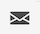

# Personalize your content{#add-personalization}

Personalization can be added to any delivery using the expression editor. 

A personalization tag always uses the following syntax: `<%=table.field%>`.For example, to insert the name of the recipient, stored in the recipient table, the personalization tag uses the <%= recipient.lastName %> syntax.

When a delivery is prepared, these tags are automatically interpreted by Adobe Campaign and replaced by the value of the field for a given recipient. The physical replacement can then be viewed when simulating your content.

To add personalization tags into a delivery, click the Open personalization dialog icon that is accessible from text-type editing fields, such as the subject line or the SMS body.

The expression editor displays. Personalization fields are organized into three menus, located to the left of the screen. These menus give access to all fields available in the Adobe Campaign database.

|Menu | Description | 
|-----|------------|
| | The **[!UICONTROL Recipient]** menu lists all the fields defined in the recipients table, such as the recipients' name, age, or address. | 
|| The **[!UICONTROL Message]** menu lists all the fields related to the delivery logs, i.e. all messages sent to recipients or devices across all channelsk, such as the date of the last event with a a given recipient |
|| The **[!UICONTROL Delivery]** menu lists all the fields related to the parameters required for performing deliveries such as the delivery channel, label, etc.|

>[!NOTE]
>
>By default, the list shows all fields within the selected table (Recipients, / Message / Delivery). If you want to include fields from tables linked to the selected table, enable the **[!UICONTROL Display advanced attributes]** option located below the list.

To add a personalization field, place your cursor at the desired location within your content and click the + button to insert it.

## Personalize your email content {#personalize-emails}

To personalize the email content, open the message in the Email designer and:

1. Click inside a text block.
1. In the contextual toolbar, select **[!UICONTROL Add personalization]**.

    

1. Insert the name of the recipient in the personalization editor and confirm.

    

    The personalization attribute is added to the email content. 
    
    You can simulate the content to check rendering. [Learn more](../preview-test/preview-content.md)

    

1. To add a content block to your email, apply the same steps and select a content block from the last icon:

    

1. Once inserted, the content block is added to the email content It is automatically adapted to the recipient profile when personalization is generated, at the delivery preparation step.

    

## Personalize your offers {#personalize-offers}

You can also access the personalization editor when adding text-type content to your offers' representations. Learn more in [this section](../content/offers.md).

