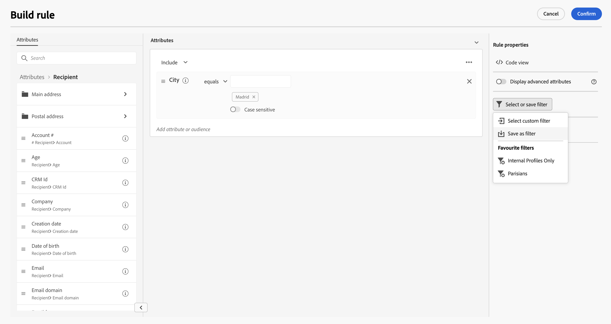
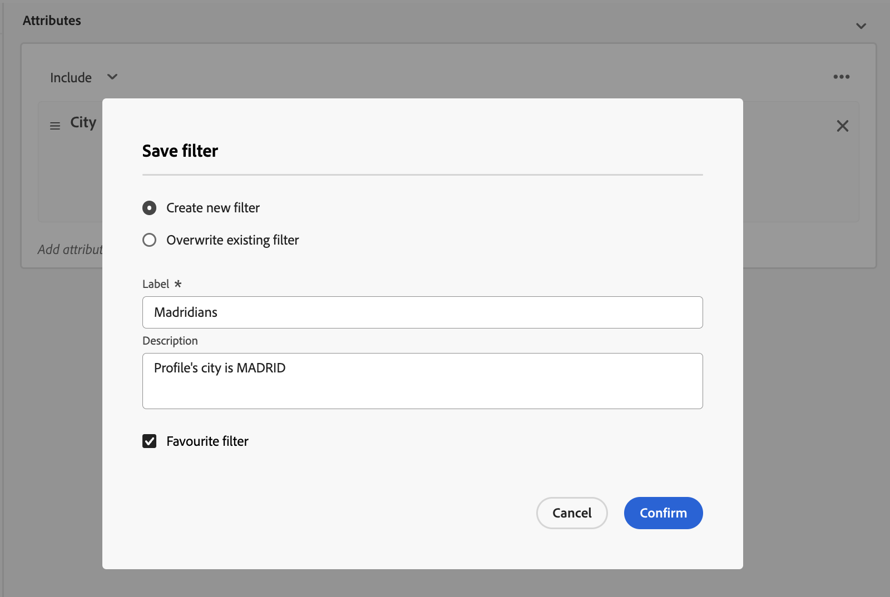
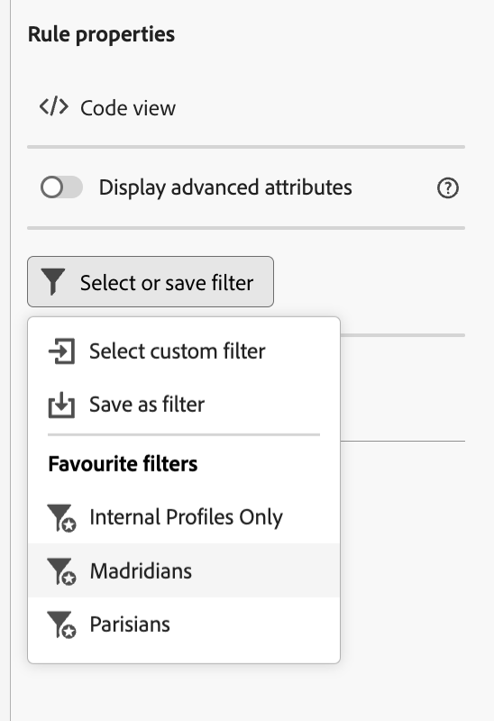

# Work with predefined filters {#predefined-filters}

>[!CONTEXTUALHELP]
>id="acw_homepage_card3"
>title="Predefined filter management"
>abstract="Campaign web now offers you an user-friendly interface to effortlessly manage and customize predefined filters to meet your specific needs. Create once and save for future use."

>[!CONTEXTUALHELP]
>id="acw_predefined-filters-dashboard"
>title="Predefined filters"
>abstract="Campaign web now offers you an user-friendly interface to effortlessly manage and customize predefined filters to meet your specific needs. Create once and save for future use."

Predefined filters are custom filters which are available for future use. They can be used as shortcuts during filtering operations with the rule builder.

## Create a predefined filter {#create-predefined-filter}

>[!CONTEXTUALHELP]
>id="acw_predefined-filters-creation"
>title="Create a predefined filter"
>abstract="Enter a label for the predefined filter, and select the table it applies to. Open the additional options to add a description and set this filter as a favorite. Then use the 'Create rule' button to define the filtering conditions."

When creating a filter with the rule builder, you can save it for a future use. When saved as a custom filter, it is available for future use. You can also create and edit predefined filter from the dedicated menu in the left navigation.

To save a custom filter in the rule builder, follow the steps below:

1. Open the rule builder and define your filtering conditions. In the example below, you filter recipients who live in Madrid.
1. Click the **Select or save filter** button, and select **Save as a filter**.

    

1. Select **Create a new filter**, and enter a name and a description for that filter.
    
    

1. (optional) Enable the **Save as favorite** option if you want to see this predefined filter in your favorites.

    

1. Click **Confirm** to save your changes.

Your custom filter is now available in the **Predefined Filters** list and accessible to all Campaign users.

## Use a predefined filter {#use-predefined-filter}

## Manage your predefined filters {#manage-predefined-filter}

