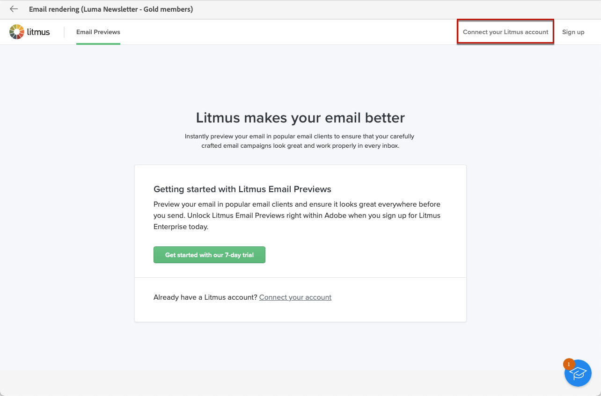
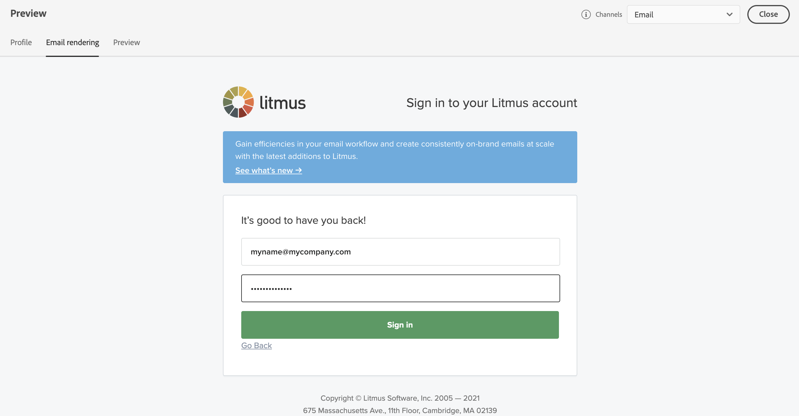
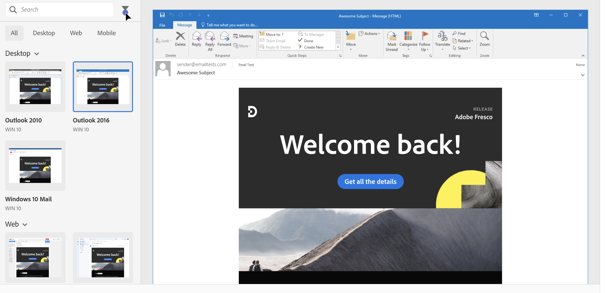

# Test the email rendering {#email-rendering}

Before sending your email, ensure your message displays optimally for recipients across various web clients and devices.

To achieve this, use your **Litmus** account within [!DNL Adobe Campaign] to preview your email rendering instantly in different contexts. This allows you to check compatibility with major desktop applications, webmail services, mobile devices, and more.

>[!CAUTION]
>
>Using email rendering in Campaign sends a proof to a third-party system. By connecting your Litmus account with [!DNL Campaign], you acknowledge that Adobe is not responsible for any data you may send to that third party. Litmus's email data retention policy applies to these emails, including personalization data that may be included in these proofs. To access or delete such data, contact Litmus directly.

To access email rendering capabilities, complete the following prerequisites:

* Have a Litmus account.
* Select profiles and/or test profiles. Learn how in [this section](preview-content.md).

Then, follow the steps below.

1. In the [Edit content](../email/edit-content.md) screen or in the [Email Designer](../email/get-started-email-designer.md), click the **[!UICONTROL Simulate content]** button.

1. Select the **[!UICONTROL Render email]** button.

    {zoomable="yes"}

1. Click **Connect your Litmus account** in the upper right section.

    {zoomable="yes"}

1. Enter your credentials and sign in.

    {zoomable="yes"}

1. Click the **Run test** button to generate email previews.

1. Review your email content in popular desktop, mobile, and web-based clients.

    {zoomable="yes"}

<!--
TO CHECK IF user is directed to Litmus or if the email rendering is shown directly in the Campaign UI.

CONTENT ABOVE COPIED FROM AJO

If not redirecting to Litmus:

To test the email rendering, follow these steps:

1. Access the email content creation screen, then click **[!UICONTROL Simulate content]**.

1. Click the **[!UICONTROL Render email]** button.

    The left pane provides various desktop, mobile, and web-based email clients. Select the desired email client to display a preview of your email in the right pane. 

    {zoomable="yes"}

    >[!NOTE]
    >
    >The email clients list provides a sample of the major mail clients. Additional email clients are available from the filter button next to the top search bar.

 -->