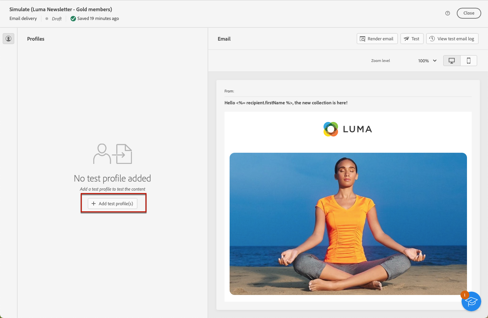

# Preview email content {#preview-content} 

Use the [!DNL Campaign] content simulation capability to preview the content of your email before sending it. This allows you to control personalization and check how it is displayed to your recipients.

To preview the content of your email, follow the steps below.

1. Browse to the email [Edit content](../content/edit-content.md) screen.

1. Click the **[!UICONTROL Simulate content]** button.

    

1. Use the **[!UICONTROL Add test profile(s)]** button to select the profiles that will be used to preview your personalized content. 

    

1. You can combine test profiles and profiles to preview your email. 

    * The **[!UICONTROL Test profiles]** tab lists all seed addresses, which are additional and fictitious recipients in the database. They can be created in the [!DNL Campaign] console into the **[!UICONTROL Resources]** > **[!UICONTROL Campaign Management]** > **[!UICONTROL Seed addresses]** folder.
    * The **[!UICONTROL Profiles]** tab lists all the recipients stored into the **[!UICONTROL Profiles and Targets]** folder from the [!DNL Campaign] console.

    

1. Click **[!UICONTROL Select]** to confirm your selection.

    A preview of the email is displayed in the right pane of the **[!UICONTROL Simulate]** screen. Personalized elements are replaced with the data from the profile selected in the left pane.

    

1. If you have added multiple profiles, you can switch between them in the list to preview the corresponding email content.

1. You can preview the rendering of your content on different devices (desktop or mobile) by clicking the dedicated icon in the top right corner.

