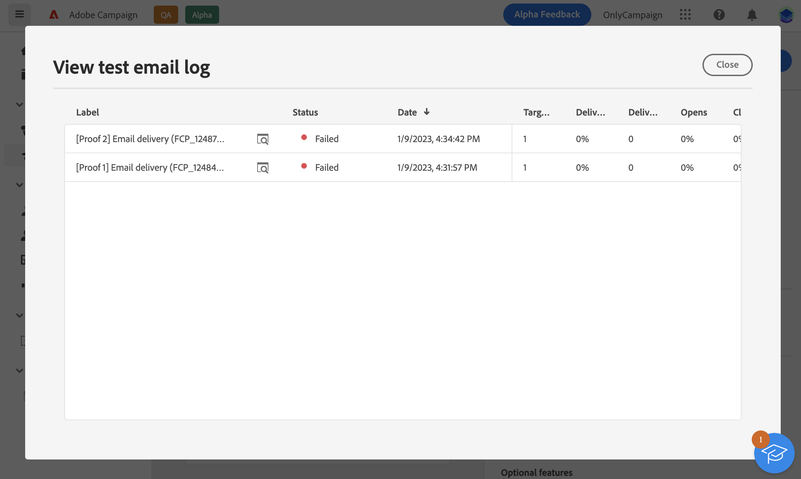

# Preview and test your email {#preview-test-send}

>[!NOTE]
>
>This documentation is under construction and frequently updated. The final version of this content will be ready in January 2023.

Once the email content has been defined, you can check how it will display before sending it. This allows you to test the email in order to detect possible errors in content or personalization settings.

To do this, Adobe Campaign allows you to:

* [Preview the email content and personalization](#preview) using profile data,
* [Check the email rendering](#rendering) of the email in popular desktop, mobile and web-based clients,
* [Send proofs](#send-proofs) to specific recipients in order to test and validate the email.

These actions are performed from the **[!UICONTROL Simulate content]** button which is accessible when creating the content of your email:

## Preview your content {#preview}

Adobe Campaign allows you to use profiles to preview the content of your email before sending in order to check personalization and how your recipients will see them.

Messages preview can be performed using:

* **Test profiles**: send proofs to additional recipients in the database that are not part of the email target,
* **Profiles from the email audience**: test the email by placing yourself in the position of one of the targeted profiles. This allows you to get an exact representation of the message that the profile will receive like custom fields, personalized information...

To preview the content of your email, follow these steps:

1. Choose the profile(s) to use to preview your email content. To do this, click the **[!UICONTROL Select profile(s)]** button then use the **[!UICONTROL Test profiles]** and **[!UICONTROL Profiles]** tab to select one or multiple profile(s). 

    

1. Once your profiles have been selected, a preview of the email displays in the right pane. Personalized elements are replaced by the data from the selected profile.

    If you have added multiple profiles, you can switch between each of them in the list to preview the corresponding email.

    

## Test the email rendering {#rendering}

Before sending your email, make sure that your message will be displayed to the recipients in an optimal way on a variety of web clients, web mails and devices.

To do this, Adobe Campaign allows you to preview the sent message in the different contexts in which it may be received and check the compatibility in major desktops and applications (webmail, message 
service, mobile, etc.).

Email rendering is accesible from the **[!UICONTROL Render email]** button.

The left pane provides various desktop, mobile and web-based email clients. Select the desired email client to display a preview of your email in the right pane. 

>[!NOTE]
>
>The email clients list provides a sample of the major mail clients. Additional email clients are available from the filter button next to the top search bar.

## Send proofs {#send-proofs}

Sending proofs allows you to validate your email and check various elements like links, opt-out links and mirror pages, images and detect possible errors.

Proofs can be sent to two types of recipients:

* Test profiles / audiences: send proofs to additional recipients in the database that are not part of the email target,

* Substitution profiles: send proofs to a specific email address using a profile from the email audience. This allows you to place yourself in the position of one of the targeted profiles and get an exact representation of the message that the profile will receive.

### Select the proofs recipients {#recipients}

Click the **[!UICONTROL Test]** button then use the **[!UICONTROL Mode]** drop-down list to choose the type of recipients that will receive the proofs:

>[!BEGINTABS]

>[!TAB Send proofs to test profiles]

1. Choose the **[!UICONTROL Use test profiles]** mode.

1. Add the test profiles that will receive the test emails.

    You can also build your own audience to select test profiles based on your own criteria using the **[!UICONTROL Add test audience]** button.

>[!TAB Send proofs to substitution profiles]

1. Choose the **[!UICONTROL Substitution from target]** mode.

1. Add the email address(es) that will receive the proofs.

1. For each email address, select the profile from the target to use. You can also let Adobe Campaign select a random profile from the target.

>[!ENDTABS]

If you want to send the final email message to the recipients of the proofs, enable the **[!UICONTROL Include test population in the main target]** option on.

### Send the proofs {#send}

Once the proofs recipients have been selected, click **[!UICONTROL Send test email]** then confirm the sending.

Once the proofs have been sent, you can access dedicated logs from the **[!UICONTROL View test email log]** button. These logs allow you to access the sent proofs, and specific statistics related to the proof sending.

Send as many proofs as necessary until you have finalized the content of your delivery. Once this is done, you can send the delivery to the main target.
