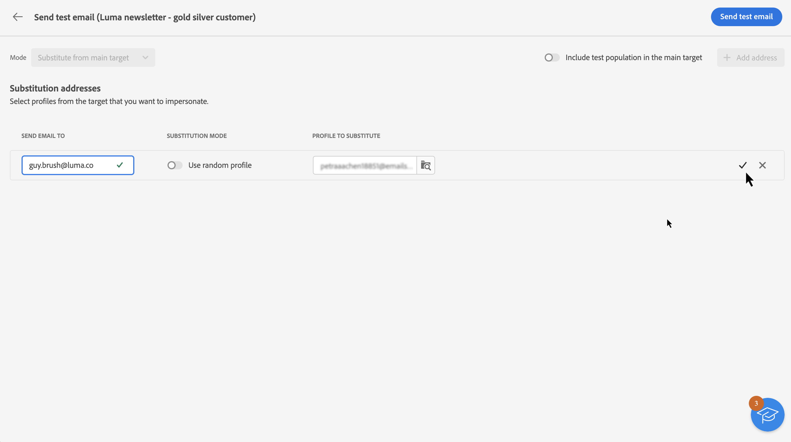

# Send proofs {#send-proofs}

>[!NOTE]
>
>This documentation is under construction and frequently updated. The final version of this content will be ready in January 2023.

Sending proofs allows you to validate your email and check various elements like links, opt-out links and mirror pages, images and detect possible errors.

Proofs can be sent to two types of recipients:

* **Test profiles / audiences**: send proofs to seed addresses, which are additional recipients in the database that are not part of the email target,

* **Substitution profiles**: send proofs to a specific email address using an existing profile. This allows you to place yourself in the position of the profiles and get an exact representation of the message that the profile will receive.

## Select the proofs recipients {#recipients}

Click the **[!UICONTROL Test]** button then use the **[!UICONTROL Mode]** drop-down list to choose the type of recipients that will receive the proofs:

>[!BEGINTABS]

>[!TAB Send proofs to test profiles]

1. Choose the **[!UICONTROL Use test profiles]** mode.

1. Add the test profiles that will receive the test emails.

    You can also build your own audience to select test profiles based on your own criteria using the **[!UICONTROL Add test audience]** button.

>[!TAB Send proofs to substitution profiles]

1. Choose the **[!UICONTROL Substitution from target]** mode.

1. Add the email address(es) that will receive the proofs.

1. For each email address, select the profile from the target to use. You can also let Adobe Campaign select a random profile from the target.

>[!ENDTABS]

If you want to send the final email message to the recipients of the proofs, enable the **[!UICONTROL Include test population in the main target]** option on.

## Send the proofs {#send}

Once the proofs recipients have been selected, click **[!UICONTROL Send test email]** then confirm the sending.

Once the proofs have been sent, you can access dedicated logs from the **[!UICONTROL View test email log]** button. These logs allow you to access the sent proofs, and specific statistics related to the proof sending.

Send as many proofs as necessary until you have finalized the content of your delivery. Once this is done, you can send the delivery to the main target.
