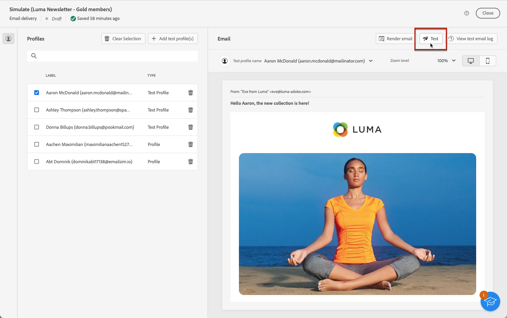

# Send test emails {#send-test}

**[!UICONTROL Adobe Campaign]** allows you to test a message before sending it to the main audience.

Sending test emails is an important step in validating your email campaign and identifying potential issues.

The recipients of a test can check various elements such as links, opt-out links, images, and mirror pages, as well as detect any errors in the rendering, content, personalization settings and email configuration.

## Select the test recipients {#test-recipients}

Test emails can be sent to two types of recipients: 

* **Test profiles** - send test emails to seed addresses, which are additional and fictitious recipients in the database. They can be created in the [!DNL Campaign] console into the **[!UICONTROL Resources]** > **[!UICONTROL Campaign Management]** > **[!UICONTROL Seed addresses]** folder. [Learn more](https://experienceleague.adobe.com/docs/campaign-classic/using/sending-messages/using-seed-addresses/creating-seed-addresses.html){target="_blank"}
    
* **Substitute from main target** - send test emails to a specific email address while impersonating an existing profile. This allows you to experience the email as the recipients would, giving you an accurate representation of the message that the profile will receive.

To select the recipients of the email test, follow the steps below.

1. Access the email [Edit content](../content/edit-content.md) screen or to the [Email Designer](../content/get-started-email-designer.md), then click the **[!UICONTROL Simulate content]** button.

1. Click the **[!UICONTROL Test]** button.

    

1. Use the **[!UICONTROL Mode]** drop-down list to choose the type of recipients that receive the test email:

    * **Test profiles** to target fictitious recipients
    
    * **Substitute from main target** to send a test to a specific email address while displaying data from an existing profile.

    

    >[!NOTE]
    >
    >By default, the **[!UICONTROL Use test profiles]** mode is selected. If you have already selected profiles to preview the email in the content simulation screen, those profiles are pre-selected as test recipients. You can clear your selection and/or add additional recipients.

1. To send test emails to substitution profiles, choose the **[!UICONTROL Substitute from target]** mode, then follow these steps:

    1. Click the **[!UICONTROL Add address]** button and specify the email address that receives the test email.

        You can enter any email address. This allows you to send test emails to any users, even if they are not users of [!DNL Adobe Campaign].

    1. Select the profile from the target to use as substitute. You can also let [!DNL Adobe Campaign] select a random profile from the target. The profile data from the selected profile will be displayed in the test email.

    1. Confirm the recipient and repeat the operation to add as many addresses as needed.

        

1. Once the test recipients have been selected, you can [send the test email](#send-test).

    >[!NOTE]
    >
    >To also send the final email message to the recipients of the test email, select the **[!UICONTROL Include test population in the main target]** option.

## Send the test email {#send-test}

To send the test email to the selected recipients, follow the steps below.

1. Click **[!UICONTROL Send test email]**.

1. Confirm the sending.

    

1. Send as many test emails as necessary until you have finalized the content of your delivery.

Once this is done, you can [prepare and send your email](../monitor/prepare-send.md) to the main target.

## Access sent test emails {#access-proofs}

Once the test emails have been sent, you can access dedicated logs from the **[!UICONTROL View test email log]** button.

These logs allow you to access all the test emails sent for the selected delivery, and to visualize specific statistics related to their sending. [Learn how to monitor delivery logs](../monitor/delivery-logs.md)

You can also access sent test emails from the [deliveries list](../msg/gs-messages.md), like any delivery.

