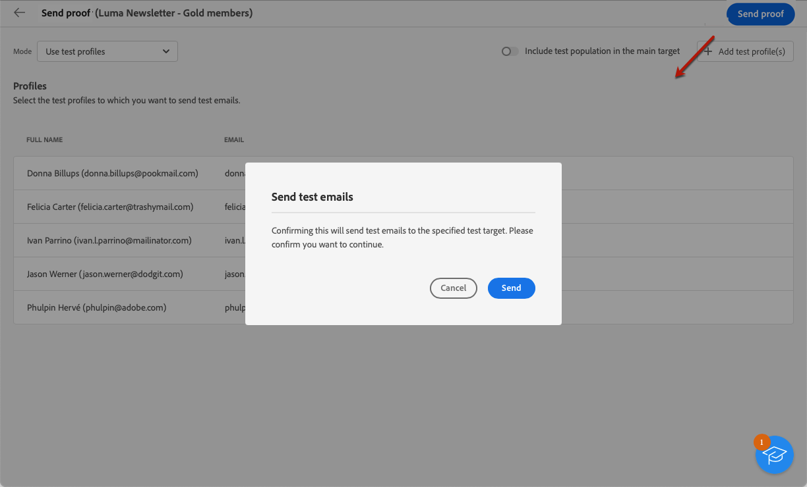

# Send test deliveries {#send-test-deliveries}

>[!CONTEXTUALHELP]
>id="acw_email_preview_mode"
>title="Preview mode"
>abstract="Preview and test the message by including the test population to the main target."

**[!UICONTROL Adobe Campaign]** allows you to test a message before sending it to the main audience.

Sending test deliveries (previously known as 'proofs') is an important step in validating your campaign and identifying potential issues.

The recipients of a test can check various elements such as links, opt-out links, images, or mirror pages, as well as detect any errors in the rendering, content, personalization settings and delivery configuration.

## Select the test recipients {#test-recipients}

>[!CONTEXTUALHELP]
>id="acw_email_preview_option_test_target"
>title="Test population"
>abstract="Select a test population mode."

According to the channel you are using, test messages can be sent to three types of recipients: 

* [Test profiles](#test-profiles) - Send **test emails and SMS** to seed addresses, which are additional recipients in the database.

    They can be created in the [!DNL Campaign] console into the **[!UICONTROL Resources]** > **[!UICONTROL Campaign Management]** > **[!UICONTROL Seed addresses]** folder. Learn more in [Campaign v8 (console) documentation](https://experienceleague.adobe.com/docs/campaign/campaign-v8/audience/add-profiles/test-profiles.html){target="_blank"}
    
* [Substitute from main target](#substitution-profiles) - Send **test emails and SMS** to a specific email address or phone number while impersonating an existing profile.

    This allows you to experience the message as the recipients would, giving you an accurate representation of the content that the profile will receive.

* [Subscribers](#subscribers) - Send **test push notifications** to fictitious subscribers added to the database.

    Just as test profiles, they can be created in the [!DNL Campaign] console into the **[!UICONTROL Resources]** > **[!UICONTROL Campaign Management]** > **[!UICONTROL Seed addresses]** folder. Learn more in [Campaign v8 (console) documentation](https://experienceleague.adobe.com/docs/campaign/campaign-v8/audience/add-profiles/test-profiles.html){target="_blank"}

To select the recipients of a test delivery, follow the steps below according to the type of profiles you want to use.

### Test profiles {#test-profiles}

>[!CONTEXTUALHELP]
>id="acw_deliveries_simulate_test_mode"
>title="Target of the proof"
>abstract="You can upload a second file as 'target of the proof', if you wish to test your delivery before sending to the main target."

>[!CONTEXTUALHELP]
>id="acw_deliveries_simulate_test_upload"
>title="Upload profiles"
>abstract="You can upload a second file with additional profiles if you like to test your delivery with a different set from the set you have used for the main target."

>[!CONTEXTUALHELP]
>id="acw_deliveries_simulate_test_sample"
>title="Template file"
>abstract="The formatting of the file must be the same as the original file. Supported file formats: txt, csv. Maximum file size: 15MB. Use first line as column header."

1. Browse to the edit content screen of your email or SMS delivery, then click the **[!UICONTROL Simulate content]** button.

1. Click the **[!UICONTROL Test]** button.

    >[!NOTE]
    >
    >If you have already selected profiles to [preview your delivery](preview-content.md), they are listed on the left pane.

    

1. From the **[!UICONTROL Mode]** drop-down list, choose **[!UICONTROL Test profiles]** to target fictitious recipients that will receive the test email or SMS delivery.

    

1. If you have already selected profiles to [preview the message](preview-content.md) in the content simulation screen, those profiles are pre-selected as test recipients. You can clear your selection and/or add additional recipients using the **[!UICONTROL Add test profile(s)]** button.

    >[!NOTE]
    >
    >By default, the **[!UICONTROL Use test profiles]** mode is selected.

1. To also send the final message to the recipients of the test delivery, select the **[!UICONTROL Include test population in the main target]** option.

1. Once the test profiles are selected, you can [send the test delivery](#send-test).

### Substitution profiles {#substitution-profiles}

To send a test email or SMS to a specific email address or phone number while displaying data from an existing profile of the [!DNL Campaign] database, use substitution profiles.

1. Before sending a test, make sure you define a target audience for you delivery. [Learn more](../audience/about-audiences.md)

1. Browse to the edit content screen of your email or SMS delivery, then click the **[!UICONTROL Simulate content]** button.

1. Click the **[!UICONTROL Test]** button.

    

1. From the **[!UICONTROL Mode]** drop-down list, choose **[!UICONTROL Substitute from main target]** to send a test to a specific email address or phone number while displaying data from an existing profile.

    >[!CAUTION]
    >
    >If you have not selected an [audience](../audience/about-audiences.md) for your delivery, the **[!UICONTROL Substitute from main target]** option will be greyed out and you will not be able to select substitution profiles.

1. Click the **[!UICONTROL Add address]** button and specify the email address or phone number that will receive the test delivery.

    

    >[!NOTE]
    >
    >You can enter any email address or phone number. This allows you to send test deliveries to any recipients, even if they are not users of [!DNL Adobe Campaign].

1. Select the profile from the target you defined for your delivery to use as substitute. You can also let [!DNL Adobe Campaign] select a random profile from the target. The profile data from the selected profile will be displayed in the test delivery.

1. Confirm the recipient and repeat the operation to add as many email addresses or phone numbers as needed.

    

1. To also send the final message to the recipients of the test delivery, select the **[!UICONTROL Include test population in the main target]** option.

1. Once the substitution profiles are selected, you can [send the test delivery](#send-test).

### Subscribers {#subscribers}

When working with push notifications, test deliveries can be only sent to subscribers. To select them, follow the steps below.

1. Browse to the edit content screen of your delivery, then click the **[!UICONTROL Simulate content]** button.

1. Click the **[!UICONTROL Test]** button.

    

1. If you have already selected subscribers to [preview the delivery](preview-content.md) in the content simulation screen, those profiles are pre-selected as test subscribers.

    You can clear your selection and/or add additional subscribers using the dedicated button.

    

1. To also send the final push notification to the test subscribers, select the **[!UICONTROL Include test population in the main target]** option.

1. Once the subscribers are selected, you can [send the test delivery](#send-test).

## Send the test delivery {#send-test}

To send the test delivery to the selected recipients, follow the steps below.

1. Click the **[!UICONTROL Send test]** button.

1. Confirm the sending.

    

1. Send as many tests as necessary until you have finalized the content of your delivery.

Once done, you can prepare and send your delivery to the main target. Learn how in the dedicated sections below:

* [Send your email](../monitor/prepare-send.md)
* [Send your push notification](../push/send-push.md#send-push)
* [Send your SMS delivery](../sms/send-sms.md#send-sms)

## Access sent test deliveries {#access-proofs}

Once the test deliveries have been sent, you can access dedicated logs from the **[!UICONTROL View test log]** button.

These logs allow you to access all the tests sent for the selected delivery, and to visualize specific statistics related to their sending. [Learn how to monitor delivery logs](../monitor/delivery-logs.md)

You can also access sent tests from the [deliveries list](../msg/gs-messages.md), like any delivery.

