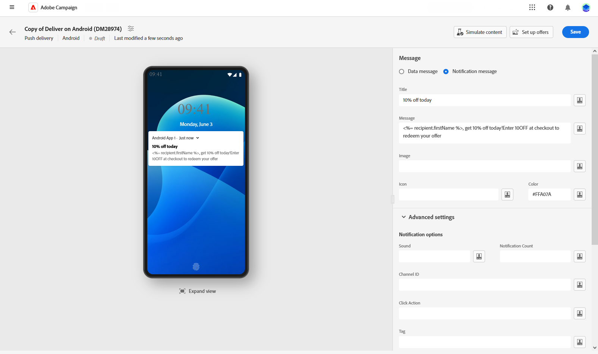
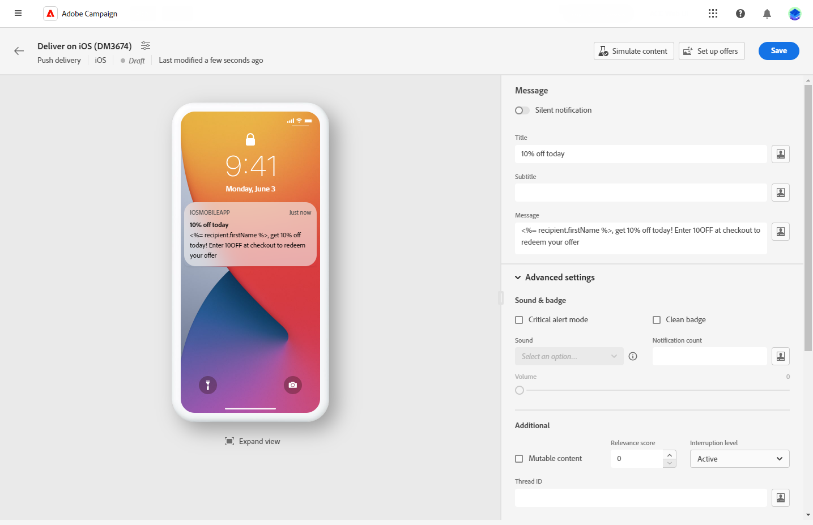

# Design a push delivery {#content-push}

>[!CONTEXTUALHELP]
>id="acw_deliveries_push_android_content"
>title="Push Android content"
>abstract="Define the content of your push notification for Android devices. To start composing your message, click the **Edit content** button."

>[!CONTEXTUALHELP]
>id="acw_deliveries_push_ios_content"
>title="Push iOS content"
>abstract="Define the content of your push notification for iOS devices. To start composing your message, click the **Edit content** button."

## Define the content of the notification {#push-message}

>[!CONTEXTUALHELP]
>id="acw_deliveries_push_ios_msg"
>title="Push iOS message"
>abstract="Define the content of your push notification for iOS devices. To compose your message, click the **Title** and **Message** fields. Use the Expression editor to personalize data, and add dynamic content. For more custom configuration, browse to the **Advanced settings** section."

>[!CONTEXTUALHELP]
>id="acw_deliveries_push_android_msg"
>title="Push Android message"
>abstract="Define the content of your push notification for Android devices. To compose your message, click the **Title** and **Message** fields. Use the Expression editor to personalize data and add dynamic content. To further personalize your push notification, you can choose an image to add to your push notification, the notification's icon to display on your profiles' devices, and its color. For more custom configuration, browse to the **Advanced settings** section."

>[!CONTEXTUALHELP]
>id="acw_deliveries_push_ios_silent"
>title="Silent notification for iOS"
>abstract="The Silent Push mode allows a "silent" notification to be sent to a mobile application. The user is not made aware of the notification's arrival. It is transferred directly to the application."

Once your push delivery is created, you can define its content. Parameters and settings depend on the mobile operating system: Android or iOS. Browse the tabs below to learn how to compose your message for each operating system. 

>[!BEGINTABS]

>[!TAB Android]

With Firebase Cloud Messaging, you can choose between two types of messages:

* The **[!UICONTROL Data message]** is handled by the client app. These messages are sent directly to the mobile application, which generates and displays an Android notification on the device. Data messages contain only your custom application variables.
    
    To define the content, personalize data, and add dynamic content, click on the **[!UICONTROL Message]** field and use the Expression editor. You can access this editor to customize your messages.
    In the **[!UICONTROL Application variables]** menu, your Application variables are automatically added. These variables allow you to define notification behavior. For example, you can configure a specific application screen to be displayed when the user activates the notification.
    
    

* The **[!UICONTROL Notification message]**, handled automatically by the FCM SDK. FCM automatically displays the message on your users' devices on behalf of the client app. Notification messages contain a predefined set of parameters and options but can still be further personalized with custom application variables.

    To compose your message, click the **[!UICONTROL Title]** and **[!UICONTROL Message]** fields. Use the Expression editor to define content, personalize data and add dynamic content.
    
    To further personalize your push notification, you can choose an image to add to your push notification, the notification's icon to display on your profiles' devices and its color.

    

>[!TAB iOS]

To compose your message, click the **[!UICONTROL Title]** and **[!UICONTROL Message]** fields. Use the Expression editor to define content, personalize data and add dynamic content.

You can add a **[!UICONTROL Subtitle]**, value of the subtitle parameter of the iOS notification payload. Refer to the this section.

The Silent Push mode allows a "silent" notification to be sent to a mobile application. The user is not made aware of the notification's arrival. It is transferred directly to the application.

>[!ENDTABS]

## Push notification advanced settings {#push-advanced}

>[!CONTEXTUALHELP]
>id="acw_deliveries_push_advanced_settings"
>title="Advanced settings for push notifications"
>abstract="Define advanced settings for your push notification, such as its priority, the associated notification count, application variables, and more."
    

>[!CONTEXTUALHELP]
>id="acw_deliveries_push_advanced_settings_critical"
>title="Critical alert mode"
>abstract="Enable this option to add sound to your notification, even when the user's phone is set to focus mode or if the device is muted. This ensures that users are notified of important alerts in any case."
    

>[!CONTEXTUALHELP]
>id="acw_deliveries_push_advanced_settings_count"
>title="Notification count"
>abstract="Use this option to set the number of unread notifications to be displayed directly on the app icon. This allows the user to quickly see the number of pending notifications."

>[!CONTEXTUALHELP]
>id="acw_deliveries_push_advanced_settings_mutable"
>title="Mutable content"
>abstract="Use this option to allow the mobile application to download media content associated with the notification."

>[!CONTEXTUALHELP]
>id="acw_deliveries_push_advanced_settings_score"
>title="Relevance score"
>abstract="Set a relevance score from 0 to 100 to prioritize the order of notifications in the notification summary. Higher scores indicate more important notifications."

>[!CONTEXTUALHELP]
>id="acw_deliveries_push_advanced_settings_app_variables"
>title="Application variables"
>abstract="Use application variables to define notification behavior. These variables are fully customizable and are included as part of the message payload sent to the mobile device."

>[!CONTEXTUALHELP]
>id="acw_deliveries_push_advanced_settings_category"
>title="Category ID"
>abstract="Specify the name of the category ID associated with the notification. This enables the display of action buttons, allowing the user to perform various tasks directly from the notification without opening the application."

Advanced options depend on the mobile operating system: Android or iOS. Browse the tabs below to learn how to define options for your message for each operating system. 

>[!BEGINTABS]

>[!TAB Android]

|Parameter | Description |
|---------|---------|
|**[!UICONTROL Sound]** | Set the sound to play when the device receives your notification.|
|**[!UICONTROL Notification Count]**|Set the number of new unread information to be displayed directly on the application icon. This allows the user to quickly see the number of pending notifications. |
|**[!UICONTROL Channel ID]** |Set your notification's channel ID. The app must create a channel with this channel ID before any notification with this channel ID is received. |
| **[!UICONTROL Click action]**| Define the action associated with a user click on your notification. This determines the behavior when the user interacts with the notification, such as opening a specific screen or performing a specific action in your app.|
|**[!UICONTROL Tag]**| Set an identifier used to replace existing notifications in the notification drawer. This helps prevent the accumulation of multiple notifications and ensures that only the latest relevant notification is displayed. |
|**[!UICONTROL Priority]**| Set the priority level of your notification, which can be default, minimum, low, or high. The priority level determines the importance and urgency of the notification, influencing how it is displayed and whether it can bypass certain system settings. For more on this, refer to [FCM documentation](https://firebase.google.com/docs/reference/fcm/rest/v1/projects.messages#notificationpriority). |
| **[!UICONTROL Visibility]**| Set the visibility level of your notification, which can be public, private, or secret. The visibility level determines how much of the notification's content is shown on the lock screen and other sensitive areas. For more information, refer to the [FCM documentation](https://firebase.google.com/docs/reference/fcm/rest/v1/projects.messages#visibility).|
|**[!UICONTROL Sticky]**| When activated, the notification remains visible even after the user clicks on it.  If deactivated, the notification is automatically dismissed when the user interacts with it. The sticky behavior allows important notifications to persist on the screen for longer periods.|
|**[!UICONTROL Application variables]**|  Allow you to define notification behavior. These variables are fully customizable and are included as part of the message payload sent to the mobile device.|

>[!TAB iOS]

|Parameter | Description |
|---------|---------|
|**[!UICONTROL Critical alert mode]**| Enable this option to add sound to your notification, even when the user's phone is set to focus mode or if the device is muted. This ensures that important alerts are noticed by the user. When selected, you can adjust the volume of the notification using the Volume level bar. A number between 0 and 100 above the bar reflects your settings. |
|**[!UICONTROL Clean Badge]**| Enable this option to refresh the badge value displayed on the application icon. It ensures that the badge accurately reflects the number of new unread information.|
|**[!UICONTROL Notification count]**| Set a number that will be displayed directly on the application icon, indicating the number of new unread information. This provides a quick visual reference for the user.|
|**[!UICONTROL Volume]**| Volume of your sound from 0 to 100. |
|**[!UICONTROL Mutable content]**| Enable this option to allow the mobile application to download media content associated with the notification. For more on this, refer to [Apple developer documentation](https://developer.apple.com/library/content/documentation/NetworkingInternet/Conceptual/RemoteNotificationsPG/ModifyingNotifications.html). |
|**[!UICONTROL Relevance score]**| Set a relevance score from 0 to 100 to prioritize the order of notifications in the notification summary. Higher scores indicate more important notifications. |
|**[!UICONTROL Interruption level]**|<ul> <li>**[!UICONTROL Active]**: Set by default, the system presents the notification immediately, lights up the screen, and can play a sound. Notifications do not break through Focus modes.</li><li>**[!UICONTROL Passive]**: The system adds the notification to the notification list without lighting up the screen or playing a sound. Notifications do not break through Focus modes.</li><li>**[!UICONTROL Time sensitive]**: The system presents the notification immediately, lights up the screen, can play a sound and break through Focus modes. This level does not require a special permission from Apple.</li> <li>**[!UICONTROL Critical]**: The system presents the notification immediately, lights up the screen, and bypasses the mute switch or focus modes. Note that this level requires a special permission from Apple.</ul>|
|**[!UICONTROL Thread-id]**| Identifier used to group related notifications together. Notifications with the same thread ID are organized as a single conversation or thread in the notification list. |
|**[!UICONTROL Category]**| Specify the name of the category ID associated with the notification. This enables the display of action buttons, allowing the user to perform various tasks directly from the notification without opening the application.|
|**[!UICONTROL Target content ID]**| Identifier used to target which application window to brought forward when the notification is opened.|
|**[!UICONTROL Launch image]**| Specify the name of the launch image file to be displayed when the user chooses to launch your application from the notification. The selected image will be shown instead of your application's regular launch screen.|
|**[!UICONTROL Application variables]**|  Allow you to define notification behavior. These variables are fully customizable and are included as part of the message payload sent to the mobile device.|

>[!ENDTABS]

<!--Sounds must be included in the application and defined when the service is created. Refer to this section.-->
