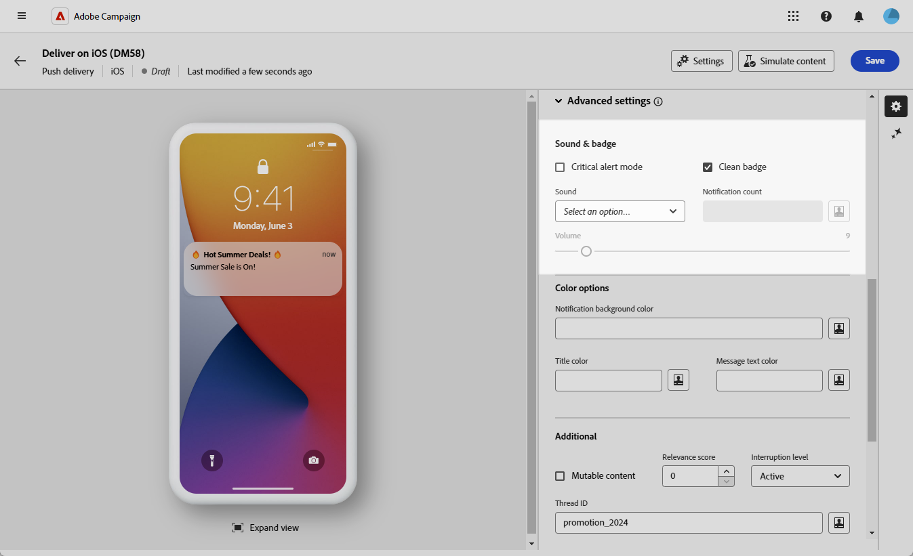
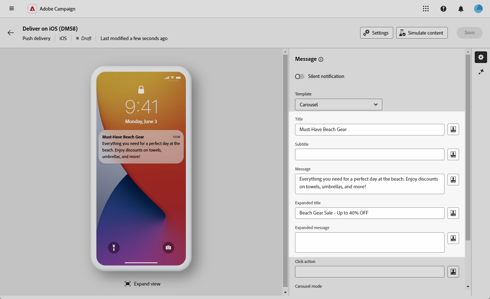
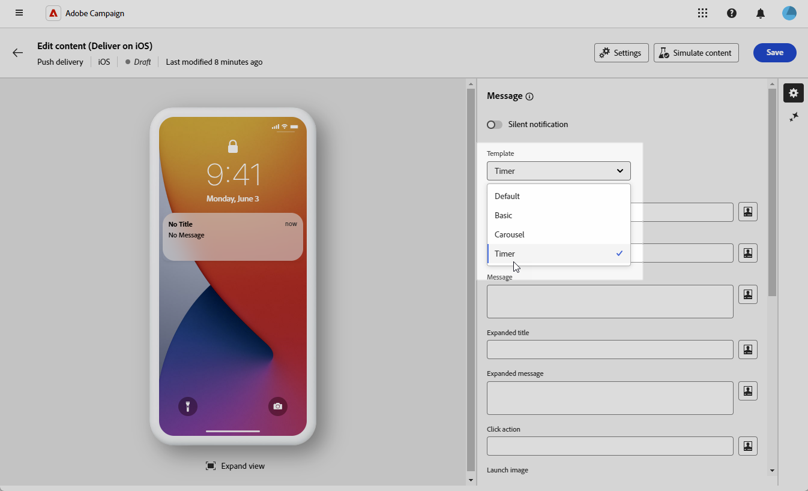
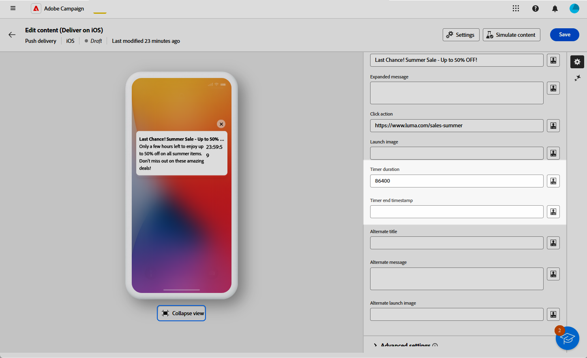
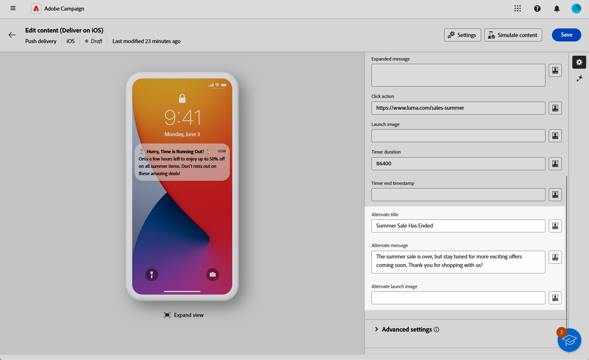

# Design an iOS rich push delivery {#rich-push}

>[!IMPORTANT]
>
>Before designing a Rich Push Notification, you need to configure your V2 connector. Refer to [this page](https://experienceleague.adobe.com/en/docs/campaign-classic/using/sending-messages/sending-push-notifications/configure-the-mobile-app/configuring-the-mobile-application) for the detailed procedure.

## Define the content of the notification {#push-message}

Once your push delivery is created, define its content using one of the following templates:

* **Default** allows you to send notifications with a simple icon and an accompanying image.
* **Basic** can include text, images, and buttons in your notifications.
* **Carousel** enables you to send notifications with text and multiple images that users can swipe through.
* **Timer** includes a live countdown timer in your notifications.

Navigate through the tabs below to learn more about how to personalize these templates.

>[!BEGINTABS]

>[!TAB Default]

1. From the **[!UICONTROL Template]** drop-down, select **[!UICONTROL Default]**.

    

1. In the **[!UICONTROL Title]** field, enter the label of the title that you want to appear in the list of notifications available from the notification center. 

   This field defines the value of the **title** parameter of the iOS notification payload.

1. Optionally, add a **[!UICONTROL Subtitle]**, which corresponds to the **subtitle** parameter of the iOS notification payload.

1. Enter the content of the message in the **[!UICONTROL Message]** field.

1. Use the Expression editor to define content, personalize data, and add dynamic content. [Learn more](../personalization/personalize.md)

    

1. To further personalize your push notification, choose a **[!UICONTROL Launch image]** URL to add to your push notification.

1. From the **[!UICONTROL Advanced settings]** drop-down, navigate to the **[!UICONTROL Sound and Badge]** tab to customize additional settings such as sound and badge options for your notifications. [Learn more](#sound-badge)

    

1. For further customization, explore the **[!UICONTROL Additional]** options available for your push notifications. [Learn more](#push-advanced)

    

1. From the **[!UICONTROL Application variables]** menu, your **[!UICONTROL Application variables]** are automatically added. They let you define notification behavior, such as configuring a specific application screen to be displayed when the user activates the notification.

Once you define your message content, use test subscribers to preview and test the message.

>[!TAB Basic]

1. From the **[!UICONTROL Template]** drop-down, select **[!UICONTROL Basic]**.

    

1. To compose your message, enter your text in the **[!UICONTROL Title]**, **[!UICONTROL Expanded title]**, **[!UICONTROL Message]**, and **[!UICONTROL Expanded message]** fields. 

    The **[!UICONTROL Message]** text appears in the collapsed view, while the **[!UICONTROL Expanded message]** is displayed when the notification is expanded.

    

1. Use the Expression editor to define content, personalize data, and add dynamic content. [Learn more](../personalization/personalize.md)

1. Optionally, add a **[!UICONTROL Subtitle]**, which corresponds to the **subtitle** parameter of the iOS notification payload.

1. Add the URL that defines the **[!UICONTROL Click action]** associated with a user click on your notification. This determines the behavior when the user interacts with the notification, such as opening a specific screen or performing a specific action in your app.

1. To further personalize your push notification, choose a **[!UICONTROL Launch image]** URL to add to your push notification.

1. From the **[!UICONTROL Advanced settings]** drop-down, navigate to the **[!UICONTROL Sound and Badge]** tab to customize additional settings such as sound and badge options for your notifications. [Learn more](#sound-badge)

    

1. In the **[!UICONTROL Color options]** menu, enter hexadecimal color codes for the **[!UICONTROL Notification background color]**, **[!UICONTROL Notification background color]**, and **[!UICONTROL Message text color]**.

    

1. For further customization, explore the **[!UICONTROL Additional]** options available for your push notifications. [Learn more](#push-advanced)

1. From the **[!UICONTROL Application variables]** menu, your **[!UICONTROL Application variables]** are automatically added. They let you define notification behavior, such as configuring a specific application screen to be displayed when the user activates the notification.

Once you define your message content, use test subscribers to preview and test the message.

>[!TAB Carousel]

1. From the **[!UICONTROL Template]** drop-down, select **[!UICONTROL Carousel]**.

    

1. To compose your message, enter your text in the **[!UICONTROL Title]**, **[!UICONTROL Expanded title]**, **[!UICONTROL Message]**, and **[!UICONTROL Expanded message]** fields. 

    The **[!UICONTROL Message]** text appears in the collapsed view, while the **[!UICONTROL Expanded message]** is displayed when the notification is expanded.

    

1. Use the Expression editor to define content, personalize data, and add dynamic content. [Learn more](../personalization/personalize.md)

1. Optionally, add a **[!UICONTROL Subtitle]**, which corresponds to the **subtitle** parameter of the iOS notification payload.

1. Add the URL that defines the **[!UICONTROL Click action]** associated with a user click on your notification. This determines the behavior when the user interacts with the notification, such as opening a specific screen or performing a specific action in your app.

1. Choose how the **[!UICONTROL Carousel]** is operated: 

    * **[!UICONTROL Auto]**: automatically cycles through images as slides, transitioning at predefined intervals.
    * **[!UICONTROL Manual]**: allows users to manually swipe between slides to navigate through the images.     

1. Click **[!UICONTROL Add image]** and enter your **[!UICONTROL Image]** URL, **[!UICONTROL Text]**, and **[!UICONTROL Action URI]**.

    Ensure that you include a minimum of three images and a maximum of five images.

    

1. Handle the order of your images with the Down and Up arrow. 

1. From the **[!UICONTROL Advanced settings]** drop-down, navigate to the **[!UICONTROL Sound and Badge]** tab to customize additional settings such as sound and badge options for your notifications. [Learn more](#sound-badge)

1. In the **[!UICONTROL Color options]** menu, enter hexadecimal color codes for the **[!UICONTROL Notification background color]**, **[!UICONTROL Notification background color]**, and **[!UICONTROL Message text color]**. 

    

1. For further customization, explore the **[!UICONTROL Additional]** options available for your push notifications. [Learn more](#push-advanced)

1. From the **[!UICONTROL Application variables]** menu, your **[!UICONTROL Application variables]** are automatically added. They let you define notification behavior, such as configuring a specific application screen to be displayed when the user activates the notification.

Once you define your message content, use test subscribers to preview and test the message.

>[!TAB Timer]

1. From the **[!UICONTROL Notification type]** drop-down, select **[!UICONTROL Timer]**.

    

1. To compose your message, enter your text in the **[!UICONTROL Title]**, **[!UICONTROL Expanded title]**, **[!UICONTROL Message]**, and **[!UICONTROL Expanded message]** fields. 

    The **[!UICONTROL Message]** text appears in the collapsed view, while the **[!UICONTROL Expanded message]** is displayed when the notification is expanded.

    

1. Use the Expression editor to define content, personalize data, and add dynamic content. [Learn more](../personalization/personalize.md)

1. Optionally, add a **[!UICONTROL Subtitle]**, which corresponds to the **subtitle** parameter of the iOS notification payload.

1. Add the URL that defines the **[!UICONTROL Click action]** associated with a user click on your notification. This determines the behavior when the user interacts with the notification, such as opening a specific screen or performing a specific action in your app.

1. To further personalize your push notification, choose a **[!UICONTROL Launch image]** URL to add to your push notification.

1. Set your **[!UICONTROL Timer duration]** in seconds or the **[!UICONTROL Timer end timestamp]** to a specific epoch timestamp.

    

1. Enter the text and image that will be displayed after the timer has expired in the **[!UICONTROL Alternate title]**, **[!UICONTROL Alternate message]**, and **[!UICONTROL Alternate launch image]** fields.

    

1. From the **[!UICONTROL Advanced settings]** drop-down, navigate to the **[!UICONTROL Sound and Badge]** tab to customize additional settings such as sound and badge options for your notifications. [Learn more](#sound-badge)

1. In the **[!UICONTROL Color options]** menu, enter hexadecimal color codes for the **[!UICONTROL Notification background color]**, **[!UICONTROL Notification background color]**, and **[!UICONTROL Message text color]**. 

1. For further customization, explore the **[!UICONTROL Additional]** options available for your push notifications. [Learn more](#push-advanced)

1. From the **[!UICONTROL Application variables]** menu, your **[!UICONTROL Application variables]** are automatically added. They let you define notification behavior, such as configuring a specific application screen to be displayed when the user activates the notification.

Once you define your message content, use test subscribers to preview and test the message.

>[!ENDTABS]

## Push notification advanced settings {#push-advanced}

### Sound and badge options {#sound-badge}

| Parameter | Description |
|-----------|-------------|
| **[!UICONTROL Critical alert mode]** | Enable this option to add sound to your notification even if the user's phone is set on focus mode or muted. |
| **[!UICONTROL Clean Badge]** | Enable this option to refresh the badge value. |
| **[!UICONTROL Sound]** | Set the sound to play when the device receives your notification. |
| **[!UICONTROL Notification count]** | Set a number to display directly on the application icon, indicating the number of new unread notifications. |
| **[!UICONTROL Volume]** | Set the volume of your sound from 0 to 100. Sounds must be included in the application and defined when the service is created. |

### Color options {#color}

| Parameter | Description |
|-----------|-------------|
| **[!UICONTROL Notification background color]** | Set the color of your notification background using Hex color codes. |
| **[!UICONTROL Title color]** | Set the color of your title using Hex color codes. |
| **[!UICONTROL Message text color]** | Set the color of your text using Hex color codes. |

### Advanced options {#notification-options}

| Parameter | Description |
|-----------|-------------|
| **[!UICONTROL Mutable content]** | Enable this option to allow the mobile application to download media content. |
|**[!UICONTROL Content available]**| Enable this option to allow your notification to trigger background updates on iOS devices, even when the app isn't actively open. This ensures that content like messages or data updates can be processed and stored in the app inbox without requiring user interaction. When selected, the `content-available: 1` flag is added to the `aps` payload in compliance with Apple Push Notification Service (APNS) standards. |
| **[!UICONTROL Relevance score]** | Set a relevance score from 0 to 100. The system uses this to sort notifications in the notification summary. |
| **[!UICONTROL Interruption level]** | <ul><li>**Active**: Set by default, the system presents the notification immediately, lights up the screen, and can play a sound. Notifications do not break through focus modes.</li><li>**Passive**: The system adds the notification to the notification list without lighting up the screen or playing a sound. Notifications do not break through focus modes.</li><li>**Time sensitive**: The system presents the notification immediately, lights up the screen, can play a sound, and breaks through focus modes. This level does not require special permission from Apple.</li><li>**Critical**: The system presents the notification immediately, lights up the screen, and bypasses the mute switch or focus modes. Note that this level requires special permission from Apple.</li></ul> |
| **[!UICONTROL Thread-id]** | Set the identifier used to group related notifications together. |
| **[!UICONTROL Category]** | Set the name of your category ID, which will display action buttons. These notifications give the user a faster way to perform different tasks in response to a notification without opening or navigating in the application. |
| **[!UICONTROL Target content ID]** | Set an identifier used to target which application window is brought forward when the notification is opened. |