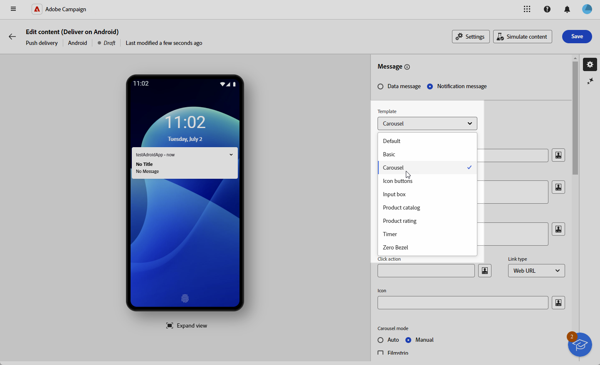

# Design an Android rich push delivery {#rich-push}

With Firebase Cloud Messaging, you can choose between two types of messages:

* The **[!UICONTROL Data message]** is handled by the client app. These messages are sent directly to the mobile application, which generates and displays an Android notification on the device. Data messages contain only your custom application variables.

* The **[!UICONTROL Notification message]**, handled automatically by the FCM SDK. FCM automatically displays the message on your users' devices on behalf of the client app. Notification messages contain a predefined set of parameters and options but can still be further personalized with custom application variables.

{zoomable="yes"}

## Define the content of the notification {#push-message}

Once your push delivery is created, you can define its content. Three templates are available:

* **Default Template** allows you to send notifications with a simple icon and an accompanying image.

* **Basic Template** can include text, images, and buttons in your notifications.

* **Carousel Template** enables you to send notifications with text and multiple images that users can swipe through.

Navigate through the tabs below to learn more on how to personalize these templates.

>[!BEGINTABS]

>[!TAB Default template]

1. From the **[!UICONTROL Template]** drop-down, select **[!UICONTROL Default]**.

    

1. To compose your message, enter your text in the **[!UICONTROL Title]** and **[!UICONTROL Message]** fields.

    

1. Use the Expression editor to define content, personalize data and add dynamic content. [Learn more](../personalization/personalize.md)

1. Define the **[!UICONTROL Click action]** associated with a user click on your notification. This determines the behavior when the user interacts with the notification, such as opening a specific screen or performing a specific action in your app.

1. To further personalize your push notification, you can choose an **[!UICONTROL Image]** URL to add to your push notification and the notification's **[!UICONTROL Icon]** to display on your profiles' devices.

    

1. Configure the **[!UICONTROL Advanced settings]** of your push notification. [Learn more](#push-advanced)

Once you have defined your message content, you can use test subscribers to preview and test the message.

>[!TAB Basic template]

1. From the **[!UICONTROL Template]** drop-down, select **[!UICONTROL Basic]**.

    

1. To compose your message, enter your text in the **[!UICONTROL Title]**, **[!UICONTROL Message]** and **[!UICONTROL Expanded message]** fields. 

    The **[!UICONTROL Message]** text appears in the collapsed view while the **[!UICONTROL Expanded message]** is displayed when the notification is expanded.

    

1. Use the Expression editor to define content, personalize data and add dynamic content. [Learn more](../personalization/personalize.md)

1. Add the URL which defines the **[!UICONTROL Click action]** associated with a user click on your notification. This determines the behavior when the user interacts with the notification, such as opening a specific screen or performing a specific action in your app.

1. Select the **[!UICONTROL Link type]** of the URL you added to the **[!UICONTROL Click action]** field:

    * **[!UICONTROL Web URL]**: Web URLs direct users to online content. Upon clicking, they prompt the device's default web browser to open and navigate to the designated URL.

    * **[!UICONTROL Deeplink]**: Deep links are URLs guiding users to specific sections within an app even if the app is closed. When clicked, a dialog can appear, allowing users to choose from various apps capable of handling the link.

    * **[!UICONTROL Open App]**: Open App URLs allow you to directly connect to content within an application. It enables your application to establish itself as the default handler for a specific type of link, bypassing the disambiguation dialog. 

    For more information on how to handle Android App Links, refer to [Android Developers documentation](https://developer.android.com/training/app-links).

    

1. To further personalize your push notification, you can choose an **[!UICONTROL Image]** URL to add to your push notification and the notification's **[!UICONTROL Icon]** to display on your profiles' devices.

1. Click **[!UICONTROL Add button]** and fill in the following fields:

    * **[!UICONTROL Label]**: Text displayed on the button.
    * **[!UICONTROL Link URI]**: Specify the URI to be executed upon clicking the button.
    * **[!UICONTROL Link type]**: Type of link either **[!UICONTROL Web URL]**, **[!UICONTROL Deeplink]**, or **[!UICONTROL Open App]**.

    You have the option to include up to three buttons in your push notification. If you opt for the **[!UICONTROL Remind later button]**, you can only include a maximum of two buttons.

    

1. Click **[!UICONTROL Add remind later]** button to add a Remind me later option to your push notification. Enter a **[!UICONTROL Label]** and **[!UICONTROL Timestamp]**. 

    The Timestamp field expects a value representing an epoch in seconds.

    

1. Configure the **[!UICONTROL Advanced settings]** of your push notification. [Learn more](#push-advanced)

Once you have defined your message content, you can use test subscribers to preview and test the message.

>[!TAB Carousel template]

1. From the **[!UICONTROL Template]** drop-down, select **[!UICONTROL Carousel]**.

    

1. To compose your message, enter your text in the **[!UICONTROL Title]**, **[!UICONTROL Message]** and **[!UICONTROL Expanded message]** fields. 

    The **[!UICONTROL Message]** text appears in the collapsed view while the **[!UICONTROL Expanded message]** is displayed when the notification is expanded.

    

1. Use the Expression editor to define content, personalize data and add dynamic content. [Learn more](../personalization/personalize.md)

1. Add the URL which defines the **[!UICONTROL Click action]** associated with a user click on your notification. This determines the behavior when the user interacts with the notification, such as opening a specific screen or performing a specific action in your app.

1. Select the **[!UICONTROL Link type]** of the URL you added to the **[!UICONTROL Click action]** field:

    * **[!UICONTROL Web UR]**L: Web URLs direct users to online content. Upon clicking, they prompt the device's default web browser to open and navigate to the designated URL.

    * **[!UICONTROL Deeplink]**: Deep links are URLs guiding users to specific sections within an app even if the app is closed. When clicked, a dialog can appear, allowing users to choose from various apps capable of handling the link.

    * **[!UICONTROL Open App]**: Open App URLs allow you to directly connect to content within an application. It enables your application to establish itself as the default handler for a specific type of link, bypassing the disambiguation dialog. 

    For more information on how to handle Android App Links, refer to [Android Developers documentation](https://developer.android.com/training/app-links).

    

1. To further personalize your push notification, you can choose the notification's **[!UICONTROL Icon]** to display on your profiles' devices.

1. Choose how the **[!UICONTROL carousel]** is operated: 

    * **[!UICONTROL Auto]**: automatically cycles through images as slides, transitioning at predefined intervals.
    * **[!UICONTROL Manual]**: allows users to manually swipe between slides to navigate through the images.     
        
        Enable the **[!UICONTROL Filmstrip]** option to include previews of the previous and next images alongside the main slide.

1. Click **[!UICONTROL Add image]** and enter your image URL and text.

    Ensure that you include a minimum of three images and a maximum of five images.

    

1. Handle the order of your images with the Down and Up arrow. 

1. Configure the **[!UICONTROL Advanced settings]** of your push notification. [Learn more](#push-advanced)

Once you have defined your message content, you can use test subscribers to preview and test the message.

>[!ENDTABS]

## Push notification advanced settings {#push-advanced}

{zoomable="yes"}

|Parameter | Description |
|---------|---------|
|**[!UICONTROL Icon color]** | Set the color of your icon with your Hex color codes. |
|**[!UICONTROL Title color]**| Set the color of your Title with your Hex color codes.|
|**[!UICONTROL Message text color]** | Set the color of your Message text with your Hex color codes.|
|**[!UICONTROL Notification background color]**| Set the color of your Notification background with your Hex color codes.|
|**[!UICONTROL Sound]** | Set the sound to play when the device receives your notification.|
|**[!UICONTROL Notification Count]**|Set the number of new unread information to be displayed directly on the application icon. This allows the user to quickly see the number of pending notifications. |
|**[!UICONTROL Channel ID]** |Set your notification's channel ID. The app must create a channel with this channel ID before any notification with this channel ID is received. |
|**[!UICONTROL Tag]**| Set an identifier used to replace existing notifications in the notification drawer. This helps prevent the accumulation of multiple notifications and ensures that only the latest relevant notification is displayed. |
|**[!UICONTROL Priority]**| Set the priority level of your notification, which can be default, minimum, low, or high. The priority level determines the importance and urgency of the notification, influencing how it is displayed and whether it can bypass certain system settings. For more on this, refer to [FCM documentation](https://firebase.google.com/docs/reference/fcm/rest/v1/projects.messages#notificationpriority). |
| **[!UICONTROL Visibility]**| Set the visibility level of your notification, which can be public, private, or secret. The visibility level determines how much of the notification's content is shown on the lock screen and other sensitive areas. For more information, refer to the [FCM documentation](https://firebase.google.com/docs/reference/fcm/rest/v1/projects.messages#visibility).|
|**[!UICONTROL Sticky notification]**| When activated, the notification remains visible even after the user clicks on it.  If deactivated, the notification is automatically dismissed when the user interacts with it. The sticky behavior allows important notifications to persist on the screen for longer periods.|
|**[!UICONTROL Application variables]**|  Allow you to define notification behavior. These variables are fully customizable and are included as part of the message payload sent to the mobile device.|
