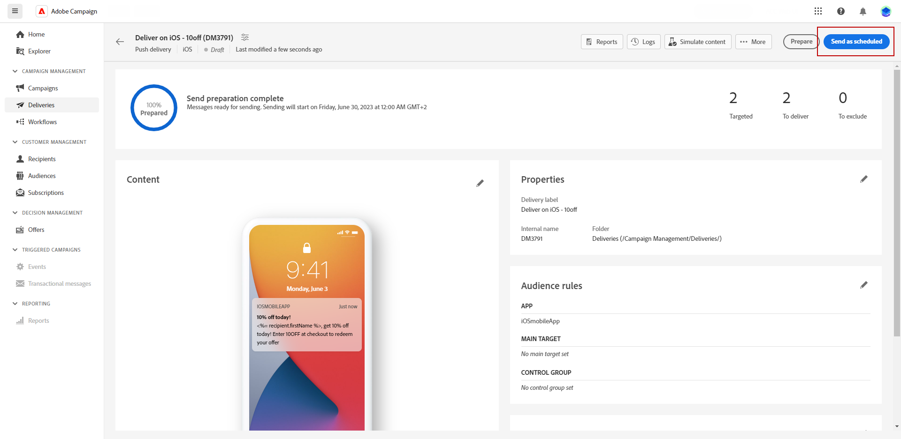

# Preview and send a push notification delivery {#send-push-delivery}

## Preview your push notification delivery {#preview-push}

Once you have defined your message content, you can utilize test subscribers to preview and test the message. If you have included personalized content, you can examine how this content is displayed in the message by using test profile data. This allows you to ensure that the message is being rendered correctly and that the personalized elements are being appropriately incorporated.

The main steps to preview your push notification are as follows. More details on how to preview deliveries are available in [this section](../preview-test/preview-content.md).

1. From your delivery content page, use **[!UICONTROL Simulate content]** to preview your personalized content.

    

1. Click **[!UICONTROL Add subscribers(s)]** to select one or several profiles to preview their data in the push notification content.

    <!--Once your test subscribers are selected, click **[!UICONTROL Select]**.
    -->

1. In the right pane, you will find a preview of the push notification, where personalized elements are dynamically replaced with data from the selected profile.

    

You can now review and send your push notification to your audience.

## Test your push notification delivery {#test-push}

Using **Adobe Campaign**, you have the ability to test push notifications before sending them to your main audience. This step is important in validating your delivery and identifying any issues. 
Test recipients can review elements such as links, images, and personalization settings, ensuring optimal performance and detecting any errors. This process helps you refine and optimize your push notifications before reaching your main audience.

 Learn how to send test push notifications in [this section](../preview-test/test-deliveries.md#subscribers).

## Send your push notification delivery {#send-push}

1. After personalizing your push notification content, click **[!UICONTROL Review & send]** from your **[!UICONTROL Delivery]** page.

    

1. Click **[!UICONTROL Prepare]** and monitor the progress and statistics provided. 

    If any errors occur, refer to the Logs menu for detailed information about the failure.

    

1. Send the messages by clicking on **[!UICONTROL Send]** to proceed with the final sending process. 

1. Confirm the send action by clicking the **[!UICONTROL Send]** or **[!UICONTROL Send as scheduled]** button.

    

Once your delivery is sent, you can track your KPIs (Key Performance Indicator) data from your delivery page and data from the **[!UICONTROL Logs]** menu.

You can now start measuring the impact of your message with built-in reports. [Learn more](../reporting/push-report.md)
