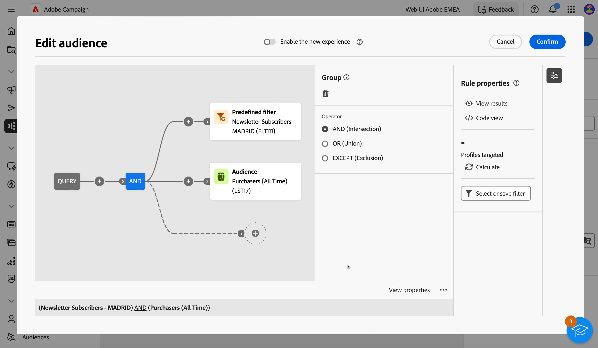

# Build your first query {#build-query}

To start building a query, access the query modeler from the location of your choice, depending on the action you want to perform. The Query modeler opens with a blank canvas. Click the + button to add the first node of your query.

You can add two types of elements:  

* Filtering components (Custom condition, Select audience, Predefined filter)  allow you to build your own rules, select an audience or a predefined filter to refine your query. 

    Example *Recipients who subscribed to the 'Sports' newsletter*. *Recipients living in New York*, *Recipients living in San Francisco*

* Group operators (AND, OR, EXCEPT) allow you to group together filtering components in the diagram to suit your needs.

    Example: *Recipients who subscribed to the "Sports" newsletter **AND** who live in New York **OR** San Francisco*.

Detailed steps on how to add and combine filtering components and group operators are available below.

## Add filtering components

Filtering components allow you to refine your query by using:

* **Custom conditions**: Filter your query by building your own condition with attributes from the database and advanced expressions.
* **Audiences**: Filter your query using an existing audience.
* **Predefined filter**: Filter your query using existing predefined filters.

### Build a custom condition

To filter your query using a custom condition, follow these steps:

1. Click the + button on the desired node and select **[!UICONTROL Custom condition]**.
1. The custom condition properties pane opens on the right hand side. In the Attribute field, select the attribute from the database that you want to leverage to create your condtion.

   Available attributes represent all the fields from your Campaign database, including fields from tables that are linked to the Recipients table.

    

    >[!NOTE]
    >
    >The Edit expression button allows you to leverage Campaign Web expression editor to manually define an expression using fields from the database and helper functions.

1. Select the operator to apply from the drop-down list.

   +++List of available operators

    >[!NOTE]
    >
    >Available operators in the drop-down list depend on the selected attribute's data type. 

    |Operator|Purpose|Example|
    |  ---  |  ---  |  ---  |
    |Equal to| Returns a result identical to the data entered in the second Value column.|Last name (@lastName) equal to 'Jones', will return only recipients whose last name is Jones.|
    |Not equal to|Returns all values not identical to the value entered.|Language (@language) to equal to 'English'|
    |Greater than|Returns a value greater than the value entered.|Age (@age) greater than 50</strong>, will return all values greater than '50', i.e. '51', '52', etc.|
    |Less than|Returns a value smaller than the value entered.|Creation date (@created) before 'DaysAgo(100)'</strong>, will return all recipients created less than 100 days ago.|
    |Greater than or equal to|Returns all values equal to or greater than the value entered.|Age (@age) greater than or equal to '30'</strong>, will return all recipients aged 30 or more.|
    |Less than or equal to|Returns all values equal to or lower than the value entered.|Age (@age) less than or equal to '60'</strong>, will return all recipients aged 60 or less.|
    |Included in|Returns results included in the values indicated. These values have to be separated by a comma.|Birth date (@birthDate) is included in '12/10/1979,12/10/1984', will return the recipients born between these dates.|
    |Not in|Works like the Is included in operator. Here, we want to exclude recipients based on the values entered.|Birth date (@birthDate) is not included in '12/10/1979,12/10/1984'. Unlike in the previous example, recipients born within these dates will not be returned.|
    |Is empty|In this case, the result we are looking for matches an empty value in the second Value column.|Mobile (@mobilePhone) is empty returns all recipients who do not have a mobile number.|
    |Is not empty|Works in reverse to the Is empty operator. It is not necessary to enter data in the second Value column.|Email (@email) is not empty.|
    |Starts with|Returns the results starting with the value entered.|Account # (@account) starts with '32010'.|
    |Does not start with|Returns the results not starting with the value entered|Account # (@account) does not start with '20'|
    |Contains|Returns the results containing at least the value entered.|Email domain (@domain) contains 'mail'</strong>, will return all domain names that contain 'mail'. So the 'gmail.com' domain will also be returned.|
    |Does not contain|Returns results not containing the value entered.|Email domain (@domain) does not contain 'vo'</strong>. In this case, domain names which contain 'vo' will not be returned. The 'voila.fr' domain name will not appear in the results.|
    |Like|Like is very similar to the Contains operator. It lets you insert a % wild card character in the value.|Last name (@lastName) like 'Jon%s'. Here, the wild card character is used as a "joker" to find the name "Jones", should the operator have forgotten the missing letter between the 'n' and the 's'.|
    |Not like|Like is very similar to the Contains operator. It lets you insert a % wild card character in the value.|Last name (@lastName) not like 'Smi%h'. Here, the recipients whose last name is 'Smi%h' will not be returned.|

    +++

1. In the Value field, select the expected value.

    You can also leverage Campaign Web expression editor to manually define an expression using fields from the database and helper functions. To do this, click the  Edit expression button.

    *Example: Query returning all profiles aged 21 or more*

    

<!--
querying linked tables
collect additional information on the targeted population, e.g. contract numbers, subscriptions to newsletters or origin.
Select the type of data you want to add. This can be data belonging to the filtering dimension or data stored in linked tables. Select the table which contains the information you want to collect and click Next.

aggregates: Define a calculation mode for the field to be added, such as an aggregate for example.-->

### Select an audience

To filter your query using an existing audience, follow these steps:

1. Click the + button on the desired node and select **[!UICONTROL Select audience]**.

1. The select audience properties pane opens on the right hand side. Select the audience that you want to leverage to use to filter your query.

    *Example: Query returning all profiles belonging to the "Festival Goers" audience"*

    

### Use a predefined filter

To filter your query using a predefined filter, follow these steps:

1. Click the + button on the desired node and select **[!UICONTROL Predefined filter]**.

1. The select audience properties pane opens on the right hand side. Select a predefined filter from the list of custom filters or from favorites.

    *Example: Query returning all profiles corresponding to the "Inactive customers" predefined filter.*

    

## Combine filtering components with operators

When adding a filtering component to your query, a new transition is automatically created on the query canvas, and the new filtering component is linked to the first one by an AND operator. This means that results from both the filtering components are combined into the query results.

In this example, a new audience-type filtering components is added to the canvas. It is automatically added on a new transition, and linked to the predefined filter type condition with an AND operator. In this case, the query results includes recipients targeted by the "Madridians" predefined filter AND belonging to the "Discount hunters" audience.

To change the operator used to link filtering conditions together, click on it and select the desired operator in the You can change the operator by clicking on it and selecting the desired operator from the Group pane that opens on the right hand side.

Available operators are:

* AND (Intersection): combines results from all the filtering components in the outbound transitions. 
* OR (Union): includes results from at least one of the filtering components in the outbound transitions.
* EXCEPT (Exclusion): excludes results from all the filtering componentns in the outbound transition. 

## Check and validate your query

Once you've built your query in the canvas, you can check it using the Rule properties pane located on the right hand side. Available operations are as folows:

* **View results:** displays the data resulting from your query.
* **Code view**: displays a code-based version of the query in SQL.
* **Calculate**: updates and displays the number of records targeted by your query.
* **Select or save filter**: choose an existing predefined filter to use in the canvas, or save your query as a predefined filter for future reuse. [Learn how to work with predefined filters](../get-started/predefined-filters.md)

    >[!IMPORTANT]
    >
    >Select a predefined filter from the Rule properties pane replaces the query that has been built in the canvas with the selected filter.
