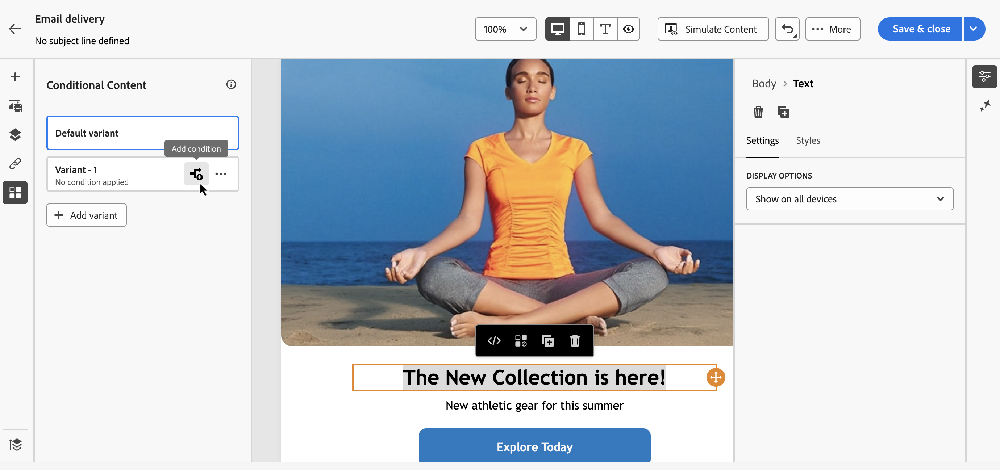

# Work with the query modeler {#segment-builder}

>[!CONTEXTUALHELP]
>id="acw_homepage_learning_card5"
>title="New Query modeler"
>abstract="Adobe Campaign Web features a query modeler that simplifies the process of filtering databases to select specific targets based on various criteria. This includes the use of advanced expressions and operators. The query modeler is available in every context where you need to define rules to filter data."

>[!CONTEXTUALHELP]
>id="acw_orchestration_querymodeler_querymessage"
>title="Query modeler"
>abstract="Define filtering criteria for recipients or any other targeting dimension from the database. Take advantage of your Adobe Experience Platform audience to further refine your target audience and maximize the impact of your campaign."

>[!CONTEXTUALHELP]
>id="acw_deliveries_refine_target"
>title="Refine target"
>abstract="These rules can only be changed in the client console."

Adobe Campaign Web user interface features a query modeler that simplifies the process of filtering the database based on various criteria. It ensures full compatibility with the queries created in the client console, facilitating a seamless transition to the web user interface.

Additionally, the query modeler manages very complex and long queries efficiently, offering enhanced flexibility and precision. It also supports predefined filters within conditions, empowering users to refine queries with ease while utilizing advanced expressions and operators for comprehensive audience targeting and segmentation strategies.

## Access the query modeler

The query modeler is available in every context where you need to define rules to filter data.

|Usage|Example|
|  ---  |  ---  |
|**Define audiences**: Specify the population you want to target in your messages or workflows, and effortlessly create new audiences tailored to your needs. [Learn how to build audiences](../audience/one-time-audience.md)|{zoomable="yes"}{width="200" align="center" zoomable="yes"} [Image showing how to access the audience creation interface]|
|**Customize workflow activities**: Apply rules within workflow activities, such as **Split** and **Reconciliation**, to align with your specific requirements. [Learn more on workflow activities](../workflows/activities/about-activities.md)|{zoomable="yes"}{width="200" align="center" zoomable="yes"} [Image showing how to access workflow customization options]|
|**Predefined filters**: Create predefined filters that serve as shortcuts during various filtering operations, whether you're working with data lists or forming the audience for a delivery. [Learn how to work with predefined filters](../get-started/predefined-filters.md)|{zoomable="yes"}{width="200" align="center" zoomable="yes"} [Image showing how to access predefined filters]|
|**Filter reports data**: Add rules to filter the data displayed in reports. [Learn how to work with reports](../reporting/gs-reports.md)|{zoomable="yes"}{width="200" align="center" zoomable="yes"} [Image showing how to filter data in reports]|
|**Customize lists**: Create custom rules to filter the data displayed in lists such as recipients or deliveries lists. [Learn how to filter lists](../get-started/list-filters.md#list-built-in-filters)|{zoomable="yes"}{width="200" align="center" zoomable="yes"} [Image showing how to customize list filters]|
|**Build conditional content**: Make email content dynamic by creating conditions that define which content should be displayed to different recipients, ensuring personalized and relevant messaging. [Learn how to build conditional content](../personalization/conditions.md)|{width="200" align="center" zoomable="yes"} [Image showing how to create conditional content]|

>[!NOTE]
>
>When accessing an object created in the client console where rules have been applied, such as an audience or a predefined filter, the **[!UICONTROL Refine target]** section may display. This means that additional parameters have been configured to refine the rule target. These parameters can be modified in the console only.
>
>{zoomable="yes"} 

## Query modeler interface {#interface}

The query modeler provides a central canvas where you build your query and a right pane that provides information on your query.

>[!CONTEXTUALHELP]
>id="acw_rule_builder_switch_button"
>title="New user experience"
>abstract="Use this toggle to switch between the classic query modeler and the new rule builder experience."

{zoomable="yes"} 

### The central canvas {#canvas}

The query modeler central canvas is where you add and combine the different components to build your query. [Learn how to build a query](build-query.md)

The toolbar located in the upper-right corner of the canvas provides options to easily manipulate the query components and navigate the canvas:

* **Multiple selection mode**: Select multiple filtering components to copy and paste them at the location of your choice.
* **Rotate**: Switch the canvas vertically.
* **Fit to screen**: Adapt the canvas zoom level to your screen.
* **Zoom out** / **Zoom in**: Zoom out or in on the canvas.
* **Display map**: Open a snapshot of the canvas showing your current location.

### The Rule properties pane {#rule-properties}

On the right-hand side, the **[!UICONTROL Rule properties]** pane provides information on your query. It allows you to perform various operations to check the query and ensure it suits your needs. This pane displays when building a query to create an audience. [Learn how to check and validate your query](build-query.md#check-and-validate-your-query)